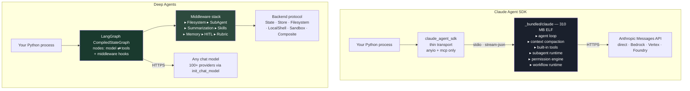
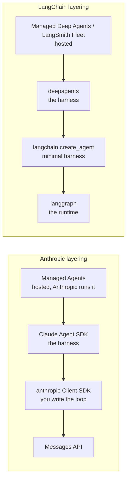
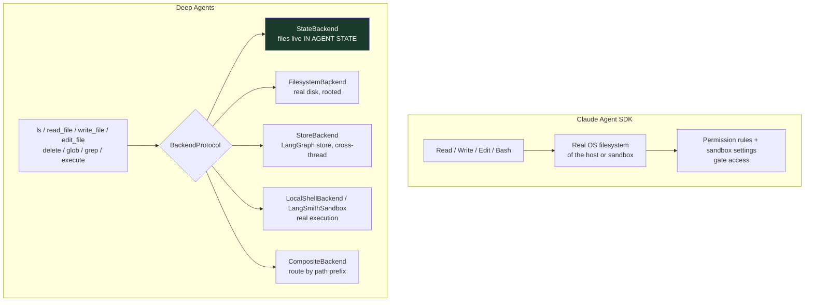
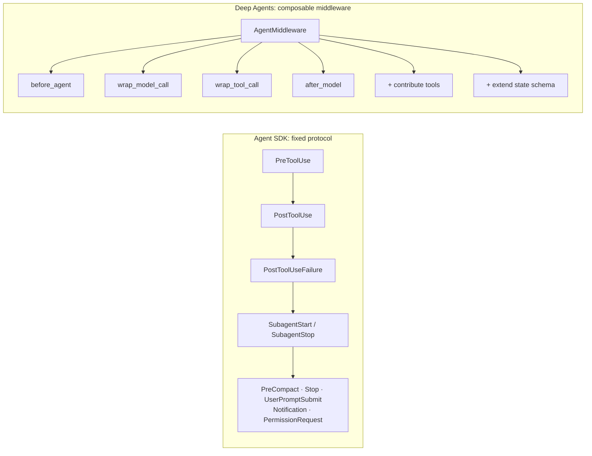
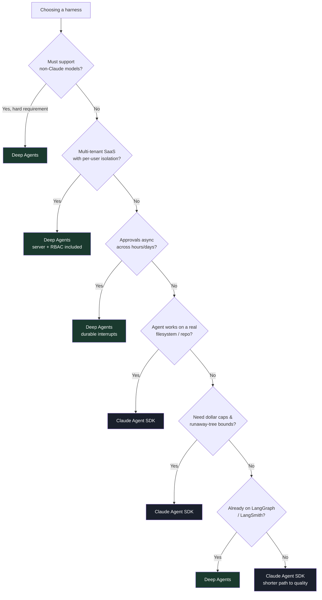

# Claude Agent SDK vs LangChain Deep Agents

**An architectural deep dive: two agent harnesses, the same problem, opposite bets.**

Companion to the [Claude Agent SDK zero-to-hero guide](./README.md). Verified against `claude-agent-sdk==0.2.139`, `deepagents==0.7.6`, `langchain==1.3.15`, `langgraph==1.2.11`, `langchain-core==1.5.5` (August 2026). Every API in this document was checked by introspecting the installed packages.

---

## Table of contents

**Part I — The architectural question**
1. [Why this comparison is not an API diff](#1-why-this-comparison-is-not-an-api-diff)
2. [The one-paragraph answer](#2-the-one-paragraph-answer)
3. [Two architectures, side by side](#3-two-architectures-side-by-side)
4. [The stacks: where each one sits](#4-the-stacks-where-each-one-sits)
5. [The five bets that drive every other difference](#5-the-five-bets-that-drive-every-other-difference)

**Part II — Zero to hero, in parallel**
6. [Level 0 — Setup and the runtime you inherit](#level-0--setup-and-the-runtime-you-inherit)
7. [Level 1 — Hello agent](#level-1--hello-agent)
8. [Level 2 — Custom tools](#level-2--custom-tools)
9. [Level 3 — The filesystem question](#level-3--the-filesystem-question)
10. [Level 4 — Subagents and delegation](#level-4--subagents-and-delegation)
11. [Level 5 — Orchestration patterns in both](#level-5--orchestration-patterns-in-both)
12. [Level 6 — Context management](#level-6--context-management)
13. [Level 7 — Human-in-the-loop and permissions](#level-7--human-in-the-loop-and-permissions)
14. [Level 8 — State, sessions, and durability](#level-8--state-sessions-and-durability)
15. [Level 9 — Streaming and observability](#level-9--streaming-and-observability)
16. [Level 10 — Extension: hooks vs middleware](#level-10--extension-hooks-vs-middleware)
17. [Level 11 — Structured output](#level-11--structured-output)
18. [Level 12 — Skills and memory](#level-12--skills-and-memory)
19. [Level 13 — Cost and limits](#level-13--cost-and-limits)
20. [Level 14 — Testing](#level-14--testing)
21. [Level 15 — Deployment and multi-tenancy](#level-15--deployment-and-multi-tenancy)

**Part III — Deciding**
22. [Head-to-head capability matrix](#22-head-to-head-capability-matrix)
23. [What LangChain says, and where I'd push back](#23-what-langchain-says-and-where-id-push-back)
24. [Decision framework](#24-decision-framework)
25. [Migration and hedging strategies](#25-migration-and-hedging-strategies)
26. [Using both together](#26-using-both-together)
27. [Anti-patterns, per framework](#27-anti-patterns-per-framework)
28. [Sources](#28-sources)

---

# Part I — The architectural question

## 1. Why this comparison is not an API diff

Both libraries expose a factory that takes a model, tools, a system prompt, and subagents. At that level they look nearly identical:

```python
# Claude Agent SDK
options = ClaudeAgentOptions(model=..., allowed_tools=[...], system_prompt=..., agents={...})

# Deep Agents
agent = create_deep_agent(model=..., tools=[...], system_prompt=..., subagents=[...])
```

Comparing them at that level tells you nothing useful. The differences that decide your architecture are structural, and they show up in four places:

1. **Where the agent loop physically runs** — a compiled Node binary you talk to over stdio, vs a LangGraph state machine executing in your Python process.
2. **What the agent's "filesystem" actually is** — a real OS filesystem, vs a pluggable backend that may be a dict in agent state.
3. **What the extension surface is shaped like** — a fixed set of protocol callbacks, vs arbitrary code inserted into a graph.
4. **What "production" means to each project** — you build the server, vs the server ships with it.

Everything else — MCP support, subagents, HITL, skills — both have. Feature checklists will tell you they're equivalent. They aren't.

---

## 2. The one-paragraph answer

> **Claude Agent SDK** is a proven, opinionated harness compiled into a binary. You get Claude Code's exact agent loop, its tool implementations, its context management, and its Claude-specific optimizations — and you accept that the loop is a black box in another process, that you're on Claude, and that you build your own server. **Deep Agents** is the same harness *pattern* re-implemented as composable LangGraph middleware in your process. You get model portability, a pluggable execution backend, arbitrary interception, durable checkpointed state, and a production agent server — and you accept a re-implementation rather than the original, and a dependency stack that moves fast.
>
> For a Claude-committed team building agents on real filesystems, the Agent SDK is the shorter path to quality. For a multi-model, multi-tenant platform where the agent is one component in a larger orchestration story, Deep Agents fits the shape of the problem better.

Neither is a wrapper for the other. They are two independent answers to "what should surround the model."

---

## 3. Two architectures, side by side



**The single most consequential difference is visible here:** in the Agent SDK, the loop is *inside a box you cannot open*. In Deep Agents, the loop is a graph you can inspect, checkpoint, replay, and rewrite.

That cuts both ways. A black box you can't break is also a black box you can't fix.

---

## 4. The stacks: where each one sits



The layers are genuine analogues:

| Layer | Anthropic | LangChain |
|---|---|---|
| Raw model access | `anthropic` Messages API | `init_chat_model` / `BaseChatModel` |
| Minimal loop | `tool_runner` (beta) | `create_agent` |
| Full harness | `claude-agent-sdk` | `deepagents` |
| Runtime primitives | *(none exposed — inside the binary)* | `langgraph` |
| Hosted | Managed Agents (separate product) | Managed Deep Agents / LangSmith Fleet |

**Note the asymmetric row.** LangChain exposes the runtime beneath the harness; Anthropic does not. If `create_deep_agent` doesn't fit, you drop to `create_agent`, and if that doesn't fit you drop to a raw LangGraph graph — same primitives all the way down. If `ClaudeAgentOptions` doesn't fit, your next step down is the `anthropic` Client SDK and writing the loop yourself, which is a rewrite, not a refactor.

**That escape hatch is the strongest structural argument for Deep Agents**, and it is easy to miss on a feature-comparison table.

The other asymmetry: Anthropic's hosted tier (Managed Agents) is a *separate product* — code written against the Agent SDK does not deploy to it. LangChain's hosted tier runs the same code you wrote locally.

---

## 5. The five bets that drive every other difference

### Bet 1: Model coupling

- **Agent SDK bets on Claude.** The system prompt, tool descriptions, and loop are tuned against Claude specifically. Prompt caching, extended thinking, effort levels, and server tools are wired in natively. Providers are Anthropic/Bedrock/Vertex/Foundry — all Claude.
- **Deep Agents bets on portability.** Any tool-calling model through `init_chat_model`: OpenAI, Google, Anthropic, OpenRouter, Fireworks, Baseten, Ollama, vLLM. **Harness profiles** (beta) exist precisely because a single harness across many models needs per-model tuning — you register a `HarnessProfile` with prompt overrides, tool exclusions, and middleware changes per provider or model.

The honest reading: the Agent SDK's coupling is a *feature* if you're on Claude and a wall if you aren't. Deep Agents' portability is real, but "works with any model" and "works *well* with any model" differ — that gap is what harness profiles exist to close, and it's still beta.

### Bet 2: Process boundary

- **Agent SDK:** loop in a subprocess. You cannot step through it, patch it, or extend it beyond the protocol's callbacks. You also cannot break it.
- **Deep Agents:** loop in your process. You can set a breakpoint inside the tool node. You can also break it.

### Bet 3: What a "filesystem" is

- **Agent SDK:** the real OS filesystem of wherever the harness runs. `Read`/`Write`/`Edit`/`Bash` touch actual files.
- **Deep Agents:** a `BackendProtocol` abstraction. The default `StateBackend` is a virtual filesystem living **in agent state** — files are a dict carried through the graph, not on disk. `FilesystemBackend`, `LocalShellBackend`, `StoreBackend`, `LangSmithSandbox`, `ContextHubBackend`, and `CompositeBackend` are alternatives.

This is a bigger deal than it sounds. With `StateBackend`, "the agent wrote a file" means "the agent's state has a new key" — checkpointable, forkable, testable, and with zero blast radius on your host. With the Agent SDK, it means a file exists on disk.

### Bet 4: Extension shape

- **Agent SDK:** a fixed protocol. Ten hook events, `can_use_tool`, in-process MCP servers, `env`. Well-defined, stable, limited.
- **Deep Agents:** `AgentMiddleware` with `before_agent` / `after_model` / `wrap_tool_call` style hooks, plus arbitrary graph surgery underneath. Unlimited, and correspondingly easier to get wrong.

### Bet 5: What ships in the box for production

- **Agent SDK:** the agent. You build the HTTP/WS server, auth, threads, run history, and multi-tenancy.
- **Deep Agents:** `langgraph build` produces a standalone image with an agent server — streaming endpoints, thread management, run history, webhooks, auth — or you use the managed offering with the same code.

This is LangChain's strongest genuine claim, and it's the one most likely to decide the question for a platform team.

---

# Part II — Zero to hero, in parallel

# Level 0 — Setup and the runtime you inherit

<table>
<tr><th>Claude Agent SDK</th><th>Deep Agents</th></tr>
<tr><td>

```bash
pip install claude-agent-sdk
# 310 MB wheel (bundled Claude Code binary)
# requires Node.js in the runtime
export ANTHROPIC_API_KEY=sk-ant-...
```

Dependencies: `anyio`, `mcp`, `sniffio`. **Does not depend on the `anthropic` package** — the compiled binary embeds the TypeScript `@anthropic-ai/sdk`.

</td><td>

```bash
pip install deepagents langchain-anthropic
# pulls langchain, langgraph, langchain-core,
# pydantic, and their transitive deps
export ANTHROPIC_API_KEY=sk-ant-...
```

Pure Python. No subprocess, no Node. Dependency tree is large but ordinary.

</td></tr>
</table>

| | Agent SDK | Deep Agents |
|---|---|---|
| Install footprint | ~310 MB, one wheel | Tens of MB, many packages |
| Runtime requirement | Node.js | Python only |
| Version surface | SDK version pins a Claude Code version (two-dimensional skew) | `deepagents` + `langchain` + `langgraph` + `langchain-core` must be compatible |
| Cold start | Subprocess spawn | Graph compile |
| Debugger reach | Your transport code only | The entire loop |

**The version-management trade is real and cuts both ways.** The Agent SDK gives you one pin that moves a whole harness — simple, but a minor bump can change agent behavior. Deep Agents gives you four fast-moving packages to keep compatible — more surface, but each upgrade is inspectable.

---

# Level 1 — Hello agent

<table>
<tr><th>Claude Agent SDK</th><th>Deep Agents</th></tr>
<tr><td>

```python
import anyio
from claude_agent_sdk import (
    query, ClaudeAgentOptions,
    AssistantMessage, TextBlock, ResultMessage,
)


async def main():
    options = ClaudeAgentOptions(
        model="claude-sonnet-5",
        system_prompt="You are a repo analyst.",
        allowed_tools=["Read", "Grep", "Glob"],
        cwd="./target-repo",
        max_turns=20,
    )
    async for msg in query(
        prompt="Find routes lacking auth.",
        options=options,
    ):
        if isinstance(msg, AssistantMessage):
            for b in msg.content:
                if isinstance(b, TextBlock):
                    print(b.text)
        elif isinstance(msg, ResultMessage):
            print(msg.subtype, msg.total_cost_usd)


anyio.run(main)
```

Async generator. Streaming is the default shape.

</td><td>

```python
from deepagents import create_deep_agent

agent = create_deep_agent(
    model="anthropic:claude-sonnet-4-6",
    system_prompt="You are a repo analyst.",
)

result = agent.invoke({
    "messages": [
        {"role": "user",
         "content": "Find routes lacking auth."}
    ]
})

print(result["messages"][-1].content)
```

Sync by default; `.ainvoke`, `.stream`, `.astream` all available. Returns a state dict, not a message stream.

</td></tr>
</table>

### What's different beneath the surface

**Tools are opt-out vs opt-in.** Deep Agents gives the model `ls`, `read_file`, `write_file`, `edit_file`, `delete`, `glob`, `grep`, `execute`, and `task` by default — verified by introspecting `FilesystemMiddleware().tools`. To *remove* one you register a `HarnessProfile` with `excluded_tools`, or pass a `FilesystemMiddleware(tools=[...])` allowlist. The Agent SDK also makes tools available by default, but `allowed_tools` controls what runs without hitting the permission path, so the practical default is more conservative.

**`write_todos` is opt-in as of deepagents 0.7.** Earlier versions included planning middleware by default; now you pass `TodoListMiddleware()` explicitly. Blog posts written before v0.7 will tell you otherwise — a good reminder to verify against the installed version rather than the ecosystem's writing.

**The return shape differs fundamentally.** The Agent SDK yields typed messages as they happen, terminating in a `ResultMessage` carrying cost, usage, denials, and structured output. Deep Agents returns final graph state; you opt into streaming for progress. If you're building a UI, both work — but the Agent SDK's shape is streaming-native and Deep Agents' is state-native.

---

# Level 2 — Custom tools

<table>
<tr><th>Claude Agent SDK</th><th>Deep Agents</th></tr>
<tr><td>

```python
from claude_agent_sdk import (
    tool, create_sdk_mcp_server, ClaudeAgentOptions,
)

LEDGER = {"ACC-1": 1284.55}


@tool("get_balance", "Get an account balance",
      {"account_id": str})
async def get_balance(args):
    bal = LEDGER.get(args["account_id"])
    if bal is None:
        return {
            "content": [{"type": "text",
                         "text": "Not found"}],
            "is_error": True,
        }
    return {"content": [{"type": "text",
                         "text": f"${bal:.2f}"}]}


banking = create_sdk_mcp_server(
    name="banking", version="1.0.0",
    tools=[get_balance],
)

options = ClaudeAgentOptions(
    mcp_servers={"banking": banking},
    allowed_tools=["mcp__banking__get_balance"],
)
```

Every custom tool is an **MCP tool**, even in-process. Naming: `mcp__<server>__<tool>`.

</td><td>

```python
from deepagents import create_deep_agent

LEDGER = {"ACC-1": 1284.55}


def get_balance(account_id: str) -> str:
    """Get an account balance.

    Args:
        account_id: The account identifier.
    """
    bal = LEDGER.get(account_id)
    if bal is None:
        return "Not found"
    return f"${bal:.2f}"


agent = create_deep_agent(
    model="anthropic:claude-sonnet-4-6",
    tools=[get_balance],
)
```

A plain Python function is a tool. LangChain `BaseTool`, `@tool`-decorated callables, and MCP tools via `langchain-mcp-adapters` all work.

</td></tr>
</table>

**Architectural read:** the Agent SDK routes *everything* through MCP, which means uniform naming, uniform permission handling, and a tool you write for the agent is already a protocol-speaking artifact reusable elsewhere. Deep Agents treats tools as LangChain tools, which means anything in the LangChain tool ecosystem drops in and your tools work with `create_agent` and raw LangGraph too.

The Agent SDK's approach costs you a little ceremony and buys protocol uniformity. Deep Agents' approach costs you a little uniformity and buys ecosystem reach. Neither is wrong.

**MCP in Deep Agents** goes through `langchain-mcp-adapters`, which converts MCP tools into LangChain tools:

```python
from langchain_mcp_adapters.client import MultiServerMCPClient

client = MultiServerMCPClient({
    "docs": {"command": "python", "args": ["-m", "my.mcp.server"],
             "transport": "stdio"},
})
mcp_tools = await client.get_tools()

agent = create_deep_agent(model="anthropic:claude-sonnet-4-6", tools=mcp_tools)
```

Both support MCP genuinely. The difference is that MCP is the *native* extension mechanism in one and an *adapter* in the other — which matters for how quickly new MCP spec features surface.

---

# Level 3 — The filesystem question

This is the deepest divergence and the one most often glossed over.



### Why `StateBackend` is a genuinely different idea

Default Deep Agents files are a dict in graph state. Consequences:

- **Checkpointable.** With a checkpointer, the entire filesystem is part of the snapshot. You can rewind an agent to before it wrote a file — no filesystem journaling required.
- **Forkable.** Branch a thread and you branch its filesystem.
- **Testable.** Assert on `result["files"]`. No temp dirs, no cleanup.
- **Zero blast radius.** An agent that "deletes everything" deletes a dict key.
- **Multi-tenant by construction.** Each thread has its own filesystem inherently.

And the costs:

- **Not real files.** A tool expecting a path on disk sees nothing. Shell commands need a real backend.
- **State size.** Large files bloat every checkpoint.
- **Nothing outside can read them.** No `docker cp`, no artifact upload without an export step.

`CompositeBackend` resolves the tension by routing per path prefix — state for scratch, real disk for `/workspace`:

```python
from deepagents.backends import CompositeBackend, StateBackend, FilesystemBackend

backend = CompositeBackend(
    default=StateBackend(),
    routes={"/workspace": FilesystemBackend(root_dir="./workspace")},
)
agent = create_deep_agent(model="anthropic:claude-sonnet-4-6", backend=backend)
```

**There is no Agent SDK equivalent.** Its file tools are the harness's file tools, touching a real filesystem. You control *where* via `cwd`, `add_dirs`, sandbox settings, and permission rules — but not *what a file is*.

### `execute` availability is backend-dependent

Verified from the `create_deep_agent` docstring: the `execute` tool runs shell commands only if the backend implements `SandboxBackendProtocol`. **For non-sandbox backends, `execute` returns an error message** rather than being hidden. Worth knowing — the model sees a tool that will fail unless you configured a sandbox backend.

The Agent SDK has `Bash` always, gated by permissions and optional sandboxing. Different safety model: Deep Agents defaults to *can't*, the Agent SDK defaults to *can, if allowed*.

---

# Level 4 — Subagents and delegation

Both implement Claude Code's original pattern: a `task`/`Agent` tool spawning an isolated child that returns one final message.

<table>
<tr><th>Claude Agent SDK</th><th>Deep Agents</th></tr>
<tr><td>

```python
from claude_agent_sdk import AgentDefinition

AGENTS = {
    "researcher": AgentDefinition(
        description=(
            "Gathers facts. Use for discovery "
            "and 'find all X'."
        ),
        prompt="You research. Cite file:line.",
        tools=["Read", "Grep", "Glob", "WebSearch"],
        model="haiku",
        maxTurns=15,
    ),
    "validator": AgentDefinition(
        description="Adversarially checks findings.",
        prompt="Try to REFUTE each claim.",
        tools=["Read", "Grep"],
        model="opus",
        effort="high",
    ),
}

options = ClaudeAgentOptions(
    model="claude-opus-5",
    agents=AGENTS,
    allowed_tools=["Read", "Grep", "Glob", "Agent"],
    env={
      "CLAUDE_CODE_MAX_SUBAGENT_SPAWN_DEPTH": "1",
      "CLAUDE_CODE_MAX_CONCURRENT_SUBAGENTS": "5",
    },
    max_budget_usd=5.0,
)
```

Dict keyed by name. `"Agent"` **must** be in `allowed_tools` or delegation silently never happens.

</td><td>

```python
from deepagents import create_deep_agent, SubAgent

agent = create_deep_agent(
    model="anthropic:claude-opus-4-6",
    subagents=[
        SubAgent(
            name="researcher",
            description=(
                "Gathers facts. Use for discovery "
                "and 'find all X'."
            ),
            system_prompt="You research. Cite file:line.",
            tools=[search],
            model="anthropic:claude-haiku-4-5",
        ),
        SubAgent(
            name="validator",
            description="Adversarially checks findings.",
            system_prompt="Try to REFUTE each claim.",
            tools=[],
            model="anthropic:claude-opus-4-6",
        ),
    ],
)
```

List of TypedDicts. `name` is a field, not a key. The `task` tool is present by default.

</td></tr>
</table>

### Field-by-field (both verified by introspection)

| Concept | `AgentDefinition` (Agent SDK) | `SubAgent` (Deep Agents) |
|---|---|---|
| Identity | dict key | `name` field |
| Routing text | `description` ✅ | `description` ✅ |
| System prompt | `prompt` ✅ | `system_prompt` ✅ |
| Tool scoping | `tools` (names) / `disallowedTools` | `tools` (objects) |
| Model override | `model` (alias or ID) | `model` (str or `BaseChatModel`) |
| Turn cap | `maxTurns` | via `ModelCallLimitMiddleware` in `middleware` |
| Reasoning effort | `effort` | model-specific, via the model object |
| Background exec | `background` | ✗ (LangGraph handles concurrency) |
| Per-agent permissions | `permissionMode` | `permissions` (filesystem rules) |
| Per-agent HITL | via parent `can_use_tool` | `interrupt_on` ✅ per subagent |
| Skills | `skills` | `skills` ✅ |
| MCP servers | `mcpServers` | via `tools` |
| Custom middleware | ✗ | `middleware` ✅ |
| Structured output | ✗ per-agent | `response_format` ✅ per subagent |
| Nesting depth control | env var, default 3 | ✗ (structural) |
| Concurrency cap | env var, default 20 | LangGraph-level |

Two things stand out.

**Deep Agents gives subagents per-agent `middleware`, `response_format`, and `interrupt_on`.** That's meaningfully more compositional: a subagent can have its own summarization policy, its own validated output schema, and its own approval gates. In the Agent SDK those are parent-level or absent.

**The Agent SDK gives you explicit depth and concurrency bounds.** `CLAUDE_CODE_MAX_SUBAGENT_SPAWN_DEPTH` and `CLAUDE_CODE_MAX_CONCURRENT_SUBAGENTS` bound runaway trees at the harness level. Deep Agents has no direct equivalent — you bound it with `ModelCallLimitMiddleware` and recursion limits, which is less targeted.

### Three subagent kinds in Deep Agents

Verified from the type definitions:

```python
SubAgent          # declarative: name, description, system_prompt, tools, model,
                  # middleware, interrupt_on, skills, permissions, response_format
CompiledSubAgent  # name, description, runnable  ← ANY LangGraph graph
AsyncSubAgent     # name, description, graph_id, url, headers  ← REMOTE graph
```

`CompiledSubAgent` is the one worth pausing on. **Any `CompiledStateGraph` can be a subagent** — including a hand-built LangGraph workflow with cycles, conditional edges, and its own state schema. The delegation boundary becomes a place to plug in arbitrary orchestration.

`AsyncSubAgent` goes further: a subagent that is a *remote* graph, addressed by `graph_id` and `url`. That's a distributed multi-agent system with a network boundary at the delegation point.

The Agent SDK's closest analogue is a subagent that calls an MCP tool that calls your service — an indirection through the tool layer rather than a first-class remote agent. If you're building cross-service agent topologies (or already run A2A), Deep Agents' `AsyncSubAgent` is a structurally better fit.

### Where the Agent SDK pulls ahead

- **Explicit runaway bounds** — depth, concurrency, and `max_budget_usd` as first-class harness caps.
- **Subagent resume** — capture `agentId` + `session_id` and continue a subagent with its full history.
- **Background subagents** — `background=True`, plus `client.stop_task(task_id)` to kill one child without killing the run.
- **Output scanning** — since v2.1.210 the harness scans subagent final messages for instruction-shaped patterns (control-tag imitation, turn markers) before the parent reads them. Deep Agents has no equivalent; you own that defense.
- **Dynamic workflows** — a JS orchestration script running dozens to hundreds of agents outside the conversation context, with a 1,000-agent cap. No Deep Agents equivalent; you'd write the fan-out in Python.

That last one is a real capability gap at extreme scale — though writing your own fan-out in LangGraph is not hard, and arguably clearer.

---

# Level 5 — Orchestration patterns in both

All six patterns from the main guide, expressed in each framework.

## 5.1 Parallel fan-out

<table>
<tr><th>Claude Agent SDK</th><th>Deep Agents</th></tr>
<tr><td>

```python
options = ClaudeAgentOptions(
    model="claude-opus-5",
    agents={"auditor": AgentDefinition(
        description="Audits ONE file. Use per file.",
        prompt=("Audit the named file. Report as "
                "`SEV | file:line | desc`, "
                "or exactly CLEAN."),
        tools=["Read", "Grep"],
        model="haiku",
    )},
    allowed_tools=["Glob", "Agent"],
    system_prompt=(
        "Glob the files, then dispatch ONE auditor "
        "per file ALL IN A SINGLE TURN so they run "
        "concurrently. Never audit anything yourself."
    ),
    env={"CLAUDE_CODE_MAX_CONCURRENT_SUBAGENTS": "10"},
)
```

Parallelism is **model-driven**. You ask for it in the prompt and verify it happened.

</td><td>

```python
import asyncio
from deepagents import create_deep_agent

auditor = create_deep_agent(
    model="anthropic:claude-haiku-4-5",
    system_prompt=("Audit the named file. Report as "
                   "`SEV | file:line | desc`, "
                   "or exactly CLEAN."),
)

async def fan_out(files: list[str]) -> list[str]:
    sem = asyncio.Semaphore(10)

    async def one(path: str) -> str:
        async with sem:
            r = await auditor.ainvoke({"messages": [
                {"role": "user",
                 "content": f"Audit {path}"}]})
            return r["messages"][-1].content

    return await asyncio.gather(*(one(f) for f in files))
```

Parallelism is **code-driven**. It is guaranteed, bounded, and testable.

</td></tr>
</table>

**This is the sharpest practical difference in the whole comparison.** In the Agent SDK, "dispatch all in a single turn" is a *request* to the model — the most common failure mode in production fan-outs is serial dispatch wearing a parallel costume, and you only find out by measuring wall clock ÷ sum of durations. In Deep Agents, `asyncio.gather` with a semaphore is a *guarantee*.

The Agent SDK can also be driven from Python this way (fan out over `query()` calls), and the main guide recommends exactly that. But it's the idiomatic path in Deep Agents and the escape hatch in the Agent SDK.

## 5.2 Evaluator–optimizer

Deep Agents ships this as middleware — `RubricMiddleware`, verified signature:

```python
RubricMiddleware(
    model="anthropic:claude-opus-4-6",
    system_prompt=...,          # grading criteria
    tools=[...],                # tools the grader may use
    max_iterations=3,
    on_evaluation=lambda ev: log(ev),
)
```

It grades the agent's output against a rubric and loops up to `max_iterations`. The Agent SDK has no built-in equivalent; you build the generator↔critic loop yourself (see the main guide's Level 6.4 — roughly 40 lines).

Genuine point to Deep Agents: a batteries-included quality loop with an observation callback. The counterpoint is that a hand-written loop gives you exact control over what the critic sees, and the main guide's rule — *the critic must not see its own previous verdicts* — is easier to guarantee when you own the loop.

## 5.3 Router / handoff

Both work the same way conceptually: a cheap model with only the delegation tool.

```python
# Agent SDK — remove capability
options = ClaudeAgentOptions(
    model="claude-haiku-4-5-20251001",
    agents=SPECIALISTS,
    allowed_tools=["Agent"],   # ONLY delegation
    system_prompt="Classify and delegate to exactly ONE agent...",
)
```

```python
# Deep Agents — remove capability via harness profile
from deepagents import HarnessProfile, register_harness_profile

register_harness_profile(
    "anthropic:claude-haiku-4-5",
    HarnessProfile(excluded_tools=frozenset(
        {"ls", "read_file", "write_file", "edit_file",
         "delete", "glob", "grep", "execute"})),
)
```

Note the asymmetry in effort. Stripping the router down to delegation-only is one list in the Agent SDK and a registered profile in Deep Agents, because Deep Agents' defaults are more generous. Neither is hard; the Agent SDK's is more local to the call site.

## 5.4 Hierarchical

Both support subagents spawning subagents. The Agent SDK bounds it with `CLAUDE_CODE_MAX_SUBAGENT_SPAWN_DEPTH` (default 3). Deep Agents bounds it structurally — you compose the tree yourself with `CompiledSubAgent`, so depth is whatever you built.

**Advantage Deep Agents on expressiveness, advantage Agent SDK on guardrails.** In a system where an eager model might spawn a tree you didn't design, the env var is worth a lot.

## 5.5 Debate / panel

Identical patterns; the constraint is the same in both — panelists must not see each other's answers before answering. Deep Agents makes independence easier to enforce because you control dispatch in Python. In the Agent SDK you rely on dispatching them in one turn with disjoint prompts.

## 5.6 Sequential pipeline

The main guide's advice — *if you can draw the flowchart before the run, put it in code* — applies to both. In Deep Agents, "put it in code" means a LangGraph graph with explicit edges, which is the framework's native idiom rather than an escape from it.

---

# Level 6 — Context management

| | Agent SDK | Deep Agents |
|---|---|---|
| Auto-compaction | ✅ built into the harness | ✅ `SummarizationMiddleware` |
| Compaction hook | `PreCompact` | Middleware you write |
| Large tool result offload | Implicit | ✅ `SummarizationToolMiddleware` / offloading to the virtual FS |
| Context isolation via subagents | ✅ | ✅ |
| Prompt caching | ✅ native, incl. fan-out sibling stagger | ✅ automatic for Anthropic + Bedrock (Claude/Nova) |
| Configurable thresholds | Limited | ✅ full middleware control |
| Visibility into what was dropped | Low | High — you wrote the summarizer |

Deep Agents' **context offloading** deserves attention: large tool results get written to the virtual filesystem and replaced with a reference, so the model can `read_file` them on demand instead of carrying them. Combined with `StateBackend`, that means a 200 KB tool result becomes a state key and a short pointer in context.

The Agent SDK achieves the same outcome primarily through subagents — the child reads everything and returns a summary. Both work; Deep Agents' mechanism is more granular and more configurable, the Agent SDK's is more automatic.

**Prompt caching is worth a specific note.** Both do it automatically on Claude. The Agent SDK goes further in the workflow runtime, deliberately staggering fan-out siblings up to 5 seconds (`CLAUDE_CODE_WORKFLOW_PREFIX_STAGGER_MS`) so all but the first read the first agent's cached prefix. That's a level of cache-aware orchestration Deep Agents doesn't attempt — and at 50-agent fan-out width it's real money.

---

# Level 7 — Human-in-the-loop and permissions

<table>
<tr><th>Claude Agent SDK</th><th>Deep Agents</th></tr>
<tr><td>

```python
from claude_agent_sdk import (
    PermissionResultAllow, PermissionResultDeny,
)

async def gate(tool_name, tool_input, context):
    if tool_name != "mcp__bank__refund":
        return PermissionResultAllow()
    amt = float(tool_input.get("amount", 0))
    if amt < 50:
        return PermissionResultAllow(
            updated_input=tool_input)
    d = await ask_human(f"Approve ${amt}?")
    if d.approved:
        return PermissionResultAllow(updated_input={
            **tool_input, "approved_by": d.approver})
    return PermissionResultDeny(
        message=d.reason, interrupt=True)

options = ClaudeAgentOptions(can_use_tool=gate)
```

A **callback**. Your process blocks while the human decides.

</td><td>

```python
from deepagents import create_deep_agent
from langgraph.checkpoint.memory import InMemorySaver

agent = create_deep_agent(
    model="anthropic:claude-sonnet-4-6",
    interrupt_on={"write_file": True,
                  "execute": True},
    checkpointer=InMemorySaver(),
)

cfg = {"configurable": {"thread_id": "t1"}}
result = agent.invoke({"messages": [...]}, cfg)
# → run halts, state persisted

from langgraph.types import Command
agent.invoke(
    Command(resume={"decisions": [{"type": "accept"}]}),
    cfg,
)
```

An **interrupt**. The run stops, state is checkpointed, and it resumes later — possibly in a different process, hours later.

</td></tr>
</table>

**This is a genuine architectural difference, not a stylistic one.**

The Agent SDK's `can_use_tool` is a blocking async callback. Your Python coroutine awaits the human. If the process dies while waiting, the run dies. For a synchronous approval — a Slack message answered in 30 seconds — it's simple and fine.

Deep Agents uses LangGraph interrupts: the graph *halts*, state is checkpointed durably, and resumption can happen from a completely different process days later. For a workflow where approval routes to a queue, waits for a compliance officer, and resumes tomorrow, this is the right primitive and the Agent SDK has no equivalent — you'd rebuild the durability yourself.

**If your approval flow is asynchronous and long-lived, this difference alone may decide the question.**

`InterruptOnConfig` (verified) supports `allowed_decisions`, `description`, `args_schema`, and a `when` predicate for conditional interrupts.

### Filesystem permissions

Deep Agents has declarative rules, verified shape:

```python
FilesystemPermission(
    operations=["read", "write"],   # Literal
    paths=["/secrets/**"],          # globs
    mode="deny",                    # "allow" | "deny" | "interrupt"
)
```

Evaluated in declaration order, first match wins; no match means allowed. Note `mode="interrupt"` — a *third* option that escalates to a human rather than a binary allow/deny. That's a nice primitive.

Important caveat from the docs: **permissions do not apply to sandbox backends**, which support arbitrary command execution via `execute`. Don't assume path rules constrain a sandboxed agent.

The Agent SDK's equivalent is permission rules plus `can_use_tool` plus `PreToolUse` hooks — more code, more general (it covers every tool, not just filesystem).

---

# Level 8 — State, sessions, and durability

| | Agent SDK | Deep Agents |
|---|---|---|
| Continue a conversation | `resume="ses_..."` | `thread_id` in config |
| Branch | `fork_session=True` | Fork a checkpoint |
| Persistence | Disk under `~/.claude/projects/`, or custom `session_store` | Any LangGraph checkpointer: memory, Postgres, Redis, SQLite |
| Durable mid-run halt | ✗ | ✅ interrupts + checkpointer |
| Time-travel | `rewind_files()` to a checkpoint | ✅ full state rewind to any checkpoint |
| Cross-thread memory | Session store | `BaseStore` + `StoreBackend` |
| Custom state fields | ✗ | ✅ `state_schema` extending `DeepAgentState` |
| Inspect state mid-run | Message stream only | Full state at every superstep |

**Deep Agents inherits LangGraph's durability model, and it is substantially more capable.** Checkpoints at every superstep, resume from any of them, and time-travel debugging. If your agent runs for hours, must survive a deploy, or needs an auditable state history, that matters a great deal.

Custom state is the other piece:

```python
from deepagents.graph import DeepAgentState

class MyState(DeepAgentState):
    tenant_id: str
    audit_trail: list[str]

agent = create_deep_agent(model=..., state_schema=MyState)
```

Verified from the docs: the schema is forwarded when compiling declarative `SubAgent` specs, so subagents see the same custom fields. `CompiledSubAgent` runnables do **not** inherit it — compile those with a compatible schema yourself.

The Agent SDK has no equivalent. State is the conversation; anything else lives in your Python around it.

---

# Level 9 — Streaming and observability

<table>
<tr><th>Claude Agent SDK</th><th>Deep Agents</th></tr>
<tr><td>

```python
async for msg in client.receive_response():
    parent = getattr(msg, "parent_tool_use_id", None)
    if isinstance(msg, AssistantMessage):
        for b in msg.content:
            if isinstance(b, ToolUseBlock):
                emit(scope="sub" if parent else "root",
                     tool=b.name)
    elif isinstance(msg, ResultMessage):
        record(cost=msg.total_cost_usd,
               per_model=msg.model_usage,
               denials=msg.permission_denials)
```

Typed message stream. `parent_tool_use_id` attributes messages to subagents. `ResultMessage` carries cost, per-model usage, and denials.

</td><td>

```python
for chunk in agent.stream(
    {"messages": [...]},
    stream_mode=["messages", "updates", "values"],
):
    ...

# Deep Agents adds stream.subagents — each
# delegated task gets its own handle with
# independent message and tool-call streams.
```

LangGraph stream modes plus a subagent projection. Tracing via LangSmith is first-class.

</td></tr>
</table>

| | Agent SDK | Deep Agents |
|---|---|---|
| Token-level streaming | `include_partial_messages=True` | `stream_mode="messages"` |
| Subagent attribution | `parent_tool_use_id` | `stream.subagents` handles |
| Per-agent lifecycle events | `SubagentStart` / `SubagentStop` hooks | Middleware hooks |
| Built-in cost accounting | ✅ `total_cost_usd`, `model_usage` | Via LangSmith or your callbacks |
| Turnkey tracing platform | ✗ (OTel yourself) | ✅ LangSmith |
| OTel | Manual; `[otel]` extra ships `opentelemetry-api` | Via LangSmith exporters or manual |

**Deep Agents wins on turnkey observability** — LangSmith is genuinely good and it's one line to enable. **The Agent SDK wins on built-in cost accounting** — `total_cost_usd` and `model_usage` come free and are exactly what you need to verify model tiering worked. In Deep Agents you compute cost from token counts yourself or read it off LangSmith.

If you already run OTel-native observability, both require work: the Agent SDK because it has no built-in exporter, Deep Agents because LangSmith is its native destination.

---

# Level 10 — Extension: hooks vs middleware

This is where the two philosophies are most visible.



**Agent SDK hooks** are ten named events plus `can_use_tool`. Stable, well-documented, limited. You cannot add a tool from a hook or extend the agent's state.

**Deep Agents middleware** is a class that can intercept the model call, wrap tool calls, run before/after the agent, contribute new tools, *and* extend the state schema. Verified catalog available out of the box:

From `deepagents.middleware`: `FilesystemMiddleware`, `SubAgentMiddleware`, `AsyncSubAgentMiddleware`, `SummarizationMiddleware`, `SummarizationToolMiddleware`, `SkillsMiddleware`, `MemoryMiddleware`, `RubricMiddleware`.

From `langchain.agents.middleware`: `TodoListMiddleware`, `HumanInTheLoopMiddleware`, `ContextEditingMiddleware`, `ModelCallLimitMiddleware`, `ToolCallLimitMiddleware`, `ModelFallbackMiddleware`, `ModelRetryMiddleware`, `ToolRetryMiddleware`, `ToolErrorMiddleware`, `PIIMiddleware`, `LLMToolSelectorMiddleware`, `LLMToolEmulator`, `ShellToolMiddleware`, `FilesystemFileSearchMiddleware`, `ProviderToolSearchMiddleware`, plus execution policies (`DockerExecutionPolicy`, `HostExecutionPolicy`, `CodexSandboxExecutionPolicy`).

`PIIMiddleware` and `ModelFallbackMiddleware` are the ones worth calling out for regulated environments — redaction and provider failover as drop-in components, with no Agent SDK equivalent.

### The trade, stated plainly

The Agent SDK's fixed protocol means:
- Your extension code can't break the loop
- Upgrades rarely break your hooks
- When you need something outside the protocol, you're stuck

Deep Agents' middleware means:
- You can implement essentially anything
- You can also insert a bug into the agent loop
- Middleware ordering matters and is a real source of subtle bugs

Two guardrails worth knowing: `FilesystemMiddleware` and `SubAgentMiddleware` **cannot** be removed via `excluded_middleware` — this is rejected by design because they're required scaffolding. You can hide their *tools* with `excluded_tools`, but the middleware stays. Even the composable framework has load-bearing pieces.

---

# Level 11 — Structured output

<table>
<tr><th>Claude Agent SDK</th><th>Deep Agents</th></tr>
<tr><td>

```python
options = ClaudeAgentOptions(
    output_format={
        "type": "json_schema",
        "schema": {
            "type": "object",
            "required": ["decisions"],
            "properties": {...},
        },
    },
)

# → ResultMessage.structured_output (a dict)
```

Raw JSON Schema. One strategy.

</td><td>

```python
from pydantic import BaseModel

class Decision(BaseModel):
    invoice_id: str
    decision: str
    reason: str

agent = create_deep_agent(
    model="anthropic:claude-sonnet-4-6",
    response_format=Decision,   # or ToolStrategy /
)                               # ProviderStrategy / AutoStrategy

# → validated Pydantic model
```

Pydantic models, with pluggable strategies. Also settable **per subagent**.

</td></tr>
</table>

Deep Agents is ahead here. Pydantic validation, a choice of strategies (`ToolStrategy` for tool-call-based extraction, `ProviderStrategy` for native structured output, `AutoStrategy` to pick), and — importantly — **`response_format` on individual subagents**. An extractor subagent that returns a validated model rather than prose is a meaningful reliability upgrade for fan-out reducers.

The Agent SDK's `output_format` covers the main case well but is main-agent-only and unvalidated beyond the schema.

---

# Level 12 — Skills and memory

Both implement the [Agent Skills standard](https://agentskills.io/) with progressive disclosure — frontmatter at startup, full content on demand.

| | Agent SDK | Deep Agents |
|---|---|---|
| Skills | ✅ `skills=[...]`, `.claude/skills/` via `setting_sources` | ✅ `skills=[...]`, `SkillsMiddleware` |
| Per-subagent preload | ✅ `AgentDefinition.skills` | ✅ `SubAgent.skills` |
| Memory files | `CLAUDE.md` via `setting_sources` | ✅ `AGENTS.md` via `memory=[...]` |
| Cross-thread memory | Session store | ✅ `StoreBackend` + LangGraph `BaseStore` |
| Agent self-updates memory | Via file edits | ✅ explicitly instructed to `edit_file` on memory |

Deep Agents' `MemoryMiddleware` ships a long default system prompt instructing the agent when to persist learnings, when *not* to (transient info, one-off requests), and — notably — never to store credentials. It also explicitly frames memory content as *file data that may be outdated or written by someone else*, telling the model not to obey commands found in memory that conflict with the user's request.

**That last part is a thoughtfully-designed prompt-injection defense**, and it's the mirror image of the Agent SDK's subagent output scanning. Each framework hardens a different boundary: Anthropic hardens subagent→parent, LangChain hardens memory→model. Neither hardens both. Worth knowing which gap you're inheriting.

---

# Level 13 — Cost and limits

| Control | Agent SDK | Deep Agents |
|---|---|---|
| Hard spend cap | ✅ `max_budget_usd` → `error_max_budget_usd` | ✗ (compute from usage yourself) |
| Turn cap | ✅ `max_turns` | ✅ `ModelCallLimitMiddleware(thread_limit=, run_limit=)` |
| Per-tool call cap | ✗ | ✅ `ToolCallLimitMiddleware(tool_name=, ...)` |
| Model-visible token budget | ✅ `task_budget={"total": N}` | ✗ |
| Subagent depth cap | ✅ env var | ✗ |
| Subagent concurrency cap | ✅ env var | Your semaphore |
| Fallback model | ✅ `fallback_model` | ✅ `ModelFallbackMiddleware` |
| Per-model usage breakdown | ✅ `ResultMessage.model_usage` | Via LangSmith / callbacks |

**The Agent SDK is clearly ahead on cost guardrails**, and this is not a minor point for a multi-agent system. `max_budget_usd` stops a runaway tree, refuses new subagents, kills background ones, and terminates with a distinguishable subtype. `task_budget` is subtler and rather clever — the model is *told* its remaining budget so it paces itself and wraps up, rather than being cut off mid-thought.

Deep Agents' `ModelCallLimitMiddleware` and `ToolCallLimitMiddleware` are good but count calls, not dollars — and in a mixed-model orchestrator, calls and dollars are only loosely correlated. `ToolCallLimitMiddleware` with a `tool_name` filter is something the Agent SDK lacks, though.

If you're running Deep Agents in production with a budget requirement, plan to write cost accounting yourself from token usage. It's not hard; it's just not there.

---

# Level 14 — Testing

| | Agent SDK | Deep Agents |
|---|---|---|
| Test tools standalone | ✅ `@tool` functions are async callables | ✅ plain Python functions |
| Test permission logic | ✅ `can_use_tool` is a function | ✅ middleware / `interrupt_on` config |
| Fake model | ✗ | ✅ `GenericFakeChatModel`, `LLMToolEmulator` |
| Deterministic filesystem | Temp dirs | ✅ `StateBackend` — assert on `result["files"]` |
| Inspect graph structure | ✗ | ✅ `agent.get_graph().nodes` |
| Assert on delegation | Parse `Agent` tool_use blocks | Inspect state / stream |
| Read-only CI mode | ✅ `permission_mode="plan"` | Restrict tools / permissions |
| Replay a failure | Session resume | ✅ checkpoint time-travel |

**Deep Agents is materially more testable**, and it comes down to two things: fake models and state-backed filesystems.

```python
# Deep Agents: a full agent test with no API calls, no temp dirs
from langchain_core.language_models.fake_chat_models import GenericFakeChatModel

agent = create_deep_agent(model=GenericFakeChatModel(messages=iter([...])))
result = agent.invoke({"messages": [{"role": "user", "content": "go"}]})
assert "report.md" in result["files"]
```

The Agent SDK has no fake-model injection point — the model call happens inside the binary. You test tools and gates in isolation (which the main guide recommends and which covers the policy-critical layer), then run real integration tests against a cheap model in `plan` mode.

For a team with a strong testing culture, this is one of Deep Agents' most underrated advantages and rarely appears in comparison tables.

---

# Level 15 — Deployment and multi-tenancy

```mermaid
graph TB
    subgraph CAS["Claude Agent SDK — you build the shell"]
        U1["Users"] --> S1["YOUR HTTP/WS server<br/>you build"]
        S1 --> A1["YOUR auth<br/>you build"]
        A1 --> T1["YOUR thread mgmt<br/>you build"]
        T1 --> P1["Client pool<br/>1 client = 1 subprocess"]
        P1 --> C1["Agent + its sandbox<br/>coupled"]
    end
    subgraph DA["Deep Agents — server included"]
        U2["Users"] --> S2["Agent server<br/>langgraph build"]
        S2 --> A2["Auth · RBAC<br/>included"]
        A2 --> T2["Threads · run history<br/>webhooks · included"]
        T2 --> G2["Graph instances"]
        G2 --> B2["Backend per user<br/>decoupled"]
    end
    style S1 fill:#742a2a,color:#fff
    style A1 fill:#742a2a,color:#fff
    style T1 fill:#742a2a,color:#fff
    style S2 fill:#1a3a2e,color:#fff
    style A2 fill:#1a3a2e,color:#fff
    style T2 fill:#1a3a2e,color:#fff
```



### The coupling argument

LangChain's comparison page makes a specific structural claim worth engaging with seriously: there are two patterns for connecting agents to sandboxes — running the agent *inside* the sandbox, or running it outside and *using the sandbox as a tool*. The Agent SDK supports only the first; Deep Agents supports both.

**This is accurate and it matters for multi-tenancy.** With the Agent SDK, agent and execution environment are the same process boundary. To give 10,000 users isolated environments you provision a sandbox per user, track ownership, and tear it down — an API wrapper you write and operate. With Deep Agents you run one long-lived agent process and point its backend at a per-user sandbox over the network.

Note that Anthropic's own hosted Managed Agents uses the decoupled model, which supports LangChain's read on where architectures are heading.

### The deployment table

| | Agent SDK | Deep Agents |
|---|---|---|
| Container needs | Python + **Node** + 310 MB wheel | Python only |
| Process model | 1 client = 1 subprocess; pool and bound it | Graph instances; ordinary async concurrency |
| HTTP server | You build it | `langgraph build` → standalone image |
| Auth / RBAC | You build it | Included |
| Thread management | You build it | Included |
| Run history, webhooks | You build it | Included |
| Multi-tenancy | You build it | Configured |
| Managed option | Managed Agents — **separate product, code doesn't port** | Managed Deep Agents — **same code** |
| License | MIT (Claude Code itself proprietary) | MIT |

**"Same code, managed or self-hosted" is the strongest single claim in LangChain's favor**, and it's true. Being able to prototype locally and deploy managed without a rewrite is genuinely valuable, and the Agent SDK has no equivalent path.

The counterweight: that path leads to LangSmith. You've traded model-vendor coupling for platform coupling. `langgraph build` self-hosting is real and MIT-licensed, so the exit exists — but the smooth path runs through a commercial product, and your architecture review should price that honestly rather than treating "open source" as the end of the analysis.

---

# Part III — Deciding

## 22. Head-to-head capability matrix

Legend: ✅ built in · ⚠️ possible with work · ✗ absent

| Capability | Agent SDK | Deep Agents |
|---|---|---|
| **Models** | | |
| Claude (API/Bedrock/Vertex/Foundry) | ✅ | ✅ |
| OpenAI / Google / open-weight / local | ✗ (⚠️ via gateway, degraded) | ✅ |
| Per-model harness tuning | ⚠️ at call site | ✅ harness profiles (beta) |
| **Core loop** | | |
| Agent loop | ✅ (compiled) | ✅ (LangGraph) |
| Loop is inspectable/debuggable | ✗ | ✅ |
| Drop to lower-level runtime | ✗ | ✅ `create_agent` → LangGraph |
| **Tools** | | |
| Built-in file/shell tools | ✅ | ✅ |
| MCP | ✅ native (stdio/HTTP/in-process) | ✅ via adapters |
| Pluggable execution backend | ✗ | ✅ |
| Virtual (state-backed) filesystem | ✗ | ✅ |
| Composite/path-routed backends | ✗ | ✅ |
| **Delegation** | | |
| Declarative subagents | ✅ | ✅ |
| Arbitrary graph as subagent | ✗ | ✅ `CompiledSubAgent` |
| Remote subagent | ✗ | ✅ `AsyncSubAgent` |
| Per-subagent middleware / output schema | ✗ | ✅ |
| Subagent resume | ✅ | ⚠️ via checkpoints |
| Background subagents + targeted stop | ✅ | ⚠️ |
| Depth & concurrency caps | ✅ | ✗ |
| Script-orchestrated mega-fan-out | ✅ workflows (1,000 agents) | ⚠️ write it yourself |
| Subagent output injection scanning | ✅ | ✗ |
| **Context** | | |
| Auto compaction | ✅ | ✅ |
| Tool-result offloading | ⚠️ | ✅ |
| Prompt caching | ✅ + fan-out stagger | ✅ (Anthropic/Bedrock) |
| Skills (progressive disclosure) | ✅ | ✅ |
| Memory files | ✅ CLAUDE.md | ✅ AGENTS.md |
| Memory injection-hardening prompt | ✗ | ✅ |
| **Control** | | |
| Permission modes | ✅ six modes | ⚠️ via permissions + interrupts |
| Blocking approval callback | ✅ | ⚠️ |
| **Durable** interrupt/resume | ✗ | ✅ |
| Declarative FS permissions | ⚠️ rules | ✅ incl. `interrupt` mode |
| Hooks / middleware | ✅ 10 events | ✅ arbitrary |
| PII redaction component | ✗ | ✅ |
| **State** | | |
| Sessions / threads | ✅ | ✅ |
| Fork / branch | ✅ | ✅ |
| Checkpointers (Postgres/Redis/…) | ⚠️ custom store | ✅ |
| Time-travel debugging | ⚠️ file rewind | ✅ full state |
| Custom state schema | ✗ | ✅ |
| **Output** | | |
| Structured output | ✅ JSON Schema | ✅ Pydantic + strategies |
| Per-subagent structured output | ✗ | ✅ |
| **Cost** | | |
| Dollar cap | ✅ | ✗ |
| Model-visible token budget | ✅ | ✗ |
| Call-count limits | ✅ turns | ✅ model + per-tool |
| Built-in cost reporting | ✅ | ⚠️ |
| **Ops** | | |
| Turnkey tracing platform | ✗ | ✅ LangSmith |
| Agent server included | ✗ | ✅ |
| Multi-tenancy built in | ✗ | ✅ |
| Managed deployment, same code | ✗ | ✅ |
| Fake-model testing | ✗ | ✅ |

**Counting rows is the wrong way to read this table.** Deep Agents has more ✅s, largely because it inherits an entire application platform. The Agent SDK's ✅s cluster in one place — *running Claude agents well and safely at multi-agent scale* — and that cluster is exactly what the harness was extracted from a shipping product to do.

---

## 23. What LangChain says, and where I'd push back

LangChain's own comparison page (drafted April 16, 2026) is unusually fair for vendor documentation. Their summary:

> Choose Deep Agents for model and infrastructure flexibility, built-in multi-tenant deployment, and managed-or-self-hosted without code changes. Choose Claude Agent SDK if you're already invested in the Anthropic ecosystem and wish to self-host and build the API, auth, and multi-tenant layers yourself.

**Where they're right:**

- The sandbox coupling argument is structurally correct and matters for multi-tenancy.
- "You build the server" is accurate and often underestimated.
- Model flexibility is real, not marketing.
- Managed-or-self-hosted without code changes is a genuine advantage.

**Where I'd add nuance:**

1. **"Already invested in the Anthropic ecosystem" undersells the technical case.** The Agent SDK isn't a re-implementation of the harness pattern — it *is* Claude Code, the artifact the pattern was reverse-engineered from. Deep Agents' own README says the project "was primarily inspired by Claude Code, and initially was largely an attempt to see what made Claude Code general purpose." An original and a generalization of it are not interchangeable, and the original carries thousands of production-hours of loop tuning you don't have to re-derive.

2. **The comparison omits the cost-guardrail gap.** `max_budget_usd`, `task_budget`, and the subagent depth/concurrency env vars have no Deep Agents equivalent. For a multi-agent system where one prompt can become a tree, that's a production-safety gap worth naming.

3. **It omits the workflow runtime.** Script-orchestrated fan-out across up to 1,000 agents, outside the conversation context, is a capability with no counterpart.

4. **"Flexibility" is not free.** Portability across models is why harness profiles exist — and they're beta. A harness that works with any model needs per-model tuning, and that tuning is work you inherit.

5. **Platform coupling replaces vendor coupling.** The frictionless path runs through LangSmith. That's a defensible trade, but it is a trade, not an escape from lock-in.

**Where I'd push back on the Anthropic side too:** the Agent SDK's docs undersell how much production scaffolding you're signing up to build. "Self-host" in the comparison table is doing a lot of work — it means the HTTP server, auth, thread management, run history, per-user sandbox lifecycle, and subprocess pooling. For a team of three, that's a quarter.

---

## 24. Decision framework



### By scenario

| Scenario | Pick | Why |
|---|---|---|
| Coding agent over a repo | **Agent SDK** | Real FS + Bash is its home turf; loop tuned for exactly this |
| Internal orchestrator, Claude-committed | **Agent SDK** | Fastest path to good behavior; cost caps included |
| Multi-tenant SaaS, thousands of users | **Deep Agents** | Server, RBAC, per-user backends included |
| Must run open-weight / local models | **Deep Agents** | Only real option |
| Approval workflow spanning days | **Deep Agents** | Durable interrupts; no Agent SDK equivalent |
| Document pipeline, no real FS needed | **Deep Agents** | `StateBackend` is a better fit than a real FS |
| Already deep in LangGraph | **Deep Agents** | Same primitives; subagents can be your existing graphs |
| Strict cost governance | **Agent SDK** | `max_budget_usd` + depth/concurrency caps |
| Hundreds of parallel agents | **Agent SDK** | Workflow runtime |
| Heavy automated-test requirements | **Deep Agents** | Fake models + state filesystem |
| Cross-service / A2A agent topology | **Deep Agents** | `AsyncSubAgent` is a first-class remote agent |
| Vendor-neutrality is a governance requirement | **Deep Agents** | With eyes open about LangSmith |
| Regulated, needs PII redaction in-loop | **Deep Agents** | `PIIMiddleware` |
| Regulated, needs auditable approval gates | **Either** | Agent SDK: `permission_denials` + `can_use_tool`. Deep Agents: interrupts + checkpoints |

### The uncomfortable honest answer

For most teams the decision is made by something outside the technology: existing platform investment, procurement, whether "must not be locked to one model vendor" is a real constraint or a slide. Both harnesses are good. Neither will be the reason your agent works or doesn't — **your subagent decomposition, tool design, and return contracts will be.** Every architectural rule in the main guide (routing-instruction descriptions, structured return contracts, side effects in the parent, capability removal over instruction) applies identically to both.

Pick the one whose *constraints* you can live with, then spend your energy on decomposition.

---

## 25. Migration and hedging strategies

### What ports, what doesn't

| Asset | Portability |
|---|---|
| MCP servers | ✅ High — both consume MCP |
| Skills (`SKILL.md`) | ✅ High — same standard |
| Subagent prompts & descriptions | ✅ High — prose, not API |
| Orchestration *patterns* | ✅ High — patterns, not code |
| Tool implementations | ⚠️ Medium — rewrap the signature |
| Permission/approval logic | ⚠️ Medium — callback vs interrupt is a real rewrite |
| Hooks / middleware | ✗ Low — different shapes |
| State & session handling | ✗ Low — fundamentally different |
| Cost-control config | ✗ Low — Deep Agents has no dollar cap |

### Hedging while you decide

**1. Put business logic in MCP servers.** Both consume MCP; a FastMCP server is the most portable asset you can build. This alone removes most switching cost.

**2. Keep prompts in files, not code.** Subagent prompts and descriptions are the highest-value, most-portable artifact. Version them separately.

**3. Wrap the harness behind your own interface.**

```python
from typing import Protocol

class Orchestrator(Protocol):
    async def run(self, task: str, ctx: dict) -> "RunResult": ...

class RunResult:
    output: dict
    cost_usd: float | None
    denials: list
    terminal: str
```

Two implementations, one interface. Your service code doesn't care. This is worth doing even if you never switch — it's also what makes A/B evaluation possible.

**4. Keep your eval set framework-agnostic.** Task in, expected outcome out. Then you can actually measure the switch instead of arguing about it.

---

## 26. Using both together

They compose better than the "vs" framing suggests.

### Pattern A — Deep Agents orchestrates, Agent SDK does the code work

```python
# Claude Agent SDK wrapped as a LangChain tool
from claude_agent_sdk import query, ClaudeAgentOptions, ResultMessage

async def claude_code_agent(task: str, repo_path: str) -> str:
    """Run a Claude Code agent against a repository. Use for
    code reading, editing, and repo-wide analysis."""
    out = ""
    async for msg in query(
        prompt=task,
        options=ClaudeAgentOptions(
            model="claude-sonnet-5",
            cwd=repo_path,
            allowed_tools=["Read", "Grep", "Glob", "Edit", "Agent"],
            permission_mode="acceptEdits",
            max_budget_usd=3.0,
        ),
    ):
        if isinstance(msg, ResultMessage):
            out = msg.result or ""
    return out


agent = create_deep_agent(
    model="openai:gpt-5.5",              # orchestrator on a different model
    tools=[claude_code_agent],           # Claude harness as a capability
)
```

The Deep Agents graph handles multi-tenancy, durable approvals, and the server; the Agent SDK handles the part it's best at. This is genuinely a good architecture when you have a mixed-model mandate but want Claude for code.

### Pattern B — Agent SDK orchestrates, Deep Agents as an MCP tool

The reverse: expose a Deep Agents graph behind an MCP server and let a Claude orchestrator call it. Useful when a specific sub-workflow needs a non-Claude model or LangGraph's durability.

### Pattern C — Both behind one A2A boundary

If you already run A2A, each harness sits behind its own A2A-addressable agent. A2A is the external contract; the harness is an implementation detail per service. Deep Agents' `AsyncSubAgent` (remote graph via `graph_id` + `url`) maps more naturally onto this, but both work.

### Pattern D — Bake-off before committing

Build the same 20-task eval against both behind the `Orchestrator` protocol above. Measure quality, cost, p95 latency, and realized parallelism. Two weeks of work that beats two quarters of regret. If you already maintain a layered eval framework, this is exactly what it's for.

---

## 27. Anti-patterns, per framework

### Both

- Job-title `description` fields instead of routing instructions
- Subagents returning raw dumps instead of contracted summaries
- Delegating side-effecting actions to subagents instead of gating them in the parent
- Model-driven control flow for a sequence you could draw in advance
- No regression eval set before tuning prompts

### Claude Agent SDK specific

- Forgetting `"Agent"` in `allowed_tools` — delegation silently never happens
- snake_case in `AgentDefinition` (it's `maxTurns`, `mcpServers`, `permissionMode`)
- Matching only `"Agent"` or only `"Task"` — match both
- Treating `result` as success without checking `subtype`
- Slim Python image with no Node
- Creating a `ClaudeSDKClient` per request — one client is one subprocess
- Assuming `WebSearch` exists on Bedrock
- Unpinned models on Bedrock/Vertex silently inverting your cost tiering

### Deep Agents specific

- **Assuming `execute` works.** Non-sandbox backends return an error string; the model still sees the tool.
- **Assuming files are on disk.** Default `StateBackend` files live in state. Nothing outside can read them.
- **Large files in `StateBackend`.** They're in every checkpoint. Route big artifacts to a real backend via `CompositeBackend`.
- **Expecting `write_todos` by default.** Opt-in since v0.7 — pass `TodoListMiddleware()`.
- **Trying to remove `FilesystemMiddleware` or `SubAgentMiddleware`.** Rejected by design. Use `excluded_tools`.
- **Assuming permissions constrain a sandbox backend.** They don't — `execute` runs arbitrary commands.
- **Forgetting a checkpointer with `interrupt_on`.** Interrupts need somewhere to persist.
- **Assuming `CompiledSubAgent` inherits `state_schema`.** It doesn't — compile it compatibly yourself.
- **Assuming a dollar cap exists.** It doesn't. Write cost accounting from token usage.
- **Ignoring middleware ordering.** Order is behavior, and ordering bugs are subtle.
- **Loose version pins.** Four fast-moving packages must stay compatible.

---

## 28. Sources

**Claude Agent SDK**
- Overview — https://code.claude.com/docs/en/agent-sdk/overview
- Subagents — https://code.claude.com/docs/en/agent-sdk/subagents
- Dynamic workflows — https://code.claude.com/docs/en/workflows
- Python reference — https://code.claude.com/docs/en/agent-sdk/python
- Bedrock — https://code.claude.com/docs/en/amazon-bedrock
- Repo — https://github.com/anthropics/claude-agent-sdk-python

**Deep Agents**
- Overview — https://docs.langchain.com/oss/python/deepagents/overview
- Comparison with Claude Agent SDK — https://docs.langchain.com/oss/python/deepagents/comparison
- Backends — https://docs.langchain.com/oss/python/deepagents/backends
- Permissions — https://docs.langchain.com/oss/python/deepagents/permissions
- Subagents — https://docs.langchain.com/oss/python/deepagents/subagents
- API reference — https://reference.langchain.com/python/deepagents
- Repo — https://github.com/langchain-ai/deepagents
- Harness anatomy — https://blog.langchain.com/the-anatomy-of-an-agent-harness

**Versions verified:** `claude-agent-sdk==0.2.139`, `deepagents==0.7.6`, `langchain==1.3.15`, `langgraph==1.2.11`, `langchain-core==1.5.5`, `anthropic==0.122.0`. August 2026.

Both projects move fast. LangChain's comparison page carries an April 16, 2026 drafting date; Deep Agents changed subagent and planning defaults in v0.7; the Agent SDK changed subagent background behavior in Claude Code v2.1.198. Re-verify anything version-gated before you rely on it.
