# Zero → Hero: Orchestrators & Multi-Agent Systems on Claude

**A build guide for the two Anthropic SDKs, and how to pick between them.**

Verified against `claude-agent-sdk==0.2.139` and `anthropic==0.122.0` (August 2026). Python-first; TypeScript notes where the APIs diverge.

---

## Table of contents

1. [The confusion, resolved in 90 seconds](#1-the-confusion-resolved-in-90-seconds)
2. [Layer cake: how the pieces actually fit](#2-layer-cake-how-the-pieces-actually-fit)
3. [Setup and auth](#3-setup-and-auth)
4. [Level 0 — The primitive: your own tool loop](#level-0--the-primitive-your-own-tool-loop)
5. [Level 1 — `tool_runner`: the loop, handed to you](#level-1--tool_runner-the-loop-handed-to-you)
6. [Level 2 — First Agent SDK agent: `query()`](#level-2--first-agent-sdk-agent-query)
7. [Level 3 — `ClaudeSDKClient`: sessions, streaming, interrupts](#level-3--claudesdkclient-sessions-streaming-interrupts)
8. [Level 4 — Tools: in-process MCP and external MCP](#level-4--tools-in-process-mcp-and-external-mcp)
9. [Level 5 — Subagents: the orchestrator primitive](#level-5--subagents-the-orchestrator-primitive)
10. [Level 6 — The six orchestration patterns](#level-6--the-six-orchestration-patterns)
11. [Level 7 — Control plane: hooks, permissions, human-in-the-loop](#level-7--control-plane-hooks-permissions-human-in-the-loop)
12. [Level 8 — Scaling out: dynamic workflows and agent teams](#level-8--scaling-out-dynamic-workflows-and-agent-teams)
13. [Level 9 — Production: cost, observability, evals, deployment](#level-9--production-cost-observability-evals-deployment)
14. [Reference tables](#14-reference-tables)
15. [Decision matrix and anti-patterns](#15-decision-matrix-and-anti-patterns)
16. [Sources](#16-sources)

---

## 1. The confusion, resolved in 90 seconds

There are two Python packages and people use the names interchangeably. They are not alternatives at the same layer — one sits on top of the other conceptually.

| | `anthropic` (Client SDK) | `claude-agent-sdk` (Agent SDK) |
|---|---|---|
| PyPI | `pip install anthropic` | `pip install claude-agent-sdk` |
| npm | `@anthropic-ai/sdk` | `@anthropic-ai/claude-agent-sdk` |
| What it is | A typed HTTP client for the Messages API | Claude Code's agent harness, exposed as a library |
| Who runs the agent loop | **You do** (or `tool_runner` does, in beta) | **The SDK does** |
| Built-in tools | None. Every tool is yours to define and execute | Read, Write, Edit, Bash, Glob, Grep, WebSearch, WebFetch, Agent, Skill, TodoWrite, … |
| Context management | You manage the message list; you handle overflow | Automatic compaction, `PreCompact` hook |
| Filesystem / shell | Nothing. You wire it | Sandboxed shell + FS with a permission system |
| Subagents | Not a concept. You'd build it | First-class: `agents={...}` + the `Agent` tool |
| Sessions | You persist messages | `session_id`, `resume`, `fork_session`, session stores |
| MCP | Remote MCP via the `mcp_servers` request param; local via helpers | Full MCP client: stdio, HTTP/SSE, **and in-process** servers |
| Runtime shape | Pure Python. One HTTP call per turn | Python process **+ a bundled Node CLI subprocess** it talks to over stdio |
| Languages | Python, TS, Go, Java, C#, Ruby, PHP | Python and TypeScript only |
| Best for | Chat endpoints, classification, extraction, RAG answer synthesis, embedding Claude in an existing framework | Autonomous agents, orchestrators, code/document workers, anything multi-agent |

### The one-line answer

> **You want `claude-agent-sdk`.** Orchestrators and multi-agent systems are exactly what its subagent, hook, permission, and session machinery exists for. Reach for `anthropic` only for the single-shot, non-agentic calls inside your system — and for the parts that must run somewhere a Node subprocess can't.

### The nuance that matters at review time

The Agent SDK is **not a wrapper around the Messages API**. It launches the Claude Code CLI (bundled with the package since `0.1.8`, no separate install) as a child process and speaks a JSON protocol to it over stdio. Consequences you must plan for:

- Your container needs Node.js. A slim `python:3.12-slim` image is not enough.
- Agent state (sessions, transcripts, subagent transcripts) lands on disk under `~/.claude/projects/`. In Kubernetes, that's either a volume or an explicit `session_store`.
- Process supervision, zombie reaping, and graceful shutdown are real concerns — one `ClaudeSDKClient` is one subprocess.
- FedRAMP/on-prem style deployments route through `CLAUDE_CODE_USE_BEDROCK=1` or `CLAUDE_CODE_USE_VERTEX=1`; the harness itself doesn't change.

There is also a third option many people miss:

- **Managed Agents** — a hosted REST product where Anthropic runs the loop *and* the sandbox. No Node subprocess, no session storage on your side. Different product, different pricing, less control. Worth evaluating if your blocker is infrastructure rather than logic.

---

## 2. Layer cake: how the pieces actually fit

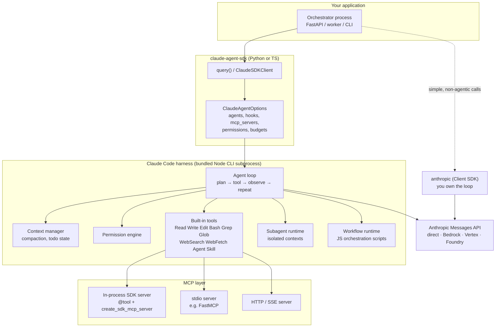

**Read it this way:** everything inside `HARNESS` is what you would otherwise write yourself. That is the entire value proposition of the Agent SDK, and the entire reason a hand-rolled orchestrator on the Client SDK takes three months to reach parity.

---

## 3. Setup and auth

```bash
python -m venv .venv && source .venv/bin/activate
pip install "claude-agent-sdk>=0.2.139" "anthropic>=0.122.0"
node --version   # required by the Agent SDK's bundled CLI
```

```bash
# Direct API
export ANTHROPIC_API_KEY=sk-ant-...

# Amazon Bedrock
export CLAUDE_CODE_USE_BEDROCK=1
export AWS_REGION=us-east-1        # plus your usual AWS credential chain

# Google Vertex AI
export CLAUDE_CODE_USE_VERTEX=1
export ANTHROPIC_VERTEX_PROJECT_ID=my-project
```

> **Terms note:** consumer Claude.ai login and Claude.ai rate limits are not permitted for third-party products built on the Agent SDK unless you have prior approval. Use API-key auth (or Bedrock/Vertex/Foundry).

Model identifiers used throughout:

| Where | Accepts |
|---|---|
| `ClaudeAgentOptions.model` | Full IDs — `claude-opus-5`, `claude-sonnet-5`, `claude-haiku-4-5-20251001` |
| `AgentDefinition.model` | Aliases — `opus`, `sonnet`, `haiku`, `fable`, `inherit` — or a full ID |
| `ClaudeAgentOptions.fallback_model` | Full ID, used when the primary is overloaded |

---

# Level 0 — The primitive: your own tool loop

Build this once, by hand, even though you will never ship it. Everything the Agent SDK does for you becomes legible the moment you have written the loop yourself.

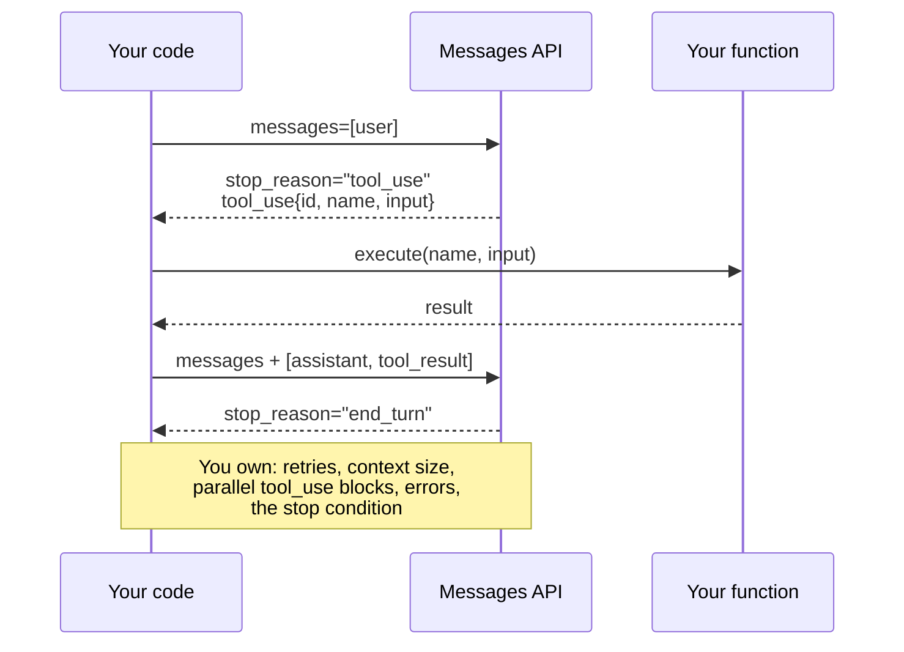

```python
# level0_manual_loop.py
import json
import anthropic

client = anthropic.Anthropic()

TOOLS = [
    {
        "name": "get_account_balance",
        "description": "Return the current balance for a customer account.",
        "input_schema": {
            "type": "object",
            "properties": {"account_id": {"type": "string"}},
            "required": ["account_id"],
        },
    }
]


def get_account_balance(account_id: str) -> str:
    return json.dumps({"account_id": account_id, "balance": 1284.55, "currency": "USD"})


IMPL = {"get_account_balance": get_account_balance}


def run(user_text: str, max_iters: int = 10) -> str:
    messages = [{"role": "user", "content": user_text}]

    for _ in range(max_iters):
        resp = client.messages.create(
            model="claude-sonnet-5",
            max_tokens=2048,
            tools=TOOLS,
            messages=messages,
        )

        if resp.stop_reason != "tool_use":
            return "".join(b.text for b in resp.content if b.type == "text")

        messages.append({"role": "assistant", "content": resp.content})

        # A single turn can contain SEVERAL tool_use blocks. All results go
        # back in ONE user message, or the API rejects the next request.
        results = []
        for block in resp.content:
            if block.type != "tool_use":
                continue
            try:
                out = IMPL[block.name](**block.input)
                results.append(
                    {"type": "tool_result", "tool_use_id": block.id, "content": out}
                )
            except Exception as exc:
                results.append(
                    {
                        "type": "tool_result",
                        "tool_use_id": block.id,
                        "content": f"Error: {exc}",
                        "is_error": True,
                    }
                )

        messages.append({"role": "user", "content": results})

    raise RuntimeError("max iterations reached without end_turn")


if __name__ == "__main__":
    print(run("What is the balance on account ACC-99213?"))
```

**What this loop does not give you, and what you would have to add:**

| Missing | What building it costs you |
|---|---|
| Context overflow handling | A summarizer, a token counter, a policy for what to drop |
| Parallelism | An executor, ordering guarantees on `tool_result` blocks |
| Filesystem/shell tools | Sandboxing, path traversal defence, command allowlists |
| Permissions | An approval protocol and a UI to hang it on |
| Subagents | A second loop, context isolation, result marshalling |
| Sessions | Serialization, resume semantics, transcript storage |
| Retries and 529s | Backoff, fallback model routing, partial-turn recovery |

That table *is* the Agent SDK's changelog.

---

# Level 1 — `tool_runner`: the loop, handed to you

Still the Client SDK, but the loop is automated. This is the sweet spot for "Claude with a few of my functions" — no Node, no filesystem, no harness.

```python
# level1_tool_runner.py
import json
from anthropic import Anthropic, beta_tool

client = Anthropic()


@beta_tool
def get_account_balance(account_id: str) -> str:
    """Return the current balance for a customer account.

    Args:
        account_id: The account identifier, e.g. ACC-99213.

    Returns:
        A JSON-encoded string with account_id, balance, and currency.
    """
    return json.dumps({"account_id": account_id, "balance": 1284.55, "currency": "USD"})


runner = client.beta.messages.tool_runner(
    model="claude-sonnet-5",
    max_tokens=2048,
    tools=[get_account_balance],
    messages=[{"role": "user", "content": "Balance on ACC-99213?"}],
)

for message in runner:
    for block in message.content:
        if block.type == "text":
            print(block.text)
```

The `@beta_tool` decorator derives the JSON schema from your type hints and Google-style docstring — the docstring is not decoration, it becomes the tool description the model reasons over. Use `@beta_async_tool` with `AsyncAnthropic`.

**Where `tool_runner` stops being enough:** the moment you want a second agent, a permission gate, a sandbox, or context that survives a long run. That is the boundary. Cross it and switch packages.

---

# Level 2 — First Agent SDK agent: `query()`

```python
# level2_first_agent.py
import anyio
from claude_agent_sdk import query, ClaudeAgentOptions, AssistantMessage, TextBlock, ResultMessage


async def main() -> None:
    options = ClaudeAgentOptions(
        model="claude-sonnet-5",
        system_prompt="You are a precise repository analyst. Be concise.",
        allowed_tools=["Read", "Grep", "Glob"],
        permission_mode="acceptEdits",
        cwd="./target-repo",
        max_turns=20,
    )

    async for message in query(
        prompt="Find every FastAPI route that lacks an auth dependency. List file:line.",
        options=options,
    ):
        if isinstance(message, AssistantMessage):
            for block in message.content:
                if isinstance(block, TextBlock):
                    print(block.text)
        elif isinstance(message, ResultMessage):
            print(f"\n[{message.subtype}] ${message.total_cost_usd:.4f}")


anyio.run(main)
```

`query()` is a one-shot async generator: one prompt in, a stream of messages out, session closed at the end. Message types worth matching on:

| Type | Meaning |
|---|---|
| `SystemMessage` (`subtype="init"`) | Session start: session_id, model, tool list, MCP server status |
| `AssistantMessage` | Claude's turn — contains `TextBlock`, `ThinkingBlock`, `ToolUseBlock` |
| `UserMessage` | Tool results fed back into the loop |
| `ResultMessage` | Terminal. `subtype`, `total_cost_usd`, `usage`, `session_id`, `num_turns` |
| `TaskStartedMessage` / `TaskProgressMessage` / `TaskNotificationMessage` | Background task lifecycle |
| `HookEventMessage` | Emitted when `include_hook_events=True` |

### The `allowed_tools` trap

`allowed_tools` **pre-approves** tools — it does not decide which tools exist. Availability is controlled by `tools`, `disallowed_tools`, and the agent's `permission_mode`. A tool that is available but not allow-listed will fall through to your `can_use_tool` callback or be denied in `dontAsk` mode. This trips up almost everyone once.

### `setting_sources` — the other trap

By default the SDK does **not** load `CLAUDE.md`, `.claude/agents/`, `.claude/skills/`, or settings files. That is deliberate: a library shouldn't silently inherit a developer's machine config. Opt in explicitly:

```python
options = ClaudeAgentOptions(setting_sources=["project"])  # "user" | "project" | "local"
```

---

# Level 3 — `ClaudeSDKClient`: sessions, streaming, interrupts

`query()` is fine for a job. For a service — anything conversational, anything with human-in-the-loop, anything you need to steer mid-flight — you want the client.

```python
# level3_client.py
import anyio
from claude_agent_sdk import (
    ClaudeSDKClient, ClaudeAgentOptions,
    AssistantMessage, TextBlock, ToolUseBlock, ResultMessage,
)


async def main() -> None:
    options = ClaudeAgentOptions(
        model="claude-sonnet-5",
        allowed_tools=["Read", "Grep", "Glob", "Bash"],
        permission_mode="acceptEdits",
        include_partial_messages=True,   # token-level streaming
        max_budget_usd=2.00,
    )

    async with ClaudeSDKClient(options=options) as client:
        await client.query("Summarize the architecture of this service.")
        session_id = None

        async for msg in client.receive_response():
            if isinstance(msg, AssistantMessage):
                for block in msg.content:
                    if isinstance(block, TextBlock):
                        print(block.text, end="", flush=True)
                    elif isinstance(block, ToolUseBlock):
                        print(f"\n  ⚙ {block.name}", flush=True)
            elif isinstance(msg, ResultMessage):
                session_id = msg.session_id

        # Same session — Claude still has the context from turn 1.
        await client.query("Now list the top 3 reliability risks you saw.")
        async for msg in client.receive_response():
            if isinstance(msg, AssistantMessage):
                for block in msg.content:
                    if isinstance(block, TextBlock):
                        print(block.text, end="", flush=True)

        print(f"\n\nsession: {session_id}")


anyio.run(main)
```

Control-plane methods on the client that matter for an orchestrator:

| Method | Use |
|---|---|
| `await client.interrupt()` | Stop the current turn. This is your cancel button. |
| `await client.set_permission_mode(mode)` | Escalate/de-escalate mid-run — e.g. drop to `plan` when a risky file is touched |
| `await client.set_model(model)` | Switch tiers mid-session — cheap for triage, expensive for the hard part |
| `await client.get_mcp_status()` | Health-check MCP servers before dispatching work |
| `await client.reconnect_mcp_server(name)` / `toggle_mcp_server(name, enabled)` | Recover a flapping backend without killing the session |
| `await client.stop_task(task_id)` | Kill one background subagent, not the whole run |
| `await client.rewind_files(user_message_id)` | Undo file edits back to a checkpoint (`enable_file_checkpointing=True`) |

### Resume, fork, persist

```python
# Continue an earlier session
options = ClaudeAgentOptions(resume="ses_abc123")

# Branch it instead — the original stays intact. Good for A/B-ing an approach.
options = ClaudeAgentOptions(resume="ses_abc123", fork_session=True)

# Custom persistence (Redis, S3, Postgres) instead of ~/.claude on disk
from claude_agent_sdk import InMemorySessionStore
options = ClaudeAgentOptions(session_store=InMemorySessionStore())
```

`fork_session` is the underrated one. In an orchestrator, forking a session gives you N variants of the *same* accumulated context — that is the cheap way to run a panel of critics without re-establishing context N times.

---

# Level 4 — Tools: in-process MCP and external MCP

Three ways to hand Claude a capability. Pick by process boundary, not by taste.

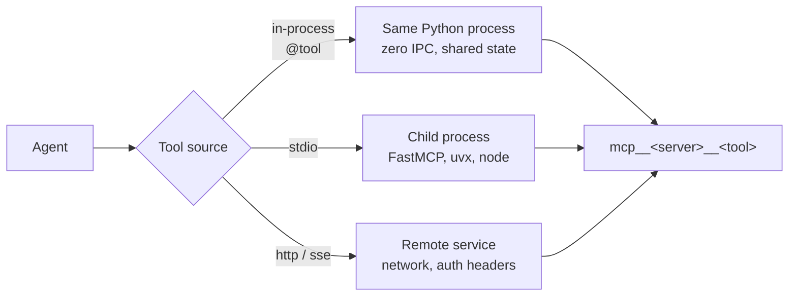

### In-process (recommended default)

```python
# level4_inprocess_tools.py
import anyio
from claude_agent_sdk import (
    tool, create_sdk_mcp_server, ClaudeSDKClient, ClaudeAgentOptions,
    AssistantMessage, TextBlock,
)

# Shared state your tools can close over — a DB pool, a feature-flag client,
# a request-scoped tenant ID. This is why in-process wins for enterprise work.
LEDGER = {"ACC-99213": 1284.55}


@tool("get_balance", "Get the current balance for an account", {"account_id": str})
async def get_balance(args):
    bal = LEDGER.get(args["account_id"])
    if bal is None:
        return {"content": [{"type": "text", "text": "Account not found"}], "is_error": True}
    return {"content": [{"type": "text", "text": f"${bal:.2f}"}]}


@tool("issue_refund", "Issue a refund against an account", {"account_id": str, "amount": float})
async def issue_refund(args):
    LEDGER[args["account_id"]] = LEDGER.get(args["account_id"], 0) - args["amount"]
    return {"content": [{"type": "text", "text": f"Refunded ${args['amount']:.2f}"}]}


banking = create_sdk_mcp_server(name="banking", version="1.0.0",
                                tools=[get_balance, issue_refund])


async def main() -> None:
    options = ClaudeAgentOptions(
        mcp_servers={"banking": banking},
        allowed_tools=["mcp__banking__get_balance"],   # refund NOT auto-approved
        model="claude-sonnet-5",
    )
    async with ClaudeSDKClient(options=options) as client:
        await client.query("What's the balance on ACC-99213?")
        async for msg in client.receive_response():
            if isinstance(msg, AssistantMessage):
                for b in msg.content:
                    if isinstance(b, TextBlock):
                        print(b.text)


anyio.run(main)
```

Note the naming convention: `mcp__<server_name>__<tool_name>`. And note what the allow-list does above — `get_balance` runs freely, `issue_refund` will hit the permission path. That is a one-line human-in-the-loop gate, and it is the right place to put it.

### External MCP servers

```python
options = ClaudeAgentOptions(
    mcp_servers={
        "internal":   banking,                                    # in-process
        "docs": {                                                 # stdio (FastMCP etc.)
            "type": "stdio",
            "command": "python",
            "args": ["-m", "my_company.mcp.docling_server"],
            "env": {"DOCLING_OCR": "1"},
        },
        "platform": {                                             # remote HTTP
            "type": "http",
            "url": "https://mcp.internal.example.com/mcp",
            "headers": {"Authorization": "Bearer ${PLATFORM_TOKEN}"},
        },
    },
    allowed_tools=["mcp__internal__get_balance", "mcp__docs__parse_pdf"],
    strict_mcp_config=True,   # ignore filesystem MCP config; use only what's here
)
```

Set `strict_mcp_config=True` in production. Without it, a developer's `~/.claude.json` can inject servers into your deployed agent.

### Choosing

| | In-process | stdio | HTTP |
|---|---|---|---|
| Latency | Lowest — a function call | Process spawn + pipe | Network |
| Shared state | Direct (pools, sessions, tenant context) | Serialized only | Serialized only |
| Blast radius | Same process — a bad tool takes the agent down | Isolated | Isolated |
| Reuse across teams | Python-only | Any language, any consumer | Any language, any consumer |
| Fit | Business logic tied to this agent | An existing FastMCP server you already ship | A platform capability behind auth |

If you already have FastMCP servers, don't rewrite them — mount them as `stdio` or `http`. Use in-process for the glue that is specific to *this* orchestrator.

---

# Level 5 — Subagents: the orchestrator primitive

This is the whole ballgame. A subagent is a separate agent instance, spawned by the parent through the `Agent` tool, running in its own fresh context.

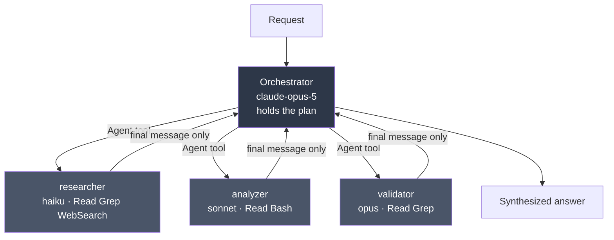

### The four reasons subagents exist

1. **Context isolation.** A subagent that reads 80 files returns one paragraph. The 80 files never enter the orchestrator's context. This is the single biggest lever on long-running agent quality.
2. **Parallelism.** Independent subagents run concurrently — wall clock is the slowest one, not the sum.
3. **Specialization.** Each gets its own system prompt, so domain instructions don't pile up in one bloated prompt.
4. **Least privilege.** A reviewer gets `["Read", "Grep", "Glob"]` and structurally *cannot* write. Not "asked not to" — cannot.

### Working code

```python
# level5_subagents.py
import anyio
from claude_agent_sdk import (
    query, ClaudeAgentOptions, AgentDefinition,
    AssistantMessage, TextBlock, ToolUseBlock, ResultMessage,
)

AGENTS = {
    "researcher": AgentDefinition(
        description=(
            "Gathers facts from the codebase and the web. Use for discovery, "
            "'find all X', and background reading. Never modifies anything."
        ),
        prompt=(
            "You are a research specialist. Gather evidence and report findings "
            "with file:line citations. Do not speculate. Do not propose fixes. "
            "Return a compact bulleted summary, never raw file dumps."
        ),
        tools=["Read", "Grep", "Glob", "WebSearch"],
        model="haiku",
        maxTurns=15,
    ),
    "analyzer": AgentDefinition(
        description=(
            "Performs deep technical analysis of code a researcher has located. "
            "Use for root-cause analysis and design critique."
        ),
        prompt=(
            "You are a staff engineer. Given specific files, analyze correctness, "
            "concurrency, and failure modes. Rank findings by severity. "
            "Support every claim with the code you read."
        ),
        tools=["Read", "Grep", "Glob", "Bash"],
        model="sonnet",
        effort="high",
    ),
    "validator": AgentDefinition(
        description=(
            "Adversarially checks another agent's findings. Use before reporting "
            "anything to a human."
        ),
        prompt=(
            "You are a skeptical reviewer. For each claim you are given, try to "
            "REFUTE it by reading the code. Label each: CONFIRMED, REFUTED, or "
            "UNVERIFIABLE, with the evidence that decided it."
        ),
        tools=["Read", "Grep", "Glob"],
        model="opus",
    ),
}


async def main() -> None:
    options = ClaudeAgentOptions(
        model="claude-opus-5",
        agents=AGENTS,
        # "Agent" MUST be allow-listed or delegation silently never happens.
        allowed_tools=["Read", "Grep", "Glob", "Agent"],
        system_prompt=(
            "You are an orchestrator. You do not investigate yourself. "
            "Delegate discovery to the researcher, deep analysis to the analyzer, "
            "and verification to the validator. Dispatch independent work in "
            "PARALLEL in a single turn. Synthesize only what the validator "
            "confirmed."
        ),
        env={
            "CLAUDE_CODE_MAX_SUBAGENT_SPAWN_DEPTH": "1",   # no grandchildren
            "CLAUDE_CODE_MAX_CONCURRENT_SUBAGENTS": "5",
        },
        max_budget_usd=5.0,
        cwd="./target-repo",
    )

    async for message in query(
        prompt="Audit this service for unhandled error paths in the payment flow.",
        options=options,
    ):
        if isinstance(message, AssistantMessage):
            for block in message.content:
                if isinstance(block, ToolUseBlock) and block.name in ("Agent", "Task"):
                    print(f"→ dispatch: {block.input.get('subagent_type')}")
                elif isinstance(block, TextBlock):
                    print(block.text)
        elif isinstance(message, ResultMessage):
            print(f"\n[{message.subtype}] ${message.total_cost_usd:.4f} "
                  f"turns={message.num_turns}")


anyio.run(main)
```

### `AgentDefinition` — the complete field list

Verified by introspecting `claude_agent_sdk.AgentDefinition` at `0.2.139`:

| Field | Type | Required | Notes |
|---|---|---|---|
| `description` | `str` | ✅ | **This is the routing key.** Claude reads it to decide when to delegate. Write it as "use for X, Y, Z" |
| `prompt` | `str` | ✅ | The subagent's system prompt |
| `tools` | `list[str]` | | Omit → inherits everything available to subagents. List → *only* those |
| `disallowedTools` | `list[str]` | | Subtractive. Accepts `mcp__server`, `mcp__server__*`, `mcp__*` |
| `model` | `str` | | `opus` / `sonnet` / `haiku` / `fable` / `inherit` / full ID |
| `skills` | `list[str]` | | Preloaded into context at startup |
| `memory` | `'user'\|'project'\|'local'` | | Memory source |
| `mcpServers` | `list[str \| dict]` | | By name, or inline config |
| `initialPrompt` | `str` | | Auto-submitted first turn **only** when run as main-thread agent; ignored as a subagent |
| `maxTurns` | `int` | | Hard stop on agentic turns |
| `background` | `bool` | | Force non-blocking execution |
| `effort` | `'low'\|'medium'\|'high'\|'xhigh'\|'max'\|int` | | Reasoning effort |
| `permissionMode` | `'default'\|'acceptEdits'\|'plan'\|'bypassPermissions'\|'dontAsk'\|'auto'` | | Per-agent permission policy |

> **Python quirk, not a typo:** multi-word fields stay **camelCase** (`disallowedTools`, `mcpServers`, `maxTurns`, `permissionMode`) because they match the wire format. Meanwhile `ClaudeAgentOptions` uses snake_case (`allowed_tools`, `mcp_servers`, `max_turns`). Mixing these up is the most common runtime error in Agent SDK code.

### What a subagent does and does not inherit

| Receives | Does **not** receive |
|---|---|
| Its own `prompt` | The parent's conversation history |
| The `Agent` tool call's prompt string | The parent's tool results |
| Project `CLAUDE.md` (only if `setting_sources` is set) | The parent's system prompt |
| Tool definitions (inherited or the `tools` subset) | Preloaded skills, unless listed in `skills` |

**Practical consequence:** the Agent tool's prompt string is your *only* channel from parent to child. Every file path, error message, and decision the subagent needs must be written into it. Orchestrator prompts should therefore say "when you delegate, include the exact file paths and the specific question."

### Delegation isn't happening — the checklist

1. Is `"Agent"` in `allowed_tools`? (Most common cause by far.)
2. Is the `description` written as a *routing instruction*, or as a job title? "Expert reviewer" routes badly; "Use for security reviews of auth code before merge" routes well.
3. Force it: `"Use the validator agent to check these findings."` Explicit naming bypasses matching entirely.
4. On Opus 5 with the `claude_code` system-prompt preset, the harness adds a line telling Claude *not* to spawn subagents unless asked. With a custom `system_prompt`, that line is absent — which is usually what you want in an orchestrator.

### Detecting delegation in your stream

```python
if isinstance(block, ToolUseBlock) and block.name in ("Agent", "Task"):
    subagent_type = block.input.get("subagent_type")

# Messages produced INSIDE a subagent carry parent_tool_use_id
if getattr(message, "parent_tool_use_id", None):
    ...  # attribute this span to the child, not the parent
```

The tool was renamed `Task` → `Agent` in Claude Code v2.1.63. Current SDKs emit `"Agent"` in `tool_use` blocks but still say `"Task"` in the `system:init` tool list and in `result.permission_denials[].tool_name`. **Match both**, always.

### Behaviour change you must know (v2.1.198+)

Subagents now run **in the background by default**. An `Agent` call that omits `run_in_background` launches a background subagent; Claude sets `run_in_background: false` when it needs the result before continuing. Before v2.1.198 the default was synchronous. If you inherited code written against the old default, its sequencing assumptions are wrong.

---

# Level 6 — The six orchestration patterns

Same primitives, six shapes. Choose by the *dependency structure of the work*, not by what sounds sophisticated.

## 6.1 Sequential pipeline

Each stage consumes the previous stage's output. Use when stage N genuinely cannot start without stage N−1.

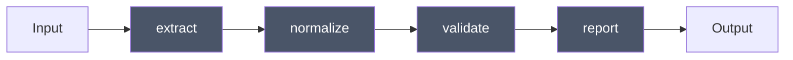

Two implementations, and the choice matters:

**(a) Model-driven** — the orchestrator decides the order. Flexible; costs a turn per hop; can skip steps.

```python
options = ClaudeAgentOptions(
    agents={"extract": ..., "normalize": ..., "validate": ..., "report": ...},
    allowed_tools=["Agent"],
    system_prompt=(
        "Run this pipeline strictly in order: extract → normalize → validate → report. "
        "Pass each stage's full output into the next stage's prompt. "
        "If validate reports failures, return to normalize once, then stop."
    ),
)
```

**(b) Code-driven** — you own the order in Python. Deterministic, testable, cheaper. **Prefer this when the sequence is known.**

```python
# level6_sequential.py
import anyio
from claude_agent_sdk import query, ClaudeAgentOptions, ResultMessage


async def run_stage(name: str, prompt: str, system: str, tools: list[str]) -> str:
    out: list[str] = []
    async for msg in query(
        prompt=prompt,
        options=ClaudeAgentOptions(
            model="claude-sonnet-5",
            system_prompt=system,
            allowed_tools=tools,
            max_turns=12,
        ),
    ):
        if isinstance(msg, ResultMessage):
            out.append(msg.result or "")
    return "\n".join(out)


async def pipeline(doc_path: str) -> str:
    extracted = await run_stage(
        "extract", f"Extract all line items from {doc_path}.",
        "You are a document extraction specialist. Output JSON only.",
        ["Read", "Grep"],
    )
    normalized = await run_stage(
        "normalize", f"Normalize these line items to our schema:\n{extracted}",
        "You normalize financial line items. Output JSON only.", ["Read"],
    )
    validated = await run_stage(
        "validate", f"Validate and flag anomalies:\n{normalized}",
        "You are a validation engine. List every violation with a rule ID.", ["Read"],
    )
    return validated


print(anyio.run(pipeline, "./invoices/2026-Q2.pdf"))
```

**Rule of thumb:** if you can draw the flowchart before the run starts, put it in code. Let the model decide control flow only when the control flow genuinely depends on what it finds.

## 6.2 Parallel fan-out / map-reduce

N independent units of work, one reducer. The highest-leverage pattern in practice.

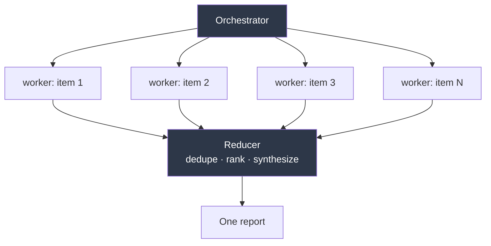

```python
# level6_fanout.py
import anyio
from claude_agent_sdk import query, ClaudeAgentOptions, AgentDefinition, ResultMessage

AGENTS = {
    "file-auditor": AgentDefinition(
        description="Audits ONE file for a specific issue class. Use once per file.",
        prompt=(
            "Audit exactly the file named in your prompt. Report findings as "
            "`SEVERITY | file:line | description`. If clean, output exactly: CLEAN."
        ),
        tools=["Read", "Grep"],
        model="haiku",
        maxTurns=8,
    ),
    "reducer": AgentDefinition(
        description="Merges many per-file audit findings into one ranked report.",
        prompt=(
            "You receive findings from many auditors. Deduplicate, group by root "
            "cause, rank by severity × blast radius. Output a single ranked list."
        ),
        tools=["Read"],
        model="opus",
    ),
}

options = ClaudeAgentOptions(
    model="claude-opus-5",
    agents=AGENTS,
    allowed_tools=["Read", "Grep", "Glob", "Agent"],
    system_prompt=(
        "Enumerate the target files first with Glob. Then dispatch ONE file-auditor "
        "per file, ALL IN A SINGLE TURN so they run concurrently. Do not audit "
        "anything yourself. When every auditor has returned, dispatch the reducer "
        "with all findings."
    ),
    env={"CLAUDE_CODE_MAX_CONCURRENT_SUBAGENTS": "10"},
    max_budget_usd=8.0,
    cwd="./target-repo",
)
```

Two things make or break fan-out:

- **"in a single turn"** in the orchestrator prompt. Without it Claude tends to dispatch one, wait, dispatch the next — serial execution wearing a parallel costume.
- **A structured return contract** (`SEVERITY | file:line | description`, or exactly `CLEAN`). The reducer's job gets dramatically easier and its output far more stable.

You can also run the fan-out in Python instead, with `anyio` — same shape, deterministic, and no orchestrator tokens spent on routing:

```python
async def fan_out(files: list[str]) -> list[str]:
    results: list[str] = []

    async def audit(path: str) -> None:
        async for msg in query(
            prompt=f"Audit {path} for missing auth checks.",
            options=ClaudeAgentOptions(model="claude-haiku-4-5-20251001",
                                       allowed_tools=["Read", "Grep"], max_turns=8),
        ):
            if isinstance(msg, ResultMessage) and msg.result:
                results.append(msg.result)

    limiter = anyio.CapacityLimiter(10)

    async def guarded(path: str) -> None:
        async with limiter:
            await audit(path)

    async with anyio.create_task_group() as tg:
        for f in files:
            tg.start_soon(guarded, f)
    return results
```

## 6.3 Router / handoff

One classifier, N specialists, no fan-out. Cheap model routes; expensive model executes.

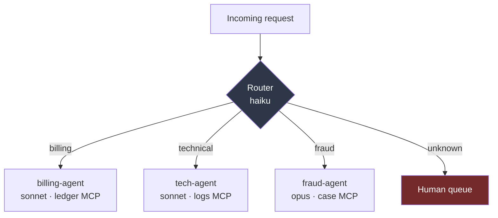

```python
AGENTS = {
    "billing-agent": AgentDefinition(
        description="Handles billing: charges, refunds, statements, disputes over amounts.",
        prompt="You are a billing specialist. Resolve billing issues using ledger tools only.",
        tools=["mcp__ledger__get_balance", "mcp__ledger__list_transactions"],
        model="sonnet",
    ),
    "fraud-agent": AgentDefinition(
        description="Handles suspected fraud, unauthorized transactions, and account takeover.",
        prompt=(
            "You are a fraud analyst. Investigate thoroughly. Never take an "
            "irreversible action; recommend and escalate."
        ),
        tools=["mcp__cases__lookup", "mcp__cases__create"],
        model="opus",
        effort="high",
    ),
}

options = ClaudeAgentOptions(
    model="claude-haiku-4-5-20251001",      # router is cheap on purpose
    agents=AGENTS,
    allowed_tools=["Agent"],                # router has NO other tools
    system_prompt=(
        "You are a router. Classify the request and delegate to exactly ONE agent. "
        "You have no other tools and must not attempt to answer yourself. "
        "If confidence is below 0.8 or the request spans categories, reply exactly: "
        "ESCALATE_TO_HUMAN followed by your reasoning."
    ),
)
```

The design point: **strip the router's tools to `["Agent"]` only.** A router that can also read files will read files. Capability removal is more reliable than instruction.

## 6.4 Evaluator–optimizer (generator ↔ critic)

The pattern that most improves output quality per dollar. Generate, critique, revise, until a bar is met or progress stalls.

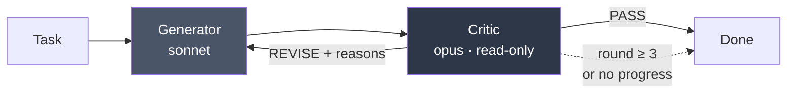

```python
# level6_evaluator_optimizer.py
import anyio
from claude_agent_sdk import query, ClaudeAgentOptions, ResultMessage


async def one_shot(prompt: str, system: str, tools: list[str], model: str) -> str:
    text = ""
    async for msg in query(
        prompt=prompt,
        options=ClaudeAgentOptions(model=model, system_prompt=system,
                                   allowed_tools=tools, max_turns=15),
    ):
        if isinstance(msg, ResultMessage):
            text = msg.result or ""
    return text


async def refine(task: str, max_rounds: int = 3) -> str:
    draft = await one_shot(
        task,
        "You are a senior engineer. Produce a complete, working solution.",
        ["Read", "Write", "Edit", "Grep", "Glob"],
        "claude-sonnet-5",
    )

    for round_no in range(1, max_rounds + 1):
        verdict = await one_shot(
            f"Task:\n{task}\n\nProposed solution:\n{draft}\n\n"
            "Judge it. Reply with PASS, or REVISE followed by numbered, "
            "specific, actionable defects. Do not rewrite it yourself.",
            "You are a demanding staff-level reviewer. Correctness, then edge "
            "cases, then clarity. Be specific. Vague criticism is a failure.",
            ["Read", "Grep", "Glob"],
            "claude-opus-5",
        )
        if verdict.strip().startswith("PASS"):
            return draft

        draft = await one_shot(
            f"Task:\n{task}\n\nCurrent solution:\n{draft}\n\n"
            f"Reviewer defects:\n{verdict}\n\nAddress every defect. Change nothing else.",
            "You are a senior engineer revising against specific review feedback.",
            ["Read", "Write", "Edit", "Grep", "Glob"],
            "claude-sonnet-5",
        )
    return draft
```

Two non-obvious rules:

- **The critic must be read-only.** A critic that can edit will fix things silently, and you lose the signal about what was wrong.
- **The critic must not see its own previous verdicts.** Fresh context per round prevents it from anchoring on "I already said this is fine."

## 6.5 Debate / panel (independent perspectives, then adjudication)

For decisions where a single pass is unreliable: architecture choices, risk judgements, ambiguous classification.

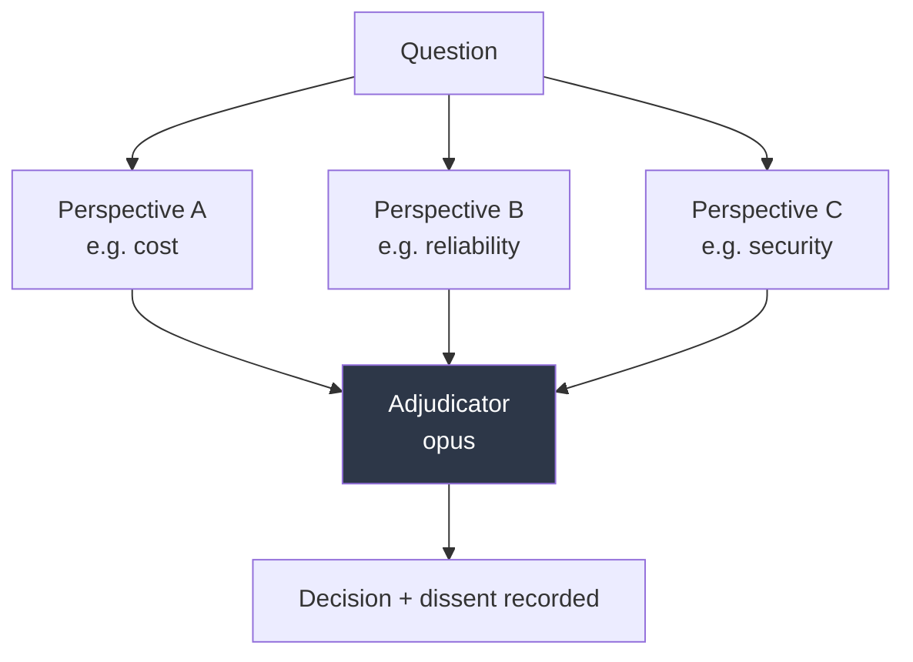

The critical constraint: **the panelists must not see each other's answers before they answer.** Independence is the entire source of signal. Dispatch them in one turn with disjoint prompts; only the adjudicator sees all three.

```python
AGENTS = {
    "cost-analyst": AgentDefinition(
        description="Argues the cost/TCO perspective on an architecture decision.",
        prompt=("Argue purely from cost and operational burden. State your position, "
                "your three strongest reasons, and the strongest objection to yourself."),
        tools=["Read", "Grep", "WebSearch"], model="sonnet",
    ),
    "reliability-analyst": AgentDefinition(
        description="Argues the reliability/failure-mode perspective.",
        prompt=("Argue purely from availability, failure modes, and blast radius. "
                "State your position, three reasons, and the strongest objection to yourself."),
        tools=["Read", "Grep", "WebSearch"], model="sonnet",
    ),
    "security-analyst": AgentDefinition(
        description="Argues the security and compliance perspective.",
        prompt=("Argue purely from security, data handling, and auditability. "
                "State your position, three reasons, and the strongest objection to yourself."),
        tools=["Read", "Grep", "WebSearch"], model="sonnet",
    ),
    "adjudicator": AgentDefinition(
        description="Weighs independent analyst positions and issues a decision.",
        prompt=("You receive independent positions. Identify where they genuinely "
                "conflict versus talk past each other. Issue ONE decision, state "
                "what would change your mind, and record dissent verbatim."),
        tools=["Read"], model="opus", effort="high",
    ),
}
```

## 6.6 Hierarchical (orchestrator of orchestrators)

For work that decomposes into sub-domains, each of which itself decomposes.

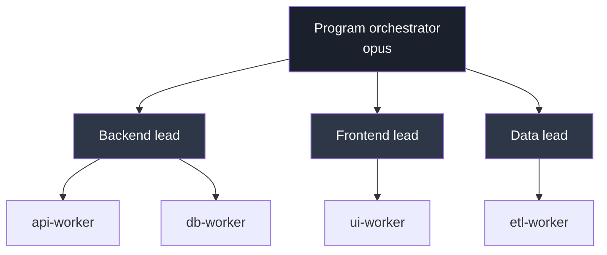

Subagents can spawn subagents, so this works out of the box. It is also the fastest way to burn money by accident. Bound it:

```python
options = ClaudeAgentOptions(
    env={
        "CLAUDE_CODE_MAX_SUBAGENT_SPAWN_DEPTH": "2",   # default 3; 1 = no grandchildren
        "CLAUDE_CODE_MAX_CONCURRENT_SUBAGENTS": "8",   # default 20
    },
    max_budget_usd=25.0,
)
```

| Limit | Set via | Default | Behaviour at the limit |
|---|---|---|---|
| Depth | `CLAUDE_CODE_MAX_SUBAGENT_SPAWN_DEPTH` | `3` | Bottom-layer agent can't spawn; does the work itself |
| Concurrency | `CLAUDE_CODE_MAX_CONCURRENT_SUBAGENTS` | `20` | Returns `Concurrent subagent limit reached` until a slot frees |
| Spend | `max_budget_usd` | none | Refuses new subagents, stops background ones, ends with `error_max_budget_usd` |

> **TS vs Python `env` gotcha:** the TypeScript SDK *replaces* the subprocess environment (spread `process.env` or you lose `PATH`); the Python SDK *merges* into the inherited environment.

### Honest guidance: go flat before you go deep

Two-level hierarchy (orchestrator → workers) covers the overwhelming majority of real systems. Three levels multiplies cost, makes tracing painful, and degrades the telephone-game problem — the orchestrator's instruction is summarized twice before it reaches the agent doing the work. Add a level only when you can point at a specific failure that flatness caused.

---

# Level 7 — Control plane: hooks, permissions, human-in-the-loop

Prompts are advisory. Hooks and permissions are enforcement. In any regulated or money-touching system, the enforcement layer is where you spend your review time.

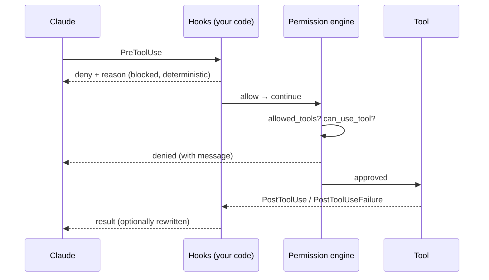

### Hook events (verified in `0.2.139`)

`PreToolUse` · `PostToolUse` · `PostToolUseFailure` · `UserPromptSubmit` · `Stop` · `SubagentStop` · `SubagentStart` · `PreCompact` · `Notification` · `PermissionRequest`

`SubagentStart` and `SubagentStop` are the ones orchestrator builders under-use — they are your span boundaries for tracing and your accounting points for per-agent cost.

```python
# level7_hooks.py
import anyio
from claude_agent_sdk import ClaudeSDKClient, ClaudeAgentOptions, HookMatcher

DESTRUCTIVE = ("rm -rf", "drop table", "truncate", "git push --force", "kubectl delete")


async def block_destructive(input_data, tool_use_id, context):
    if input_data.get("tool_name") != "Bash":
        return {}
    cmd = (input_data.get("tool_input") or {}).get("command", "").lower()
    for pattern in DESTRUCTIVE:
        if pattern in cmd:
            return {
                "hookSpecificOutput": {
                    "hookEventName": "PreToolUse",
                    "permissionDecision": "deny",
                    "permissionDecisionReason": (
                        f"Blocked by policy: command matched '{pattern}'."
                    ),
                }
            }
    return {}


async def audit_subagent_start(input_data, tool_use_id, context):
    print(f"[audit] subagent start: {input_data.get('agent_type')} "
          f"id={input_data.get('agent_id')}")
    return {}


async def audit_subagent_stop(input_data, tool_use_id, context):
    print(f"[audit] subagent stop: {input_data.get('agent_id')}")
    return {}


options = ClaudeAgentOptions(
    model="claude-sonnet-5",
    allowed_tools=["Read", "Grep", "Glob", "Bash", "Agent"],
    hooks={
        "PreToolUse": [HookMatcher(matcher="Bash", hooks=[block_destructive])],
        "SubagentStart": [HookMatcher(hooks=[audit_subagent_start])],
        "SubagentStop": [HookMatcher(hooks=[audit_subagent_stop])],
    },
    include_hook_events=True,
)
```

> Hooks require `ClaudeSDKClient` — they are **not** supported with bare `query()`. The Python SDK also does not support `SessionStart`, `SessionEnd`, or `Notification` hooks due to setup constraints.

### Human-in-the-loop via `can_use_tool`

This is the mechanism for the confirmation step in any approval workflow — a refund, a production deploy, a customer-facing message.

```python
# level7_hitl.py
from claude_agent_sdk import (
    ClaudeSDKClient, ClaudeAgentOptions,
    PermissionResultAllow, PermissionResultDeny,
)

REQUIRES_APPROVAL = {"mcp__banking__issue_refund", "mcp__ledger__post_adjustment"}
AUTO_APPROVE_UNDER = 50.00


async def approval_gate(tool_name: str, tool_input: dict, context):
    if tool_name not in REQUIRES_APPROVAL:
        return PermissionResultAllow()

    amount = float(tool_input.get("amount", 0))

    # Policy tier 1: small amounts flow through, with the input pinned.
    if amount < AUTO_APPROVE_UNDER:
        return PermissionResultAllow(updated_input=tool_input)

    # Policy tier 2: real human. Replace this with your queue / websocket / Slack.
    decision = await ask_human(
        f"Approve {tool_name} for ${amount:.2f} on "
        f"{tool_input.get('account_id')}?"
    )

    if decision.approved:
        # You can MUTATE the input on the way through — e.g. cap the amount,
        # attach the approver ID for the downstream audit trail.
        return PermissionResultAllow(
            updated_input={**tool_input, "approved_by": decision.approver_id}
        )

    return PermissionResultDeny(
        message=f"Denied by {decision.approver_id}: {decision.reason}",
        interrupt=False,   # True = kill the run; False = let Claude adapt
    )


options = ClaudeAgentOptions(
    mcp_servers={"banking": banking_server},
    allowed_tools=["mcp__banking__get_balance"],   # read-only is pre-approved
    can_use_tool=approval_gate,                    # everything else routes here
    permission_mode="default",
)
```

Three details that matter in production:

1. **`updated_input` is a mutation point, not just a yes/no.** Cap amounts, inject the approver ID, redact a field, rewrite a target path. Your audit trail gets built here.
2. **`interrupt=True` vs `False`.** `False` returns the denial to Claude as a tool result, and Claude will try to work around it — sometimes usefully, sometimes by finding a path you didn't want. For hard policy stops, use `True`.
3. **Approvals happen in the parent, never in a subagent.** A subagent cannot prompt a human mid-task. Therefore: **put investigation in subagents and approval-gated actions in the parent.** This single rule prevents most multi-agent approval bugs.

### Permission modes

| Mode | Behaviour |
|---|---|
| `default` | Prompts (via `can_use_tool`) for anything not allow-listed |
| `acceptEdits` | File edits auto-approved; other tools still gated |
| `plan` | Read-only. Claude produces a plan and cannot act. **Use for dry runs.** |
| `dontAsk` | Never prompts — anything not allow-listed is denied outright |
| `bypassPermissions` | No checks at all. Ephemeral sandboxes only |
| `auto` | Harness-managed classification |

`plan` mode plus `fork_session` gives you a clean "propose, review, then execute" flow: plan on a fork, show a human the plan, then run the approved version on the main session.

---

# Level 8 — Scaling out: dynamic workflows and agent teams

Beyond a handful of delegated tasks per turn, subagents stop being the right shape. Two things exist above them.

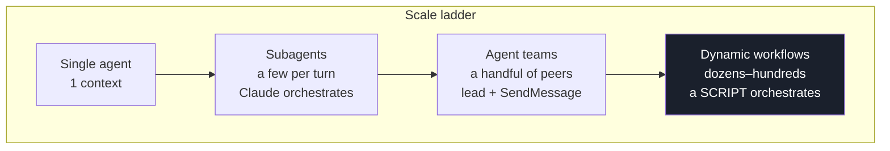

### Who holds the plan — the only question that matters

| | Subagents | Skills | Agent teams | Workflows |
|---|---|---|---|---|
| What it is | A worker Claude spawns | Instructions Claude follows | A lead supervising peer sessions | A script the runtime executes |
| Who decides what's next | Claude, turn by turn | Claude, per the prompt | The lead, turn by turn | **The script** |
| Where intermediate results live | Claude's context | Claude's context | A shared task list | **Script variables** |
| What's repeatable | The worker definition | The instructions | The team definition | **The orchestration itself** |
| Scale | A few per turn | Same | A handful of long-running peers | Dozens to hundreds per run |
| Interruption | Restarts the turn | Restarts the turn | Teammates keep running | Resumable in-session |

### Dynamic workflows

Claude writes a JavaScript orchestration script for your task; a runtime executes it in the background while the session stays responsive. Because the loop, branching, and intermediate results live in **script variables**, none of that lands in a context window — which is why it scales to hundreds of agents without drowning.

The saved script shape:

```javascript
export const meta = {
  name: 'audit-routes',
  description: 'Audit every route handler for missing auth checks',
}

const found = await agent('List every .ts file under src/routes/.', {
  schema: {
    type: 'object',
    required: ['files'],
    properties: { files: { type: 'array', items: { type: 'string' } } },
  },
})

const audits = await pipeline(found.files, file =>
  agent(`Audit ${file} for missing authentication checks.`, { label: file }),
)

return audits.filter(Boolean)
```

`agent()` spawns one subagent; `pipeline()` runs one per list item. An `agent()` call resolves to `null` if stopped or on an unrecoverable API error — hence `.filter(Boolean)`.

Runtime constraints to design against:

| Constraint | Implication |
|---|---|
| No mid-run user input | For sign-off between stages, run each stage as its own workflow |
| No direct filesystem or shell access from the script | The script coordinates; only agents touch the world |
| No module loading (`import()` fails before the run starts) | Anything needing a library goes inside an agent's task |
| Up to 16 concurrent agents, fewer on constrained CPUs | Plan wall-clock accordingly |
| 1,000 agents total per run | Hard runaway guard |
| Fan-out siblings stagger up to 5s (`CLAUDE_CODE_WORKFLOW_PREFIX_STAGGER_MS`) | Deliberate — they share the first agent's prompt cache |

From the Agent SDK: include `Workflow` in `allowedTools` to auto-approve runs. The `Workflow` tool is TypeScript Agent SDK v0.3.149+. In `claude -p` and the Agent SDK there is no one to prompt, so runs start immediately under your configured permission rules — which means **your permission config is the only thing standing between a workflow and your filesystem.** Configure it before you enable this.

Resume semantics have a sharp edge worth internalizing: replay follows the order agents *started*. Cached results stop at the first agent that didn't finish, and **every agent that started after that one re-runs, even if it completed.** Many small agents therefore preserve more progress than a few long ones.

### Agent teams

Two to sixteen full Claude Code sessions, one lead, coordinating through a shared task list and peer-to-peer `SendMessage`. Unlike subagents, teammates can message *each other* without the lead relaying. Each teammate is a full context window — expect a multiple of single-session token cost.

Security properties worth quoting to your security reviewer: a message arriving over `SendMessage` is labeled to the receiving agent as coming from another Claude session, not from you. A teammate cannot approve a permission prompt or supply consent on your behalf, and a denied teammate cannot relay the action to another teammate to bypass the check. Teammate permission prompts surface in the lead session.

### Picking

- **Subagents** — your default. Reach for anything else only when you can name what subagents failed at.
- **Agent teams** — when workers genuinely need to *coordinate with each other* mid-task (competing hypotheses, cross-layer work).
- **Workflows** — when the run is large, repetitive, and you want the orchestration as a readable, re-runnable artifact.
- **Your own Python orchestration over `query()`** — when the control flow is known, must be deterministic, must be unit-testable, and must integrate with your existing scheduler. **For a regulated production pipeline, this is often the right answer even though it is the least fashionable one.**

---

# Level 9 — Production: cost, observability, evals, deployment

## 9.1 Cost control, in layers

```python
options = ClaudeAgentOptions(
    max_budget_usd=10.0,        # hard stop → error_max_budget_usd
    max_turns=40,               # loop guard
    task_budget={"total": 200_000},   # token budget the MODEL is aware of; it paces itself
    model="claude-sonnet-5",
    fallback_model="claude-haiku-4-5-20251001",
    env={
        "CLAUDE_CODE_MAX_SUBAGENT_SPAWN_DEPTH": "1",
        "CLAUDE_CODE_MAX_CONCURRENT_SUBAGENTS": "6",
    },
)
```

`task_budget` is different in kind from the others: it is sent as `output_config.task_budget` and the model is *told* its remaining budget, so it paces tool use and wraps up rather than being guillotined. Use it together with `max_budget_usd`, not instead of it.

**Model tiering is the biggest single lever.** A realistic split:

| Role | Model | Why |
|---|---|---|
| Router / classifier | `haiku` | Thousands of calls, trivial decision |
| Fan-out workers | `haiku` or `sonnet` | Bounded, repetitive, narrow context |
| Orchestrator | `opus` | Must reason across heterogeneous results |
| Critic / adjudicator | `opus` | Quality gate — the one place to overspend |

## 9.2 Observability

Track cost and latency **per agent**, not per run — a run-level number tells you nothing about which specialist is burning your budget.

```python
# level9_tracing.py
from dataclasses import dataclass, field
from claude_agent_sdk import (
    ClaudeAgentOptions, HookMatcher, AssistantMessage, ToolUseBlock, ResultMessage,
)


@dataclass
class RunTelemetry:
    dispatches: list[dict] = field(default_factory=list)
    total_cost_usd: float = 0.0
    turns: int = 0


telemetry = RunTelemetry()


async def on_subagent_start(input_data, tool_use_id, context):
    telemetry.dispatches.append({
        "agent_type": input_data.get("agent_type"),
        "agent_id": input_data.get("agent_id"),
        "session_id": input_data.get("session_id"),
        "event": "start",
    })
    return {}


async def on_subagent_stop(input_data, tool_use_id, context):
    telemetry.dispatches.append({
        "agent_id": input_data.get("agent_id"),
        "event": "stop",
    })
    return {}


def observe(message) -> None:
    """Call from your message loop."""
    parent = getattr(message, "parent_tool_use_id", None)   # set ⇒ inside a subagent
    if isinstance(message, AssistantMessage):
        for block in message.content:
            if isinstance(block, ToolUseBlock):
                span = "subagent" if parent else "root"
                print(f"[{span}] tool={block.name}")
    elif isinstance(message, ResultMessage):
        telemetry.total_cost_usd += message.total_cost_usd or 0.0
        telemetry.turns += message.num_turns or 0
```

Map this onto OpenTelemetry with one span per agent:

- `SubagentStart` → open a child span keyed on `agent_id`, attributes `agent.type`, `agent.model`
- `parent_tool_use_id` on streamed messages → attribute tool spans to the right agent
- `SubagentStop` → close it
- `ResultMessage.usage` / `total_cost_usd` → span attributes for cost rollups

If you already emit OTel GenAI semantic conventions elsewhere in your stack, use `gen_ai.operation.name`, `gen_ai.request.model`, and `gen_ai.usage.*` so agent spans join your existing dashboards rather than living in a silo.

## 9.3 Evaluating an orchestrator

Multi-agent systems fail differently from single agents, and single-agent evals miss all of it. Score these separately:

| Dimension | What to measure | Why it breaks |
|---|---|---|
| **Routing accuracy** | Did the right specialist get the task? | Vague `description` fields |
| **Delegation rate** | How often did the orchestrator do the work itself? | `Agent` not allow-listed; weak system prompt |
| **Context leakage** | Orchestrator tokens per run | Subagents returning raw dumps instead of summaries |
| **Handoff fidelity** | Did the child receive the paths/facts it needed? | The Agent prompt string is the only channel |
| **Parallelism realized** | Wall clock ÷ sum of subagent durations | Serial dispatch masquerading as fan-out |
| **Cost per resolved task** | `total_cost_usd` ÷ successful outcomes | Retry loops, depth explosions |
| **End quality** | Task-specific rubric, LLM-judge or human | The only one that ultimately counts |

Build a fixed set of 20–50 tasks with known-good outcomes before you tune anything. Orchestrator prompt changes have non-obvious second-order effects — a wording change that improves routing often collapses parallelism — and you cannot see that without a regression set.

## 9.4 Deployment

```dockerfile
FROM python:3.12-slim

# The Agent SDK spawns a bundled Node CLI. Without Node, nothing runs.
RUN apt-get update && apt-get install -y --no-install-recommends \
        nodejs npm git ca-certificates \
    && rm -rf /var/lib/apt/lists/*

WORKDIR /app
COPY requirements.txt .
RUN pip install --no-cache-dir -r requirements.txt

COPY . .

# Sessions and transcripts land here — mount a volume if you need them to survive.
ENV CLAUDE_CONFIG_DIR=/data/claude
VOLUME ["/data/claude"]

CMD ["python", "-m", "app.orchestrator"]
```

Behind FastAPI:

```python
# level9_service.py
from contextlib import asynccontextmanager
from fastapi import FastAPI
from pydantic import BaseModel
from claude_agent_sdk import ClaudeSDKClient, ClaudeAgentOptions, ResultMessage

SESSIONS: dict[str, ClaudeSDKClient] = {}


@asynccontextmanager
async def lifespan(app: FastAPI):
    yield
    for client in SESSIONS.values():
        await client.disconnect()


app = FastAPI(lifespan=lifespan)


class Ask(BaseModel):
    prompt: str
    session_id: str | None = None


@app.post("/ask")
async def ask(req: Ask):
    # One client == one Node subprocess. Pool them; do not create per request.
    client = SESSIONS.get(req.session_id or "")
    if client is None:
        client = ClaudeSDKClient(options=ClaudeAgentOptions(
            model="claude-sonnet-5",
            allowed_tools=["Read", "Grep", "Glob", "Agent"],
            permission_mode="dontAsk",     # no human on the other end of an HTTP call
            max_budget_usd=2.0,
            strict_mcp_config=True,
        ))
        await client.connect()

    await client.query(req.prompt)
    result = None
    async for msg in client.receive_response():
        if isinstance(msg, ResultMessage):
            result = msg
    SESSIONS[result.session_id] = client
    return {"session_id": result.session_id, "result": result.result,
            "cost_usd": result.total_cost_usd}
```

Production checklist:

- [ ] Node.js present in the image; `node --version` in a healthcheck
- [ ] `strict_mcp_config=True` so no host config bleeds in
- [ ] `permission_mode="dontAsk"` for unattended paths — never `bypassPermissions` outside a disposable sandbox
- [ ] `max_budget_usd` and `max_turns` on **every** entry point
- [ ] Subprocess pool with an upper bound; one client is one process
- [ ] Session persistence decided explicitly: volume, or a custom `session_store`
- [ ] `setting_sources` left unset unless you deliberately want project config
- [ ] Secrets to MCP servers via env, not literals in `headers`
- [ ] `SubagentStart`/`SubagentStop` wired to your tracer before you need it
- [ ] Regression eval set in CI, gating orchestrator prompt changes

## 9.5 If you already run A2A

The Agent SDK's `SendMessage` and agent teams are **intra-harness** coordination — sessions on the same machine, discovered through files on disk and a local socket. They are not an interop protocol and they do not cross organizational boundaries.

The clean composition is layered, not either/or:

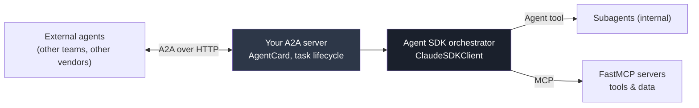

- **A2A** = the external contract. Agent discovery, task lifecycle, cross-team interop.
- **Agent SDK subagents** = internal decomposition inside one A2A-addressable agent.
- **MCP** = how any of them reach tools and data.

Map A2A's task lifecycle onto the SDK: `session_id` is your task ID, `ResultMessage` is your terminal state, and `can_use_tool` is where an A2A `input-required` state gets raised back to the caller. Don't try to express A2A semantics with `SendMessage`; they solve different problems at different layers.

---

## 14. Reference tables

### `ClaudeAgentOptions` — full field list (`0.2.139`)

Grouped for use, verified by introspection.

**Model & reasoning:** `model` · `fallback_model` · `effort` · `thinking` · `max_thinking_tokens` · `betas`

**Tools & MCP:** `tools` · `allowed_tools` · `disallowed_tools` · `mcp_servers` · `strict_mcp_config` · `skills` · `plugins`

**Agents & orchestration:** `agents` · `max_turns` · `task_budget` · `max_budget_usd`

**Permissions & safety:** `permission_mode` · `can_use_tool` · `permission_prompt_tool_name` · `sandbox` · `hooks` · `include_hook_events`

**Session:** `session_id` · `resume` · `resume_session_at` · `resume_drops_turn` · `continue_conversation` · `fork_session` · `session_store` · `session_store_flush` · `enable_file_checkpointing`

**Environment:** `cwd` · `add_dirs` · `env` · `settings` · `setting_sources` · `cli_path` · `extra_args` · `load_timeout_ms`

**I/O & prompt:** `system_prompt` · `output_format` · `include_partial_messages` · `max_buffer_size` · `stderr` · `debug_stderr` · `user`

### Permission decision helpers

| Class | Fields |
|---|---|
| `PermissionResultAllow` | `behavior`, `updated_input`, `updated_permissions` |
| `PermissionResultDeny` | `behavior`, `message`, `interrupt` |
| `HookMatcher` | `matcher`, `hooks`, `timeout` |

### Built-in tools worth knowing

| Tool | Notes |
|---|---|
| `Read` `Write` `Edit` | Filesystem. `Edit` respects checkpointing |
| `Bash` | Shell. The tool to gate hardest |
| `Glob` `Grep` | Discovery. Cheap, safe, allow-list freely |
| `WebSearch` `WebFetch` | Network |
| `Agent` | Subagent invocation (was `Task` pre-v2.1.63) |
| `Workflow` | Dynamic workflow runs (TS SDK v0.3.149+) |
| `Skill` | Invokes skills not preloaded |
| `SendMessage` `ListAgents` | Peer messaging between sessions/teammates |
| `TodoWrite` | The agent's own task list — useful progress signal to surface in a UI |

---

## 15. Decision matrix and anti-patterns

### Which SDK, by scenario

| Scenario | Use |
|---|---|
| Chat endpoint, streaming a single answer | `anthropic` |
| Classification, extraction, structured output at volume | `anthropic` (+ Batches) |
| RAG answer synthesis over retrieved chunks | `anthropic` |
| Claude with 3–5 of your own functions, no filesystem | `anthropic` + `tool_runner` |
| Non-Python/TS backend | `anthropic` (or the CLI as a subprocess with `-p --output-format json`) |
| Agent that reads/edits a repo or filesystem | `claude-agent-sdk` |
| Anything with subagents or delegation | `claude-agent-sdk` |
| Long-running work needing context compaction | `claude-agent-sdk` |
| Approval gates, permission policy, audited tool use | `claude-agent-sdk` |
| Document pipelines with OCR/parse tools over MCP | `claude-agent-sdk` |
| Hundreds of parallel units of work | `claude-agent-sdk` + workflows, or your own fan-out over `query()` |
| You can't run a Node subprocess | `anthropic`, or Managed Agents |

### Anti-patterns

**Subagent for a single sequential read.** Spawn cost exceeds the work. Just read the file.

**One mega-agent with forty tools.** Tool selection accuracy degrades with tool count. Split by domain and route.

**Orchestrator that also does the work.** Give it `["Agent"]` and little else. Capability removal beats instruction every time.

**Approval gates inside subagents.** A subagent cannot prompt a human. Investigation goes in subagents; approval-gated actions go in the parent.

**Model-driven control flow for a fixed sequence.** If you can draw the flowchart in advance, write it in Python. Cheaper, deterministic, unit-testable.

**Unbounded depth.** Default depth is 3 and Opus 5 delegates eagerly. One prompt becomes a tree. Always set `CLAUDE_CODE_MAX_SUBAGENT_SPAWN_DEPTH` and `max_budget_usd`.

**Job-title `description` fields.** "Expert code reviewer" routes badly. "Use for security review of auth code before merge" routes well. The `description` is a routing instruction, not a bio.

**Serial fan-out.** Without "dispatch all in a single turn" in the orchestrator prompt, Claude often dispatches one at a time. Measure wall clock ÷ sum of subagent durations; if it's near 1.0, your fan-out isn't fanning out.

**Subagents that return raw dumps.** Defeats the entire point of context isolation. Specify the return contract in the subagent's prompt.

**`snake_case` in `AgentDefinition`.** It's `maxTurns`, `disallowedTools`, `mcpServers`, `permissionMode` — camelCase inside `AgentDefinition`, snake_case inside `ClaudeAgentOptions`.

**Matching only `"Agent"` or only `"Task"`.** Match both; the SDKs are inconsistent across surfaces by design during the rename.

---

## 16. Sources

Official documentation (verify against these; the SDK moves quickly):

- Agent SDK overview — https://code.claude.com/docs/en/agent-sdk/overview
- Agent SDK quickstart — https://platform.claude.com/docs/en/agent-sdk/quickstart
- Subagents in the SDK — https://code.claude.com/docs/en/agent-sdk/subagents
- Dynamic workflows — https://code.claude.com/docs/en/workflows
- Agent teams — https://code.claude.com/docs/en/agent-teams
- Python SDK reference — https://code.claude.com/docs/en/agent-sdk/python
- Tool runner (Client SDK) — https://platform.claude.com/docs/en/agents-and-tools/tool-use/tool-runner
- Python SDK repo — https://github.com/anthropics/claude-agent-sdk-python
- TypeScript SDK repo — https://github.com/anthropics/claude-agent-sdk-typescript
- Example agents — https://github.com/anthropics/claude-agent-sdk-demos
- Agent harness design — https://claude.com/blog/a-harness-for-every-task-dynamic-workflows-in-claude-code

Package versions this guide was verified against: `claude-agent-sdk==0.2.139`, `anthropic==0.122.0`.

Anything version-gated (subagent background default, `Task`→`Agent` rename, workflow availability, depth/concurrency limits) should be re-checked against the changelogs before you rely on it — several of these changed within the last two releases.
