# Zero → Hero: Orchestrators & Multi-Agent Systems on Claude

**A build guide for the Claude Agent SDK — what it is, what's inside it, how to orchestrate with it, how to run it on Bedrock/Vertex, and whether you can point it at non-Claude models.**

Verified against `claude-agent-sdk==0.2.139` and `anthropic==0.122.0` (August 2026). Every API surface in this document was checked by introspecting the installed packages, not recalled from memory. Python-first; TypeScript notes where the APIs diverge.

---

## Table of contents

**Part I — Orientation**
1. [The confusion, resolved in 90 seconds](#1-the-confusion-resolved-in-90-seconds)
2. [What is actually inside `claude-agent-sdk`](#2-what-is-actually-inside-claude-agent-sdk)
3. [Layer cake: how the pieces fit](#3-layer-cake-how-the-pieces-fit)
4. [Setup and auth](#4-setup-and-auth)

**Part II — The ladder**
5. [Level 0 — The primitive: your own tool loop](#level-0--the-primitive-your-own-tool-loop)
6. [Level 1 — `tool_runner`: the loop, handed to you](#level-1--tool_runner-the-loop-handed-to-you)
7. [Level 2 — First Agent SDK agent: `query()`](#level-2--first-agent-sdk-agent-query)
8. [Level 3 — `ClaudeSDKClient`: sessions, streaming, interrupts](#level-3--claudesdkclient-sessions-streaming-interrupts)
9. [Level 3.5 — The message protocol in detail](#level-35--the-message-protocol-in-detail)
10. [Level 4 — Tools: in-process MCP and external MCP](#level-4--tools-in-process-mcp-and-external-mcp)
11. [Level 5 — Subagents: the orchestrator primitive](#level-5--subagents-the-orchestrator-primitive)
12. [Level 6 — The six orchestration patterns](#level-6--the-six-orchestration-patterns)
13. [Level 7 — Control plane: hooks, permissions, human-in-the-loop](#level-7--control-plane-hooks-permissions-human-in-the-loop)
14. [Level 8 — Scaling out: dynamic workflows and agent teams](#level-8--scaling-out-dynamic-workflows-and-agent-teams)

**Part III — Making it real**
15. [Level 9 — Context management and structured output](#level-9--context-management-and-structured-output)
16. [Level 10 — Skills and plugins](#level-10--skills-and-plugins)
17. [Level 11 — Failure modes and resilience](#level-11--failure-modes-and-resilience)
18. [Level 12 — Security and prompt injection](#level-12--security-and-prompt-injection)
19. [Level 13 — Testing an orchestrator](#level-13--testing-an-orchestrator)
20. [Level 14 — Cost, observability, evaluation](#level-14--cost-observability-evaluation)
21. [Level 15 — Deployment](#level-15--deployment)

**Part IV — Providers and models**
22. [Running on Bedrock, Vertex, Foundry, Mantle](#22-running-on-bedrock-vertex-foundry-mantle)
23. [Can it call GPT, Azure OpenAI, DeepSeek? LiteLLM and the honest answer](#23-can-it-call-gpt-azure-openai-deepseek-litellm-and-the-honest-answer)
24. [Composing with A2A](#24-composing-with-a2a)

**Part V — Reference**
25. [Capstone: an end-to-end document orchestrator](#25-capstone-an-end-to-end-document-orchestrator)
26. [Reference tables](#26-reference-tables)
27. [Decision matrix and anti-patterns](#27-decision-matrix-and-anti-patterns)
28. [Sources](#28-sources)

---

# Part I — Orientation

## 1. The confusion, resolved in 90 seconds

There are two Python packages and people use the names interchangeably. They are not alternatives at the same layer.

| | `anthropic` (Client SDK) | `claude-agent-sdk` (Agent SDK) |
|---|---|---|
| PyPI | `pip install anthropic` | `pip install claude-agent-sdk` |
| npm | `@anthropic-ai/sdk` | `@anthropic-ai/claude-agent-sdk` |
| What it is | A typed HTTP client for the Messages API | Claude Code's agent harness, exposed as a library |
| Who runs the agent loop | **You do** (or `tool_runner` does, in beta) | **The SDK does** |
| Built-in tools | None. Every tool is yours to define and execute | Read, Write, Edit, Bash, Glob, Grep, WebSearch, WebFetch, Agent, Skill, TodoWrite, … |
| Context management | You manage the message list; you handle overflow | Automatic compaction, `PreCompact` hook |
| Filesystem / shell | Nothing. You wire it | Sandboxed shell + FS with a permission system |
| Subagents | Not a concept. You'd build it | First-class: `agents={...}` + the `Agent` tool |
| Sessions | You persist messages | `session_id`, `resume`, `fork_session`, session stores |
| MCP | Remote MCP via the `mcp_servers` request param; local via helpers | Full MCP client: stdio, HTTP/SSE, **and in-process** |
| Runtime shape | Pure Python. One HTTP call per turn | Python process **+ a bundled Node CLI subprocess** over stdio |
| Languages | Python, TS, Go, Java, C#, Ruby, PHP | Python and TypeScript only |
| Best for | Chat endpoints, classification, extraction, RAG synthesis | Autonomous agents, orchestrators, anything multi-agent |

### The one-line answer

> **You want `claude-agent-sdk`.** Orchestrators and multi-agent systems are exactly what its subagent, hook, permission, and session machinery exists for. Reach for `anthropic` only for the single-shot, non-agentic calls inside your system — and for parts that must run where a Node subprocess can't.

---

## 2. What is actually inside `claude-agent-sdk`

This surprises almost everyone, and it drives several architecture decisions later in this guide, so it goes near the front.

### It does not depend on the `anthropic` package

```
$ pip show claude-agent-sdk
Requires: anyio, mcp, sniffio

$ grep -rn "import anthropic" site-packages/claude_agent_sdk/
(nothing)
```

Full declared dependency list: `anyio>=4.0.0`, `mcp>=1.23.0,<2.0.0`, `sniffio>=1.0.0`. That's it.

### What it ships instead

```
site-packages/claude_agent_sdk/_bundled/claude    310 MB, ELF executable
```

A precompiled Claude Code CLI binary. The Python layer is a thin transport — `_internal/transport/subprocess_cli.py` — that spawns it with `--output-format stream-json --verbose` and exchanges newline-delimited JSON over stdio.

Strings inside the binary confirm what it embeds: `@anthropic-ai/claude-code`, `@anthropic-ai/sdk` (the **TypeScript** client SDK), `@anthropic-ai/sandbox-runtime`, `@anthropic-ai/bedrock-sdk`, `@anthropic-ai/vertex-sdk`.

### The real layering

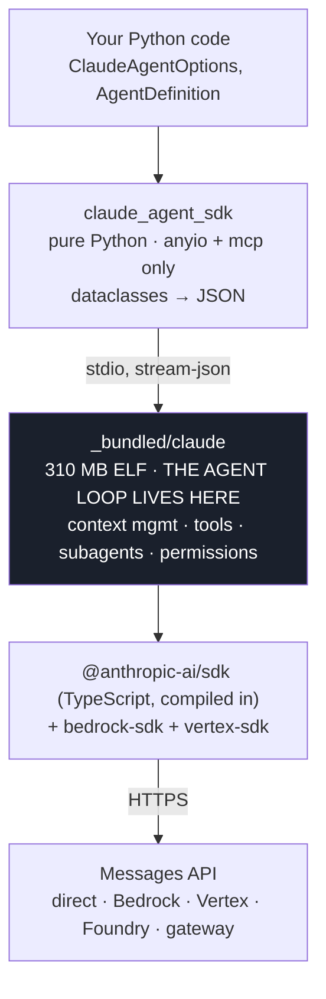

### Four consequences you must plan for

**1. The agent loop is not Python.** Retries, compaction, tool dispatch, and the subagent runtime all happen inside the binary. Your extension points are exactly what the protocol exposes — hooks, `can_use_tool`, in-process MCP servers, `env`. There is no monkey-patching your way in. Design around the seams that exist.

**2. `pip install` gives you a 310 MB wheel.** That's your image size, CI cache, and air-gapped artifact mirror. Plan for it before someone asks why the container tripled.

**3. Version skew is two-dimensional.** `claude-agent-sdk 0.2.139` pins a specific Claude Code version inside it. This is why the docs say "requires Claude Code v2.1.219 or later" rather than an SDK version — bumping the pip package is what moves the harness. To decouple them, point at an external CLI:

```python
options = ClaudeAgentOptions(cli_path="/usr/local/bin/claude")
```

**4. Node is required in your container.** Even with the bundled binary, the runtime expects a working Node environment for parts of the toolchain. A bare `python:3.12-slim` is not enough.

### Mixing both packages is fine

They share nothing but the API key environment variable. A common and correct production shape:

```python
import anthropic                      # cheap single-shot calls: classify, extract, embed-adjacent
from claude_agent_sdk import query    # the orchestrator
```

---

## 3. Layer cake: how the pieces fit

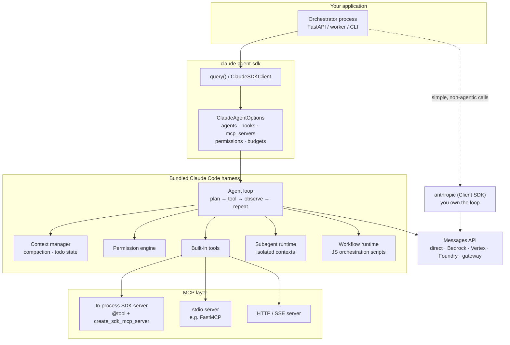

Everything inside `HARNESS` is what you would otherwise write yourself. That is the whole value proposition, and the whole reason a hand-rolled orchestrator on the Client SDK takes months to reach parity.

---

## 4. Setup and auth

```bash
python -m venv .venv && source .venv/bin/activate
pip install "claude-agent-sdk>=0.2.139" "anthropic>=0.122.0"
node --version   # required
```

```bash
export ANTHROPIC_API_KEY=sk-ant-...
```

Provider alternatives are covered in full in [§22](#22-running-on-bedrock-vertex-foundry-mantle).

> **Terms note:** consumer Claude.ai login and Claude.ai rate limits are not permitted for third-party products built on the Agent SDK unless previously approved. Use API-key auth, or Bedrock/Vertex/Foundry.

Model identifiers used throughout:

| Where | Accepts |
|---|---|
| `ClaudeAgentOptions.model` | Full IDs — `claude-opus-5`, `claude-sonnet-5`, `claude-haiku-4-5-20251001` |
| `AgentDefinition.model` | Aliases — `opus`, `sonnet`, `haiku`, `fable`, `inherit` — or a full ID |
| `ClaudeAgentOptions.fallback_model` | Full ID, used when the primary is overloaded |

---

# Part II — The ladder

# Level 0 — The primitive: your own tool loop

Build this once, by hand, even though you'll never ship it. Everything the harness does for you becomes legible the moment you've written the loop yourself.

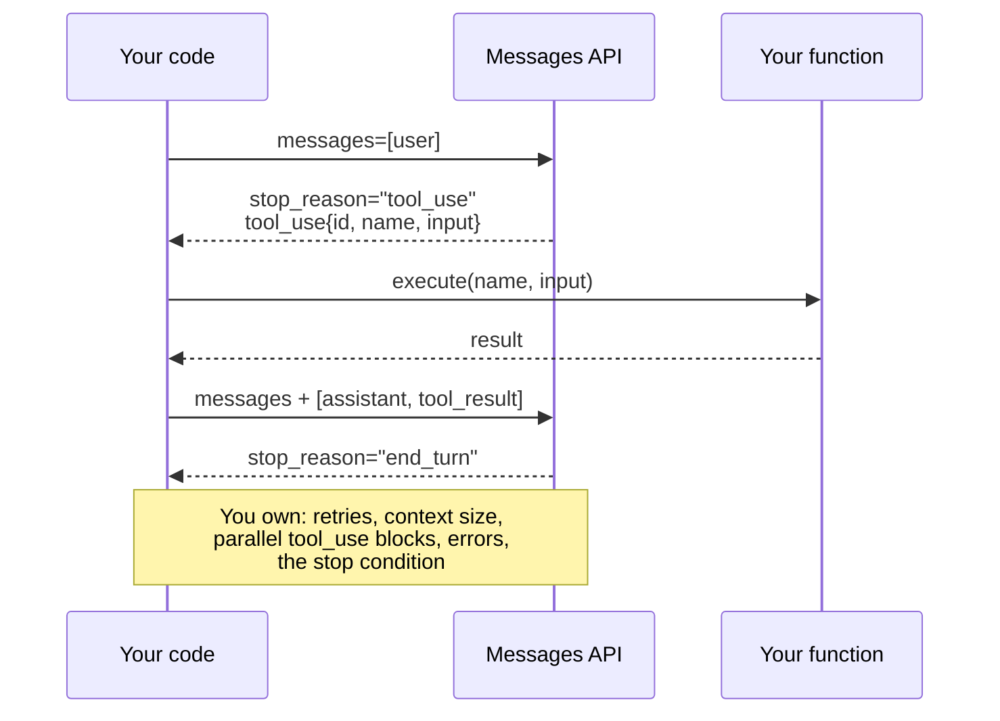

```python
# level0_manual_loop.py
import json
import anthropic

client = anthropic.Anthropic()

TOOLS = [
    {
        "name": "get_account_balance",
        "description": "Return the current balance for a customer account.",
        "input_schema": {
            "type": "object",
            "properties": {"account_id": {"type": "string"}},
            "required": ["account_id"],
        },
    }
]


def get_account_balance(account_id: str) -> str:
    return json.dumps({"account_id": account_id, "balance": 1284.55, "currency": "USD"})


IMPL = {"get_account_balance": get_account_balance}


def run(user_text: str, max_iters: int = 10) -> str:
    messages = [{"role": "user", "content": user_text}]

    for _ in range(max_iters):
        resp = client.messages.create(
            model="claude-sonnet-5",
            max_tokens=2048,
            tools=TOOLS,
            messages=messages,
        )

        if resp.stop_reason != "tool_use":
            return "".join(b.text for b in resp.content if b.type == "text")

        messages.append({"role": "assistant", "content": resp.content})

        # A single turn can contain SEVERAL tool_use blocks. All results go
        # back in ONE user message, or the API rejects the next request.
        results = []
        for block in resp.content:
            if block.type != "tool_use":
                continue
            try:
                out = IMPL[block.name](**block.input)
                results.append(
                    {"type": "tool_result", "tool_use_id": block.id, "content": out}
                )
            except Exception as exc:
                results.append(
                    {
                        "type": "tool_result",
                        "tool_use_id": block.id,
                        "content": f"Error: {exc}",
                        "is_error": True,
                    }
                )

        messages.append({"role": "user", "content": results})

    raise RuntimeError("max iterations reached without end_turn")


if __name__ == "__main__":
    print(run("What is the balance on account ACC-99213?"))
```

**What this loop does not give you:**

| Missing | What building it costs you |
|---|---|
| Context overflow handling | A summarizer, a token counter, a policy for what to drop |
| Parallelism | An executor, ordering guarantees on `tool_result` blocks |
| Filesystem/shell tools | Sandboxing, path traversal defence, command allowlists |
| Permissions | An approval protocol and a UI to hang it on |
| Subagents | A second loop, context isolation, result marshalling |
| Sessions | Serialization, resume semantics, transcript storage |
| Retries and 529s | Backoff, fallback model routing, partial-turn recovery |

That table *is* the Agent SDK's changelog.

---

# Level 1 — `tool_runner`: the loop, handed to you

Still the Client SDK, but the loop is automated. The sweet spot for "Claude with a few of my functions" — no Node, no filesystem, no harness.

```python
# level1_tool_runner.py
import json
from anthropic import Anthropic, beta_tool

client = Anthropic()


@beta_tool
def get_account_balance(account_id: str) -> str:
    """Return the current balance for a customer account.

    Args:
        account_id: The account identifier, e.g. ACC-99213.

    Returns:
        A JSON-encoded string with account_id, balance, and currency.
    """
    return json.dumps({"account_id": account_id, "balance": 1284.55, "currency": "USD"})


runner = client.beta.messages.tool_runner(
    model="claude-sonnet-5",
    max_tokens=2048,
    tools=[get_account_balance],
    messages=[{"role": "user", "content": "Balance on ACC-99213?"}],
)

for message in runner:
    for block in message.content:
        if block.type == "text":
            print(block.text)
```

`@beta_tool` derives the JSON schema from your type hints and Google-style docstring — the docstring becomes the tool description the model reasons over, so it is not decoration. Use `@beta_async_tool` with `AsyncAnthropic`.

**Where it stops being enough:** the moment you want a second agent, a permission gate, a sandbox, or context that survives a long run. Cross that line and switch packages.

---

# Level 2 — First Agent SDK agent: `query()`

```python
# level2_first_agent.py
import anyio
from claude_agent_sdk import query, ClaudeAgentOptions, AssistantMessage, TextBlock, ResultMessage


async def main() -> None:
    options = ClaudeAgentOptions(
        model="claude-sonnet-5",
        system_prompt="You are a precise repository analyst. Be concise.",
        allowed_tools=["Read", "Grep", "Glob"],
        permission_mode="acceptEdits",
        cwd="./target-repo",
        max_turns=20,
    )

    async for message in query(
        prompt="Find every FastAPI route that lacks an auth dependency. List file:line.",
        options=options,
    ):
        if isinstance(message, AssistantMessage):
            for block in message.content:
                if isinstance(block, TextBlock):
                    print(block.text)
        elif isinstance(message, ResultMessage):
            print(f"\n[{message.subtype}] ${message.total_cost_usd:.4f}")


anyio.run(main)
```

`query()` is a one-shot async generator: one prompt in, a stream of messages out, session closed at the end.

### The `allowed_tools` trap

`allowed_tools` **pre-approves** tools — it does not decide which tools exist. Availability is controlled by `tools`, `disallowed_tools`, and `permission_mode`. A tool that's available but not allow-listed falls through to your `can_use_tool` callback, or is denied in `dontAsk` mode. This trips up almost everyone once.

### The `setting_sources` trap

By default the SDK does **not** load `CLAUDE.md`, `.claude/agents/`, `.claude/skills/`, or settings files. That's deliberate: a library shouldn't silently inherit a developer's machine config. Opt in explicitly:

```python
options = ClaudeAgentOptions(setting_sources=["project"])  # "user" | "project" | "local"
```

---

# Level 3 — `ClaudeSDKClient`: sessions, streaming, interrupts

`query()` is fine for a job. For a service — anything conversational, anything with human-in-the-loop, anything you need to steer mid-flight — you want the client.

```python
# level3_client.py
import anyio
from claude_agent_sdk import (
    ClaudeSDKClient, ClaudeAgentOptions,
    AssistantMessage, TextBlock, ToolUseBlock, ResultMessage,
)


async def main() -> None:
    options = ClaudeAgentOptions(
        model="claude-sonnet-5",
        allowed_tools=["Read", "Grep", "Glob", "Bash"],
        permission_mode="acceptEdits",
        include_partial_messages=True,   # token-level streaming
        max_budget_usd=2.00,
    )

    async with ClaudeSDKClient(options=options) as client:
        await client.query("Summarize the architecture of this service.")
        session_id = None

        async for msg in client.receive_response():
            if isinstance(msg, AssistantMessage):
                for block in msg.content:
                    if isinstance(block, TextBlock):
                        print(block.text, end="", flush=True)
                    elif isinstance(block, ToolUseBlock):
                        print(f"\n  ⚙ {block.name}", flush=True)
            elif isinstance(msg, ResultMessage):
                session_id = msg.session_id

        # Same session — Claude still has the context from turn 1.
        await client.query("Now list the top 3 reliability risks you saw.")
        async for msg in client.receive_response():
            if isinstance(msg, AssistantMessage):
                for block in msg.content:
                    if isinstance(block, TextBlock):
                        print(block.text, end="", flush=True)

        print(f"\n\nsession: {session_id}")


anyio.run(main)
```

Control-plane methods that matter for an orchestrator:

| Method | Use |
|---|---|
| `await client.interrupt()` | Stop the current turn. Your cancel button. |
| `await client.set_permission_mode(mode)` | Escalate/de-escalate mid-run |
| `await client.set_model(model)` | Switch tiers mid-session |
| `await client.get_mcp_status()` | Health-check MCP servers before dispatching |
| `await client.reconnect_mcp_server(name)` / `toggle_mcp_server(name, enabled)` | Recover a flapping backend without killing the session |
| `await client.stop_task(task_id)` | Kill one background subagent, not the whole run |
| `await client.rewind_files(user_message_id)` | Undo edits to a checkpoint (`enable_file_checkpointing=True`) |
| `await client.get_server_info()` | Introspect the harness (version, tools, capabilities) |

### Resume, fork, persist

```python
# Continue an earlier session
options = ClaudeAgentOptions(resume="ses_abc123")

# Branch it instead — the original stays intact. Good for A/B-ing an approach.
options = ClaudeAgentOptions(resume="ses_abc123", fork_session=True)

# Custom persistence (Redis, S3, Postgres) instead of ~/.claude on disk
from claude_agent_sdk import InMemorySessionStore
options = ClaudeAgentOptions(session_store=InMemorySessionStore())
```

`fork_session` is the underrated one. In an orchestrator, forking gives you N variants of the *same* accumulated context — the cheap way to run a panel of critics without re-establishing context N times.

Session inspection helpers exist at module level too: `list_sessions`, `get_session_info`, `get_session_messages`, `list_subagents`, `get_subagent_messages`, `fork_session`, `rename_session`, `tag_session`, `delete_session`. These let you build a session browser or an audit UI without touching the transcript files directly.

---

# Level 3.5 — The message protocol in detail

You will spend real time in this stream. Knowing its shape saves hours.

### Message types

| Type | Meaning |
|---|---|
| `SystemMessage` (`subtype="init"`) | Session start: session_id, model, tool list, MCP status |
| `AssistantMessage` | Claude's turn — `TextBlock`, `ThinkingBlock`, `ToolUseBlock`, `ServerToolUseBlock` |
| `UserMessage` | Tool results fed back into the loop |
| `ResultMessage` | Terminal. Cost, usage, session_id, structured output |
| `TaskStartedMessage` / `TaskProgressMessage` / `TaskUpdatedMessage` / `TaskNotificationMessage` | Background task lifecycle |
| `HookEventMessage` | Emitted when `include_hook_events=True` |
| `StreamEvent` | Token-level deltas when `include_partial_messages=True` |
| `ConversationResetMessage` | Context was reset |
| `MirrorErrorMessage` | Error surfaced from the harness |

### `ResultMessage` — every field (verified)

```
subtype · duration_ms · duration_api_ms · is_error · num_turns · session_id
stop_reason · total_cost_usd · usage · result · structured_output
model_usage · permission_denials · deferred_tool_use · errors
api_error_status · uuid · terminal_reason · origin
```

The under-used ones:

- **`model_usage`** — per-model token breakdown. In a tiered orchestrator this is how you prove your Haiku workers are actually running on Haiku.
- **`permission_denials`** — everything your gates blocked. Feed this straight into your audit log. Note it still reports `tool_name: "Task"` for subagent denials even though `tool_use` blocks say `"Agent"`.
- **`structured_output`** — populated when you set `output_format` (see [Level 9](#level-9--context-management-and-structured-output)).
- **`terminal_reason`** — why the run ended, more specific than `subtype`.
- **`stop_reason`** — the model-level stop reason for the final turn.

### `AssistantMessage` fields

```
content · model · parent_tool_use_id · error · usage · message_id
stop_reason · session_id · uuid
```

**`parent_tool_use_id` is the single most important field for multi-agent work.** Set ⇒ this message came from inside a subagent. It's your span key for tracing, your attribution key for cost, and your filter for "show me only the orchestrator's reasoning."

```python
parent = getattr(message, "parent_tool_use_id", None)
scope = "subagent" if parent else "root"
```

### `result.subtype` values you will see

| Value | Meaning |
|---|---|
| `success` | Normal completion |
| `error_max_turns` | Hit `max_turns` |
| `error_max_budget_usd` | Hit `max_budget_usd` |
| `error_during_execution` | Something failed mid-run |

Always branch on this. A run that returns text after `error_max_turns` returned *partial* work, and treating it as success is a silent data-quality bug.

---

# Level 4 — Tools: in-process MCP and external MCP

Three ways to hand Claude a capability. Pick by process boundary, not by taste.

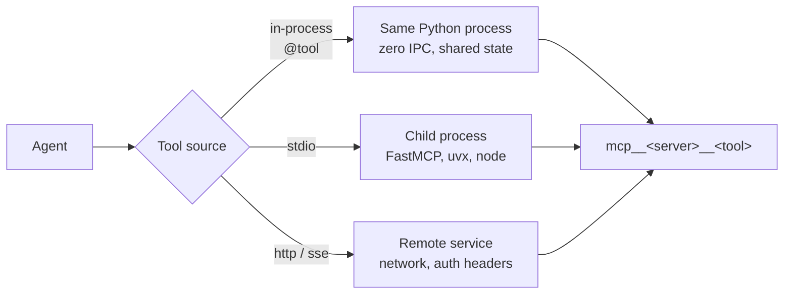

### In-process (recommended default)

```python
# level4_inprocess_tools.py
import anyio
from claude_agent_sdk import (
    tool, create_sdk_mcp_server, ClaudeSDKClient, ClaudeAgentOptions,
    AssistantMessage, TextBlock,
)

# Shared state your tools close over — a DB pool, a feature-flag client,
# a request-scoped tenant ID. This is why in-process wins for enterprise work.
LEDGER = {"ACC-99213": 1284.55}


@tool("get_balance", "Get the current balance for an account", {"account_id": str})
async def get_balance(args):
    bal = LEDGER.get(args["account_id"])
    if bal is None:
        return {"content": [{"type": "text", "text": "Account not found"}], "is_error": True}
    return {"content": [{"type": "text", "text": f"${bal:.2f}"}]}


@tool("issue_refund", "Issue a refund against an account", {"account_id": str, "amount": float})
async def issue_refund(args):
    LEDGER[args["account_id"]] = LEDGER.get(args["account_id"], 0) - args["amount"]
    return {"content": [{"type": "text", "text": f"Refunded ${args['amount']:.2f}"}]}


banking = create_sdk_mcp_server(name="banking", version="1.0.0",
                                tools=[get_balance, issue_refund])


async def main() -> None:
    options = ClaudeAgentOptions(
        mcp_servers={"banking": banking},
        allowed_tools=["mcp__banking__get_balance"],   # refund NOT auto-approved
        model="claude-sonnet-5",
    )
    async with ClaudeSDKClient(options=options) as client:
        await client.query("What's the balance on ACC-99213?")
        async for msg in client.receive_response():
            if isinstance(msg, AssistantMessage):
                for b in msg.content:
                    if isinstance(b, TextBlock):
                        print(b.text)


anyio.run(main)
```

Naming convention: `mcp__<server_name>__<tool_name>`. Note what the allow-list does above — `get_balance` runs freely, `issue_refund` hits the permission path. That's a one-line human-in-the-loop gate, and it's the right place for it.

`@tool` accepts either a simple dict schema (`{"a": float}`) or a full JSON Schema dict, plus optional MCP `annotations` for read-only/destructive hints.

### External MCP servers

```python
options = ClaudeAgentOptions(
    mcp_servers={
        "internal":   banking,                                    # in-process
        "docs": {                                                 # stdio (FastMCP etc.)
            "type": "stdio",
            "command": "python",
            "args": ["-m", "my_company.mcp.doc_server"],
            "env": {"OCR_ENABLED": "1"},
        },
        "platform": {                                             # remote HTTP
            "type": "http",
            "url": "https://mcp.internal.example.com/mcp",
            "headers": {"Authorization": "Bearer ${PLATFORM_TOKEN}"},
        },
    },
    allowed_tools=["mcp__internal__get_balance", "mcp__docs__parse_pdf"],
    strict_mcp_config=True,   # ignore filesystem MCP config; use only what's here
)
```

**Set `strict_mcp_config=True` in production.** Without it, a developer's `~/.claude.json` can inject servers into your deployed agent.

### Choosing

| | In-process | stdio | HTTP |
|---|---|---|---|
| Latency | Lowest — a function call | Process spawn + pipe | Network |
| Shared state | Direct (pools, sessions, tenant context) | Serialized only | Serialized only |
| Blast radius | Same process — a bad tool takes the agent down | Isolated | Isolated |
| Reuse across teams | Python-only | Any language, any consumer | Any language, any consumer |
| Fit | Business logic tied to this agent | An existing FastMCP server you already ship | A platform capability behind auth |

If you already have FastMCP servers, don't rewrite them — mount them as `stdio` or `http`. Use in-process for glue specific to *this* orchestrator.

### Health checks

```python
status = await client.get_mcp_status()
for server in status["mcpServers"]:
    if server.get("status") != "connected":
        await client.reconnect_mcp_server(server["name"])
```

Do this before dispatching a large fan-out. Discovering a dead MCP server after spawning 40 subagents is expensive.

---

# Level 5 — Subagents: the orchestrator primitive

This is the whole ballgame. A subagent is a separate agent instance, spawned by the parent through the `Agent` tool, running in its own fresh context.

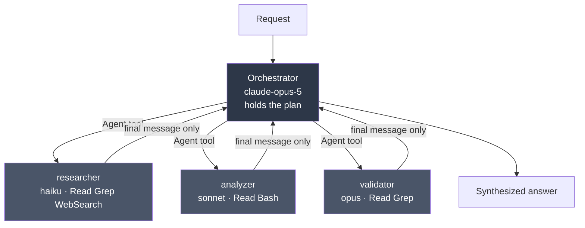

### The four reasons subagents exist

1. **Context isolation.** A subagent that reads 80 files returns one paragraph. The 80 files never enter the orchestrator's context. Single biggest lever on long-run quality.
2. **Parallelism.** Independent subagents run concurrently — wall clock is the slowest one, not the sum.
3. **Specialization.** Each gets its own system prompt, so domain instructions don't pile up in one bloated prompt.
4. **Least privilege.** A reviewer gets `["Read", "Grep", "Glob"]` and structurally *cannot* write. Not "asked not to" — cannot.

### Working code

```python
# level5_subagents.py
import anyio
from claude_agent_sdk import (
    query, ClaudeAgentOptions, AgentDefinition,
    AssistantMessage, TextBlock, ToolUseBlock, ResultMessage,
)

AGENTS = {
    "researcher": AgentDefinition(
        description=(
            "Gathers facts from the codebase and the web. Use for discovery, "
            "'find all X', and background reading. Never modifies anything."
        ),
        prompt=(
            "You are a research specialist. Gather evidence and report findings "
            "with file:line citations. Do not speculate. Do not propose fixes. "
            "Return a compact bulleted summary, never raw file dumps."
        ),
        tools=["Read", "Grep", "Glob", "WebSearch"],
        model="haiku",
        maxTurns=15,
    ),
    "analyzer": AgentDefinition(
        description=(
            "Performs deep technical analysis of code a researcher has located. "
            "Use for root-cause analysis and design critique."
        ),
        prompt=(
            "You are a staff engineer. Given specific files, analyze correctness, "
            "concurrency, and failure modes. Rank findings by severity. "
            "Support every claim with the code you read."
        ),
        tools=["Read", "Grep", "Glob", "Bash"],
        model="sonnet",
        effort="high",
    ),
    "validator": AgentDefinition(
        description=(
            "Adversarially checks another agent's findings. Use before reporting "
            "anything to a human."
        ),
        prompt=(
            "You are a skeptical reviewer. For each claim you are given, try to "
            "REFUTE it by reading the code. Label each: CONFIRMED, REFUTED, or "
            "UNVERIFIABLE, with the evidence that decided it."
        ),
        tools=["Read", "Grep", "Glob"],
        model="opus",
    ),
}


async def main() -> None:
    options = ClaudeAgentOptions(
        model="claude-opus-5",
        agents=AGENTS,
        # "Agent" MUST be allow-listed or delegation silently never happens.
        allowed_tools=["Read", "Grep", "Glob", "Agent"],
        system_prompt=(
            "You are an orchestrator. You do not investigate yourself. "
            "Delegate discovery to the researcher, deep analysis to the analyzer, "
            "and verification to the validator. Dispatch independent work in "
            "PARALLEL in a single turn. Synthesize only what the validator "
            "confirmed."
        ),
        env={
            "CLAUDE_CODE_MAX_SUBAGENT_SPAWN_DEPTH": "1",   # no grandchildren
            "CLAUDE_CODE_MAX_CONCURRENT_SUBAGENTS": "5",
        },
        max_budget_usd=5.0,
        cwd="./target-repo",
    )

    async for message in query(
        prompt="Audit this service for unhandled error paths in the payment flow.",
        options=options,
    ):
        if isinstance(message, AssistantMessage):
            for block in message.content:
                if isinstance(block, ToolUseBlock) and block.name in ("Agent", "Task"):
                    print(f"→ dispatch: {block.input.get('subagent_type')}")
                elif isinstance(block, TextBlock):
                    print(block.text)
        elif isinstance(message, ResultMessage):
            print(f"\n[{message.subtype}] ${message.total_cost_usd:.4f} "
                  f"turns={message.num_turns}")


anyio.run(main)
```

### `AgentDefinition` — the complete field list

Verified by introspecting `claude_agent_sdk.AgentDefinition` at `0.2.139`:

| Field | Type | Required | Notes |
|---|---|---|---|
| `description` | `str` | ✅ | **The routing key.** Claude reads it to decide when to delegate. Write it as "use for X, Y, Z" |
| `prompt` | `str` | ✅ | The subagent's system prompt |
| `tools` | `list[str]` | | Omit → inherits everything available to subagents. List → *only* those |
| `disallowedTools` | `list[str]` | | Subtractive. Accepts `mcp__server`, `mcp__server__*`, `mcp__*` |
| `model` | `str` | | `opus` / `sonnet` / `haiku` / `fable` / `inherit` / full ID |
| `skills` | `list[str]` | | Preloaded into context at startup |
| `memory` | `'user'\|'project'\|'local'` | | Memory source |
| `mcpServers` | `list[str \| dict]` | | By name, or inline config |
| `initialPrompt` | `str` | | Auto-submitted first turn **only** as main-thread agent; ignored as a subagent |
| `maxTurns` | `int` | | Hard stop on agentic turns |
| `background` | `bool` | | Force non-blocking execution |
| `effort` | `'low'\|'medium'\|'high'\|'xhigh'\|'max'\|int` | | Reasoning effort |
| `permissionMode` | `'default'\|'acceptEdits'\|'plan'\|'bypassPermissions'\|'dontAsk'\|'auto'` | | Per-agent permission policy |

> **Python quirk, not a typo:** multi-word fields stay **camelCase** (`disallowedTools`, `mcpServers`, `maxTurns`, `permissionMode`) because they match the wire format. Meanwhile `ClaudeAgentOptions` uses snake_case (`allowed_tools`, `mcp_servers`, `max_turns`). Mixing these up is the most common runtime error in Agent SDK code.

### What a subagent inherits

| Receives | Does **not** receive |
|---|---|
| Its own `prompt` | The parent's conversation history |
| The `Agent` tool call's prompt string | The parent's tool results |
| Project `CLAUDE.md` (only if `setting_sources` is set) | The parent's system prompt |
| Tool definitions (inherited or the `tools` subset) | Preloaded skills, unless listed in `skills` |

**Practical consequence:** the Agent tool's prompt string is your *only* channel from parent to child. Every file path, error message, and decision must be written into it. Orchestrator prompts should say: "when you delegate, include the exact file paths and the specific question."

### Delegation isn't happening — the checklist

1. Is `"Agent"` in `allowed_tools`? (Most common cause by far.)
2. Is the `description` a *routing instruction* or a job title? "Expert reviewer" routes badly; "Use for security reviews of auth code before merge" routes well.
3. Force it: `"Use the validator agent to check these findings."` Explicit naming bypasses matching.
4. On Opus 5 with the `claude_code` system-prompt preset, the harness adds a line telling Claude *not* to spawn subagents unless asked. With a custom `system_prompt`, that line is absent — usually what you want in an orchestrator.

### Detecting delegation

```python
if isinstance(block, ToolUseBlock) and block.name in ("Agent", "Task"):
    subagent_type = block.input.get("subagent_type")

if getattr(message, "parent_tool_use_id", None):
    ...  # attribute this span to the child, not the parent
```

Renamed `Task` → `Agent` in Claude Code v2.1.63. Current SDKs emit `"Agent"` in `tool_use` blocks but still say `"Task"` in the `system:init` tool list and in `result.permission_denials[].tool_name`. **Match both**, always.

### Resuming a subagent

When a subagent completes, the Agent tool result includes `agentId: <id>`. Capture it plus the `session_id`, then resume:

```python
async for message in query(
    prompt=f"Resume agent {agent_id} and list the top 3 most complex endpoints",
    options=ClaudeAgentOptions(
        allowed_tools=["Read", "Grep", "Glob", "Agent"],
        agents=AGENTS,          # pass the SAME definitions
        resume=session_id,      # must be the same session
    ),
):
    ...
```

A resumed subagent retains its full history — all previous tool calls and reasoning. The built-in `Explore` and `Plan` agents are one-shot and return no `agentId`.

### Behaviour change you must know (v2.1.198+)

Subagents now run **in the background by default**. An `Agent` call that omits `run_in_background` launches a background subagent; Claude sets `run_in_background: false` when it needs the result before continuing. Before v2.1.198 the default was synchronous. Code written against the old default has wrong sequencing assumptions.

---

# Level 6 — The six orchestration patterns

Same primitives, six shapes. Choose by the *dependency structure of the work*, not by what sounds sophisticated.

## 6.1 Sequential pipeline

Each stage consumes the previous stage's output. Use when stage N genuinely cannot start without stage N−1.

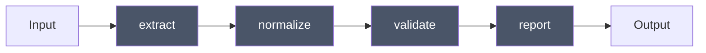

**(a) Model-driven** — the orchestrator decides the order. Flexible; costs a turn per hop; can skip steps.

```python
options = ClaudeAgentOptions(
    agents={"extract": ..., "normalize": ..., "validate": ..., "report": ...},
    allowed_tools=["Agent"],
    system_prompt=(
        "Run this pipeline strictly in order: extract → normalize → validate → report. "
        "Pass each stage's full output into the next stage's prompt. "
        "If validate reports failures, return to normalize once, then stop."
    ),
)
```

**(b) Code-driven** — you own the order in Python. Deterministic, testable, cheaper. **Prefer this when the sequence is known.**

```python
# level6_sequential.py
import anyio
from claude_agent_sdk import query, ClaudeAgentOptions, ResultMessage


async def run_stage(name: str, prompt: str, system: str, tools: list[str]) -> str:
    out: list[str] = []
    async for msg in query(
        prompt=prompt,
        options=ClaudeAgentOptions(
            model="claude-sonnet-5",
            system_prompt=system,
            allowed_tools=tools,
            max_turns=12,
        ),
    ):
        if isinstance(msg, ResultMessage):
            out.append(msg.result or "")
    return "\n".join(out)


async def pipeline(doc_path: str) -> str:
    extracted = await run_stage(
        "extract", f"Extract all line items from {doc_path}.",
        "You are a document extraction specialist. Output JSON only.",
        ["Read", "Grep"],
    )
    normalized = await run_stage(
        "normalize", f"Normalize these line items to our schema:\n{extracted}",
        "You normalize financial line items. Output JSON only.", ["Read"],
    )
    validated = await run_stage(
        "validate", f"Validate and flag anomalies:\n{normalized}",
        "You are a validation engine. List every violation with a rule ID.", ["Read"],
    )
    return validated


print(anyio.run(pipeline, "./invoices/2026-Q2.pdf"))
```

**Rule of thumb:** if you can draw the flowchart before the run starts, put it in code. Let the model decide control flow only when it genuinely depends on what it finds.

## 6.2 Parallel fan-out / map-reduce

N independent units of work, one reducer. The highest-leverage pattern in practice.

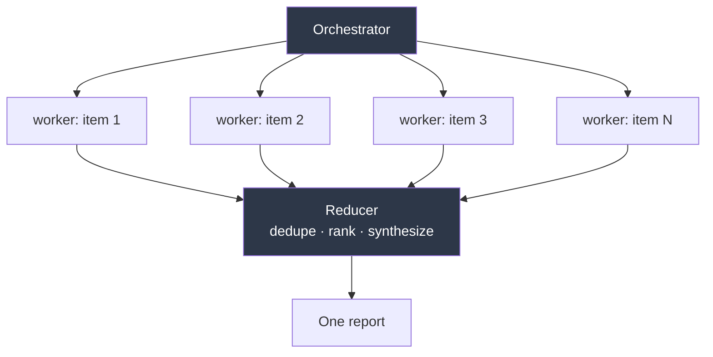

```python
# level6_fanout.py
import anyio
from claude_agent_sdk import query, ClaudeAgentOptions, AgentDefinition, ResultMessage

AGENTS = {
    "file-auditor": AgentDefinition(
        description="Audits ONE file for a specific issue class. Use once per file.",
        prompt=(
            "Audit exactly the file named in your prompt. Report findings as "
            "`SEVERITY | file:line | description`. If clean, output exactly: CLEAN."
        ),
        tools=["Read", "Grep"],
        model="haiku",
        maxTurns=8,
    ),
    "reducer": AgentDefinition(
        description="Merges many per-file audit findings into one ranked report.",
        prompt=(
            "You receive findings from many auditors. Deduplicate, group by root "
            "cause, rank by severity × blast radius. Output a single ranked list."
        ),
        tools=["Read"],
        model="opus",
    ),
}

options = ClaudeAgentOptions(
    model="claude-opus-5",
    agents=AGENTS,
    allowed_tools=["Read", "Grep", "Glob", "Agent"],
    system_prompt=(
        "Enumerate the target files first with Glob. Then dispatch ONE file-auditor "
        "per file, ALL IN A SINGLE TURN so they run concurrently. Do not audit "
        "anything yourself. When every auditor has returned, dispatch the reducer "
        "with all findings."
    ),
    env={"CLAUDE_CODE_MAX_CONCURRENT_SUBAGENTS": "10"},
    max_budget_usd=8.0,
    cwd="./target-repo",
)
```

Two things make or break fan-out:

- **"in a single turn"** in the orchestrator prompt. Without it Claude tends to dispatch one, wait, dispatch the next — serial execution wearing a parallel costume.
- **A structured return contract** (`SEVERITY | file:line | description`, or exactly `CLEAN`). The reducer's job gets dramatically easier and its output far more stable.

Code-driven version — deterministic, no orchestrator tokens spent on routing:

```python
async def fan_out(files: list[str]) -> list[str]:
    results: list[str] = []
    limiter = anyio.CapacityLimiter(10)

    async def audit(path: str) -> None:
        async with limiter:
            async for msg in query(
                prompt=f"Audit {path} for missing auth checks.",
                options=ClaudeAgentOptions(model="claude-haiku-4-5-20251001",
                                           allowed_tools=["Read", "Grep"], max_turns=8),
            ):
                if isinstance(msg, ResultMessage) and msg.result:
                    results.append(msg.result)

    async with anyio.create_task_group() as tg:
        for f in files:
            tg.start_soon(audit, f)
    return results
```

**Measure it.** Wall clock ÷ sum of subagent durations. Near 1.0 means your fan-out isn't fanning out.

## 6.3 Router / handoff

One classifier, N specialists, no fan-out. Cheap model routes; expensive model executes.

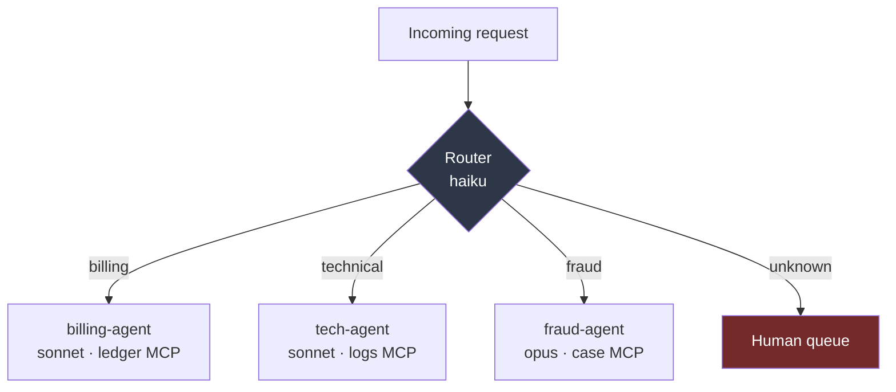

```python
AGENTS = {
    "billing-agent": AgentDefinition(
        description="Handles billing: charges, refunds, statements, disputes over amounts.",
        prompt="You are a billing specialist. Resolve billing issues using ledger tools only.",
        tools=["mcp__ledger__get_balance", "mcp__ledger__list_transactions"],
        model="sonnet",
    ),
    "fraud-agent": AgentDefinition(
        description="Handles suspected fraud, unauthorized transactions, account takeover.",
        prompt=(
            "You are a fraud analyst. Investigate thoroughly. Never take an "
            "irreversible action; recommend and escalate."
        ),
        tools=["mcp__cases__lookup", "mcp__cases__create"],
        model="opus",
        effort="high",
    ),
}

options = ClaudeAgentOptions(
    model="claude-haiku-4-5-20251001",      # router is cheap on purpose
    agents=AGENTS,
    allowed_tools=["Agent"],                # router has NO other tools
    system_prompt=(
        "You are a router. Classify the request and delegate to exactly ONE agent. "
        "You have no other tools and must not attempt to answer yourself. "
        "If confidence is below 0.8 or the request spans categories, reply exactly: "
        "ESCALATE_TO_HUMAN followed by your reasoning."
    ),
)
```

The design point: **strip the router's tools to `["Agent"]` only.** A router that can also read files will read files. Capability removal is more reliable than instruction.

## 6.4 Evaluator–optimizer (generator ↔ critic)

The pattern that most improves output quality per dollar.

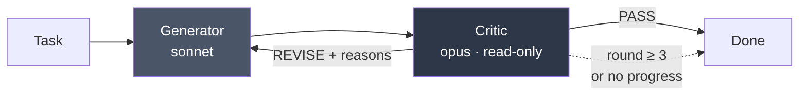

```python
# level6_evaluator_optimizer.py
import anyio
from claude_agent_sdk import query, ClaudeAgentOptions, ResultMessage


async def one_shot(prompt: str, system: str, tools: list[str], model: str) -> str:
    text = ""
    async for msg in query(
        prompt=prompt,
        options=ClaudeAgentOptions(model=model, system_prompt=system,
                                   allowed_tools=tools, max_turns=15),
    ):
        if isinstance(msg, ResultMessage):
            text = msg.result or ""
    return text


async def refine(task: str, max_rounds: int = 3) -> str:
    draft = await one_shot(
        task,
        "You are a senior engineer. Produce a complete, working solution.",
        ["Read", "Write", "Edit", "Grep", "Glob"],
        "claude-sonnet-5",
    )

    for _ in range(max_rounds):
        verdict = await one_shot(
            f"Task:\n{task}\n\nProposed solution:\n{draft}\n\n"
            "Judge it. Reply with PASS, or REVISE followed by numbered, "
            "specific, actionable defects. Do not rewrite it yourself.",
            "You are a demanding staff-level reviewer. Correctness, then edge "
            "cases, then clarity. Be specific. Vague criticism is a failure.",
            ["Read", "Grep", "Glob"],
            "claude-opus-5",
        )
        if verdict.strip().startswith("PASS"):
            return draft

        draft = await one_shot(
            f"Task:\n{task}\n\nCurrent solution:\n{draft}\n\n"
            f"Reviewer defects:\n{verdict}\n\nAddress every defect. Change nothing else.",
            "You are a senior engineer revising against specific review feedback.",
            ["Read", "Write", "Edit", "Grep", "Glob"],
            "claude-sonnet-5",
        )
    return draft
```

Two non-obvious rules:

- **The critic must be read-only.** A critic that can edit will fix things silently, and you lose the signal about what was wrong.
- **The critic must not see its own previous verdicts.** Fresh context per round prevents anchoring on "I already said this is fine."

## 6.5 Debate / panel

For decisions where a single pass is unreliable: architecture choices, risk judgements, ambiguous classification.

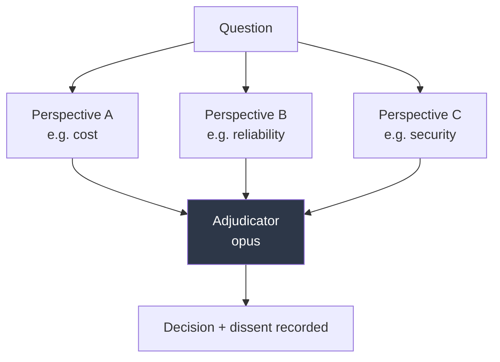

The critical constraint: **panelists must not see each other's answers before they answer.** Independence is the entire source of signal. Dispatch them in one turn with disjoint prompts; only the adjudicator sees all three.

```python
AGENTS = {
    "cost-analyst": AgentDefinition(
        description="Argues the cost/TCO perspective on an architecture decision.",
        prompt=("Argue purely from cost and operational burden. State your position, "
                "your three strongest reasons, and the strongest objection to yourself."),
        tools=["Read", "Grep", "WebSearch"], model="sonnet",
    ),
    "reliability-analyst": AgentDefinition(
        description="Argues the reliability/failure-mode perspective.",
        prompt=("Argue purely from availability, failure modes, and blast radius. "
                "State your position, three reasons, and the strongest objection to yourself."),
        tools=["Read", "Grep", "WebSearch"], model="sonnet",
    ),
    "security-analyst": AgentDefinition(
        description="Argues the security and compliance perspective.",
        prompt=("Argue purely from security, data handling, and auditability. "
                "State your position, three reasons, and the strongest objection to yourself."),
        tools=["Read", "Grep", "WebSearch"], model="sonnet",
    ),
    "adjudicator": AgentDefinition(
        description="Weighs independent analyst positions and issues a decision.",
        prompt=("You receive independent positions. Identify where they genuinely "
                "conflict versus talk past each other. Issue ONE decision, state "
                "what would change your mind, and record dissent verbatim."),
        tools=["Read"], model="opus", effort="high",
    ),
}
```

## 6.6 Hierarchical (orchestrator of orchestrators)

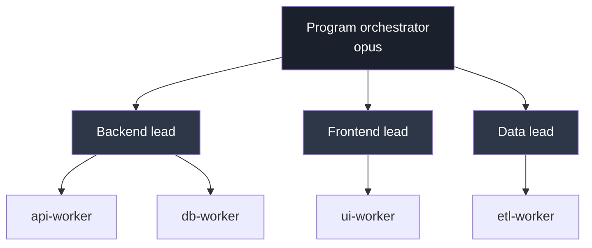

Subagents can spawn subagents, so this works out of the box. It is also the fastest way to burn money by accident.

```python
options = ClaudeAgentOptions(
    env={
        "CLAUDE_CODE_MAX_SUBAGENT_SPAWN_DEPTH": "2",   # default 3; 1 = no grandchildren
        "CLAUDE_CODE_MAX_CONCURRENT_SUBAGENTS": "8",   # default 20
    },
    max_budget_usd=25.0,
)
```

| Limit | Set via | Default | Behaviour at the limit |
|---|---|---|---|
| Depth | `CLAUDE_CODE_MAX_SUBAGENT_SPAWN_DEPTH` | `3` | Bottom-layer agent can't spawn; does the work itself |
| Concurrency | `CLAUDE_CODE_MAX_CONCURRENT_SUBAGENTS` | `20` | Returns `Concurrent subagent limit reached` until a slot frees |
| Spend | `max_budget_usd` | none | Refuses new subagents, stops background ones, ends with `error_max_budget_usd` |

> **TS vs Python `env` gotcha:** the TypeScript SDK *replaces* the subprocess environment (spread `process.env` or you lose `PATH`); the Python SDK *merges* into the inherited environment.

### Honest guidance: go flat before you go deep

Two-level hierarchy (orchestrator → workers) covers the overwhelming majority of real systems. Three levels multiplies cost, makes tracing painful, and worsens the telephone game — the orchestrator's instruction is summarized twice before it reaches the agent doing the work. Add a level only when you can point at a specific failure that flatness caused.

---

# Level 7 — Control plane: hooks, permissions, human-in-the-loop

Prompts are advisory. Hooks and permissions are enforcement. In any regulated or money-touching system, the enforcement layer is where you spend your review time.

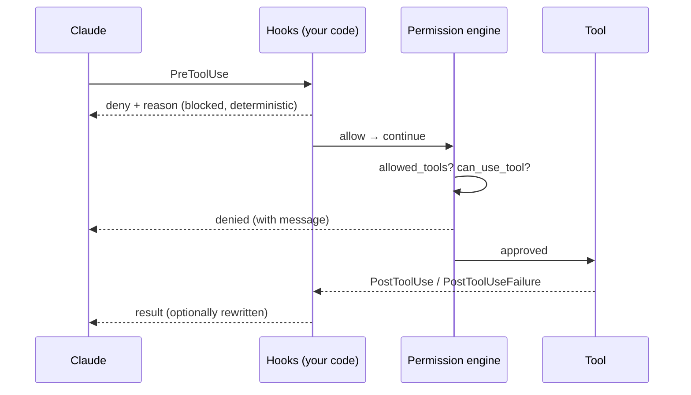

### Hook events (verified in `0.2.139`)

`PreToolUse` · `PostToolUse` · `PostToolUseFailure` · `UserPromptSubmit` · `Stop` · `SubagentStop` · `SubagentStart` · `PreCompact` · `Notification` · `PermissionRequest`

`SubagentStart` and `SubagentStop` are the ones orchestrator builders under-use — they are your span boundaries for tracing and your accounting points for per-agent cost.

```python
# level7_hooks.py
import anyio
from claude_agent_sdk import ClaudeSDKClient, ClaudeAgentOptions, HookMatcher

DESTRUCTIVE = ("rm -rf", "drop table", "truncate", "git push --force", "kubectl delete")


async def block_destructive(input_data, tool_use_id, context):
    if input_data.get("tool_name") != "Bash":
        return {}
    cmd = (input_data.get("tool_input") or {}).get("command", "").lower()
    for pattern in DESTRUCTIVE:
        if pattern in cmd:
            return {
                "hookSpecificOutput": {
                    "hookEventName": "PreToolUse",
                    "permissionDecision": "deny",
                    "permissionDecisionReason": (
                        f"Blocked by policy: command matched '{pattern}'."
                    ),
                }
            }
    return {}


async def audit_subagent_start(input_data, tool_use_id, context):
    print(f"[audit] subagent start: {input_data.get('agent_type')} "
          f"id={input_data.get('agent_id')}")
    return {}


async def audit_subagent_stop(input_data, tool_use_id, context):
    print(f"[audit] subagent stop: {input_data.get('agent_id')}")
    return {}


options = ClaudeAgentOptions(
    model="claude-sonnet-5",
    allowed_tools=["Read", "Grep", "Glob", "Bash", "Agent"],
    hooks={
        "PreToolUse": [HookMatcher(matcher="Bash", hooks=[block_destructive])],
        "SubagentStart": [HookMatcher(hooks=[audit_subagent_start])],
        "SubagentStop": [HookMatcher(hooks=[audit_subagent_stop])],
    },
    include_hook_events=True,
)
```

`HookMatcher` fields: `matcher` (tool name pattern; omit for all), `hooks` (list of callables), `timeout`.

> Hooks require `ClaudeSDKClient` — they are **not** supported with bare `query()`. The Python SDK also does not support `SessionStart`, `SessionEnd`, or `Notification` hooks due to setup constraints.

### Human-in-the-loop via `can_use_tool`

The mechanism for the confirmation step in any approval workflow — a refund, a production deploy, a customer-facing message.

```python
# level7_hitl.py
from claude_agent_sdk import (
    ClaudeSDKClient, ClaudeAgentOptions,
    PermissionResultAllow, PermissionResultDeny,
)

REQUIRES_APPROVAL = {"mcp__banking__issue_refund", "mcp__ledger__post_adjustment"}
AUTO_APPROVE_UNDER = 50.00


async def approval_gate(tool_name: str, tool_input: dict, context):
    if tool_name not in REQUIRES_APPROVAL:
        return PermissionResultAllow()

    amount = float(tool_input.get("amount", 0))

    # Policy tier 1: small amounts flow through, with the input pinned.
    if amount < AUTO_APPROVE_UNDER:
        return PermissionResultAllow(updated_input=tool_input)

    # Policy tier 2: real human. Replace with your queue / websocket / Slack.
    decision = await ask_human(
        f"Approve {tool_name} for ${amount:.2f} on {tool_input.get('account_id')}?"
    )

    if decision.approved:
        # You can MUTATE the input on the way through — cap the amount,
        # attach the approver ID for the downstream audit trail.
        return PermissionResultAllow(
            updated_input={**tool_input, "approved_by": decision.approver_id}
        )

    return PermissionResultDeny(
        message=f"Denied by {decision.approver_id}: {decision.reason}",
        interrupt=False,   # True = kill the run; False = let Claude adapt
    )


options = ClaudeAgentOptions(
    mcp_servers={"banking": banking_server},
    allowed_tools=["mcp__banking__get_balance"],   # read-only is pre-approved
    can_use_tool=approval_gate,                    # everything else routes here
    permission_mode="default",
)
```

Three details that matter in production:

1. **`updated_input` is a mutation point, not just a yes/no.** Cap amounts, inject the approver ID, redact a field, rewrite a target path. Your audit trail gets built here.
2. **`interrupt=True` vs `False`.** `False` returns the denial to Claude as a tool result, and Claude will try to work around it — sometimes usefully, sometimes by finding a path you didn't want. For hard policy stops, use `True`.
3. **Approvals happen in the parent, never in a subagent.** A subagent cannot prompt a human mid-task. Therefore: **put investigation in subagents and approval-gated actions in the parent.** This single rule prevents most multi-agent approval bugs.

### Permission modes

| Mode | Behaviour |
|---|---|
| `default` | Prompts (via `can_use_tool`) for anything not allow-listed |
| `acceptEdits` | File edits auto-approved; other tools still gated |
| `plan` | Read-only. Claude produces a plan and cannot act. **Use for dry runs.** |
| `dontAsk` | Never prompts — anything not allow-listed is denied outright |
| `bypassPermissions` | No checks at all. Ephemeral sandboxes only |
| `auto` | Harness-managed classification |

`plan` mode plus `fork_session` gives you a clean "propose, review, execute" flow: plan on a fork, show a human the plan, then run the approved version on the main session.

### Sandboxing

```python
options = ClaudeAgentOptions(
    sandbox={
        "enabled": True,          # bash sandboxing, macOS/Linux only
        "network": {
            "allowedDomains": ["api.internal.example.com", "pypi.org"],
            "deniedDomains": ["*"],
            "allowLocalBinding": False,
        },
    },
)
```

Read the docstring carefully: filesystem and network *restrictions* are configured via permission rules (Read deny rules, Edit allow/deny rules, WebFetch allow/deny rules), not via these settings. The `sandbox` block controls process-level isolation for bash.

---

# Level 8 — Scaling out: dynamic workflows and agent teams

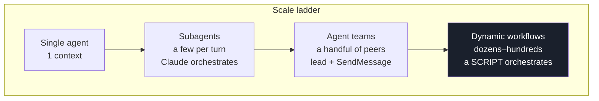

### Who holds the plan — the only question that matters

| | Subagents | Skills | Agent teams | Workflows |
|---|---|---|---|---|
| What it is | A worker Claude spawns | Instructions Claude follows | A lead supervising peer sessions | A script the runtime executes |
| Who decides what's next | Claude, turn by turn | Claude, per the prompt | The lead, turn by turn | **The script** |
| Where intermediate results live | Claude's context | Claude's context | A shared task list | **Script variables** |
| What's repeatable | The worker definition | The instructions | The team definition | **The orchestration itself** |
| Scale | A few per turn | Same | A handful of long-running peers | Dozens to hundreds per run |
| Interruption | Restarts the turn | Restarts the turn | Teammates keep running | Resumable in-session |

### Dynamic workflows

Claude writes a JavaScript orchestration script for your task; a runtime executes it in the background while the session stays responsive. Because the loop, branching, and intermediate results live in **script variables**, none of that lands in a context window — which is why it scales to hundreds of agents without drowning.

The saved script shape:

```javascript
export const meta = {
  name: 'audit-routes',
  description: 'Audit every route handler for missing auth checks',
}

const found = await agent('List every .ts file under src/routes/.', {
  schema: {
    type: 'object',
    required: ['files'],
    properties: { files: { type: 'array', items: { type: 'string' } } },
  },
})

const audits = await pipeline(found.files, file =>
  agent(`Audit ${file} for missing authentication checks.`, { label: file }),
)

return audits.filter(Boolean)
```

`agent()` spawns one subagent; `pipeline()` runs one per list item. An `agent()` call resolves to `null` if stopped or on an unrecoverable API error — hence `.filter(Boolean)`.

Runtime constraints to design against:

| Constraint | Implication |
|---|---|
| No mid-run user input | For sign-off between stages, run each stage as its own workflow |
| No direct filesystem or shell access from the script | The script coordinates; only agents touch the world |
| No module loading (`import()` fails before the run starts) | Anything needing a library goes inside an agent's task |
| Up to 16 concurrent agents, fewer on constrained CPUs | Plan wall-clock accordingly |
| 1,000 agents total per run | Hard runaway guard |
| Fan-out siblings stagger up to 5s (`CLAUDE_CODE_WORKFLOW_PREFIX_STAGGER_MS`) | Deliberate — they share the first agent's prompt cache |

From the Agent SDK: include `Workflow` in `allowedTools` to auto-approve runs. The `Workflow` tool is TypeScript Agent SDK v0.3.149+. In `claude -p` and the Agent SDK there is no one to prompt, so runs start immediately under your configured permission rules — **your permission config is the only thing standing between a workflow and your filesystem.** Configure it before you enable this.

Resume semantics have a sharp edge: replay follows the order agents *started*. Cached results stop at the first agent that didn't finish, and **every agent that started after that one re-runs, even if it completed.** Many small agents therefore preserve more progress than a few long ones.

Size guideline (`workflowSizeGuideline`, v2.1.219+): `small` (<5 agents), `medium` (<15, the default), `large` (<50), `unrestricted`. It's advice to Claude, not a cap — the runtime caps still apply.

### Agent teams

Two to sixteen full Claude Code sessions, one lead, coordinating through a shared task list and peer-to-peer `SendMessage`. Unlike subagents, teammates can message *each other* without the lead relaying. Each teammate is a full context window — expect a multiple of single-session token cost.

Security properties worth quoting to your security reviewer: a message arriving over `SendMessage` is labeled to the receiving agent as coming from another Claude session, not from you. A teammate cannot approve a permission prompt or supply consent on your behalf, and a denied teammate cannot relay the action to another teammate to bypass the check. Teammate permission prompts surface in the lead session.

### Picking

- **Subagents** — your default. Reach for anything else only when you can name what subagents failed at.
- **Agent teams** — when workers genuinely need to *coordinate with each other* mid-task.
- **Workflows** — when the run is large, repetitive, and you want the orchestration as a readable, re-runnable artifact.
- **Your own Python orchestration over `query()`** — when the control flow is known, must be deterministic, must be unit-testable, and must integrate with your existing scheduler. **For a regulated production pipeline this is often the right answer**, even though it is the least fashionable one.

---

# Part III — Making it real

# Level 9 — Context management and structured output

## 9.1 Compaction

The harness compacts automatically when context fills. You get one hook:

```python
async def on_precompact(input_data, tool_use_id, context):
    # Persist anything you must not lose before the harness summarizes.
    save_checkpoint(session_id=input_data["session_id"])
    return {}

options = ClaudeAgentOptions(
    hooks={"PreCompact": [HookMatcher(hooks=[on_precompact])]},
)
```

Compaction is lossy by design. The architectural response is not "tune compaction" — it's **don't put things in the orchestrator's context that don't belong there.** That is what subagents are for. If your orchestrator is compacting often, you have a delegation problem, not a context problem.

A useful diagnostic: track orchestrator tokens per run over time. Rising numbers mean subagents are returning too much. Tighten their return contracts.

## 9.2 Thinking configuration

```python
options = ClaudeAgentOptions(
    thinking={"type": "enabled", "budget_tokens": 8000},
    max_thinking_tokens=8000,
    effort="high",     # 'low' | 'medium' | 'high' | 'xhigh' | 'max' | int
)
```

Subagents inherit the main session's extended thinking configuration (v2.1.198+), but `AgentDefinition.effort` overrides per agent. Reserve high effort for adjudicators and critics; discovery agents rarely benefit.

## 9.3 Structured output

Instead of parsing prose, ask for a schema:

```python
options = ClaudeAgentOptions(
    output_format={
        "type": "json_schema",
        "schema": {
            "type": "object",
            "required": ["findings", "risk_level"],
            "properties": {
                "findings": {
                    "type": "array",
                    "items": {
                        "type": "object",
                        "properties": {
                            "severity": {"enum": ["low", "medium", "high", "critical"]},
                            "file": {"type": "string"},
                            "line": {"type": "integer"},
                            "description": {"type": "string"},
                        },
                        "required": ["severity", "file", "description"],
                    },
                },
                "risk_level": {"enum": ["accept", "review", "block"]},
            },
        },
    },
)

async for msg in query(prompt="Audit src/auth/", options=options):
    if isinstance(msg, ResultMessage):
        data = msg.structured_output       # already a dict, no parsing
```

This is the single highest-value upgrade for a reducer stage. Instead of prompt-engineering a return format and hoping, you get validated JSON in `ResultMessage.structured_output`.

Caveat: with `output_format` set, a turn ends on entries *after* the last assistant message, so forking at an assistant UUID is refused by design. Relevant only if you're doing surgical session forking.

## 9.4 Token budgets the model can see

```python
options = ClaudeAgentOptions(task_budget={"total": 200_000})
```

Different in kind from `max_budget_usd`: this is sent as `output_config.task_budget` and the model is *told* its remaining budget, so it paces tool use and wraps up rather than being guillotined. Use both together.

---

# Level 10 — Skills and plugins

Skills are reusable instruction bundles; plugins package skills, agents, hooks, and MCP servers together.

```python
options = ClaudeAgentOptions(
    setting_sources=["project"],          # required to load .claude/skills/
    skills=["invoice-parsing", "sox-controls"],
    allowed_tools=["Skill", "Read", "Grep", "Agent"],
    plugins=[{"type": "local", "path": "./plugins/finance-toolkit"}],
)
```

Per-subagent preloading:

```python
AgentDefinition(
    description="Parses vendor invoices to our canonical schema.",
    prompt="You are an invoice extraction specialist.",
    tools=["Read", "Grep"],
    skills=["invoice-parsing"],   # preloaded into THIS agent's context at startup
)
```

The distinction that matters: skills listed in `AgentDefinition.skills` are **preloaded**; unlisted skills remain invocable through the `Skill` tool but aren't in context at startup. Preload the one skill an agent always needs; leave the rest discoverable.

Skills are the right home for stable domain knowledge that would otherwise bloat every system prompt — a house style guide, a compliance checklist, a schema reference. Subagent prompts stay about *behavior*; skills carry *knowledge*.

`SdkPluginConfig` currently supports only `{"type": "local", "path": ...}`.

---

# Level 11 — Failure modes and resilience

### Exception hierarchy

```python
from claude_agent_sdk import (
    ClaudeSDKError,        # base
    CLINotFoundError,      # bundled/external CLI missing — deployment problem
    CLIConnectionError,    # transport died
    CLIJSONDecodeError,    # malformed protocol frame
    ProcessError,          # subprocess exited nonzero
)
```

`MessageParseError` also exists in `_errors` for unrecognized message shapes.

### The pattern that catches everything

```python
# level11_resilient.py
import anyio
from claude_agent_sdk import (
    query, ClaudeAgentOptions, ResultMessage,
    CLINotFoundError, ProcessError, CLIConnectionError, ClaudeSDKError,
)


async def run_guarded(prompt: str, options: ClaudeAgentOptions) -> dict:
    result = {"ok": False, "text": None, "cost": 0.0, "reason": None}
    try:
        async for msg in query(prompt=prompt, options=options):
            if isinstance(msg, ResultMessage):
                result["cost"] = msg.total_cost_usd or 0.0
                result["text"] = msg.result
                result["reason"] = msg.subtype
                result["ok"] = msg.subtype == "success" and not msg.is_error
    except CLINotFoundError:
        result["reason"] = "cli_missing"       # do not retry — fix the image
        raise
    except (ProcessError, CLIConnectionError) as exc:
        result["reason"] = f"transport:{exc}"  # retry-able
    except ClaudeSDKError as exc:
        result["reason"] = f"sdk:{exc}"
    return result
```

**A single-shot `query()` raises *after* yielding an error result.** So the `ResultMessage` — with its cost and session_id — has already been delivered to your loop by the time the exception surfaces. Capture state inside the loop, not after it. This is why the pattern above assigns before the `except`.

### Failure taxonomy for orchestrators

| Failure | Symptom | Response |
|---|---|---|
| `error_max_turns` | Partial work returned as if complete | Branch on `subtype`; treat as failure |
| `error_max_budget_usd` | Run stops, background subagents killed | Raise the cap or narrow the task; don't blind-retry |
| Concurrent subagent limit | `Concurrent subagent limit reached` in a tool_result | Lower fan-out width or raise the env limit |
| API error inside a subagent | Never delivered as the subagent's result | Detect via missing/`null` results; re-dispatch that one unit |
| MCP server down | Tool calls fail mid-run | `get_mcp_status()` pre-flight + `reconnect_mcp_server()` |
| Rate limit | `RateLimitEvent` in the stream | Back off; consider `fallback_model` |
| Node missing | `CLINotFoundError` at startup | Image problem — fail fast, never retry |

### Fallback model

```python
options = ClaudeAgentOptions(
    model="claude-opus-5",
    fallback_model="claude-sonnet-5",   # used when the primary is overloaded
)
```

Worth setting on orchestrators. A degraded orchestrator that completes beats a perfect one that 529s.

### Idempotency

Fan-out retries mean a unit of work can execute twice. If your subagents call tools with side effects, the tool — not the agent — must be idempotent. Pass a deterministic key:

```python
@tool("post_adjustment", "Post a ledger adjustment", {"idem_key": str, "amount": float})
async def post_adjustment(args):
    if await already_posted(args["idem_key"]):
        return {"content": [{"type": "text", "text": "already posted (no-op)"}]}
    ...
```

---

# Level 12 — Security and prompt injection

Multi-agent systems have a larger attack surface than single agents, and the boundaries are not where people expect.

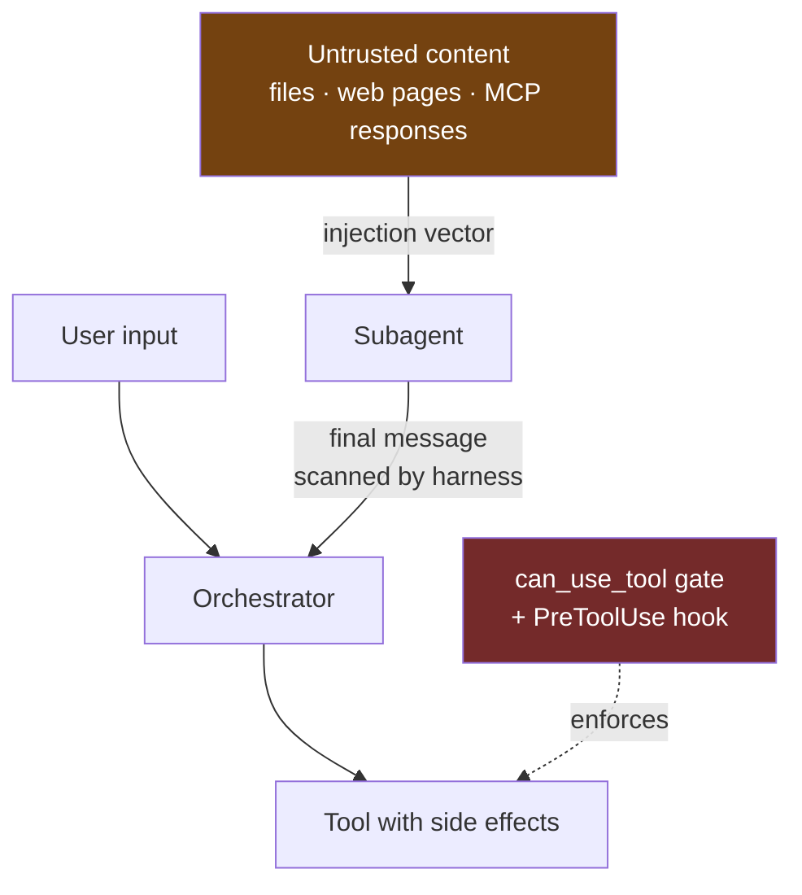

### What the harness does for you

In v2.1.210 and later, a subagent's final message is scanned for instruction-shaped patterns before the parent reads it:

- **Control-tag imitation** (e.g. a fake `<system-reminder>` block) is neutralized in place with an inserted backslash; nothing is deleted.
- **Permission-configuration mentions** (`.claude/settings.json`, `bypassPermissions`, `--dangerously-skip-permissions`) are kept as written.
- **Turn markers** — a line starting with `Human:` or `Assistant:` — get a backslash before the colon so the message can't fake a turn boundary.

For control-tag and permission-config matches, a `[harness: ...]` marker line is prepended. The scan never removes or rewords the subagent's text.

Also: a teammate cannot approve a permission prompt on your behalf, and a denied teammate cannot relay the action to another teammate to bypass the check. Messages between agents are labeled as coming from another Claude session, not from you.

### What you must do yourself

**1. Treat every subagent result as untrusted input.** A subagent that read a malicious file returns text shaped by that file. The harness scan is defense in depth, not a guarantee. Never let a subagent's raw output drive a tool call without a gate.

**2. Keep side effects in the parent, behind `can_use_tool`.** This is the same rule as the human-in-the-loop section, for a different reason. Investigation in subagents; irreversible action in the parent, gated.

**3. Set `strict_mcp_config=True`.** Otherwise a developer's `~/.claude.json` — or anything that can write it — injects MCP servers into your deployed agent. MCP tool descriptions are model-visible text and are therefore an injection vector.

**4. Pin MCP servers.** Prefer in-process tools and pinned container images over `npx`-style dynamic fetches. A tool description that changes between runs is a supply-chain problem.

**5. Never `bypassPermissions` outside a disposable sandbox.** Use `dontAsk` for unattended paths — it denies rather than allows what isn't allow-listed.

**6. Scope credentials per agent.** A subagent limited to `["Read", "Grep"]` cannot exfiltrate over `WebFetch` because the tool isn't in its session at all. Capability removal beats instruction, and it beats monitoring.

**7. Log `permission_denials`.** Every gate that fired is in `ResultMessage.permission_denials`. That's your security telemetry; ship it somewhere durable.

---

# Level 13 — Testing an orchestrator

Agent systems are testable. Most teams skip it because the obvious approach — assert on model output — is fragile. Test the *structure* instead.

### 13.1 Test tools as plain functions

In-process `@tool` functions are ordinary async callables. Test them without any model:

```python
import pytest

@pytest.mark.anyio
async def test_get_balance_missing_account():
    out = await get_balance({"account_id": "NOPE"})
    assert out["is_error"] is True
```

This is a strong argument for in-process tools over stdio: your business logic stays unit-testable.

### 13.2 Test permission gates without the model

`can_use_tool` is also a plain function:

```python
@pytest.mark.anyio
async def test_large_refund_requires_approval(monkeypatch):
    monkeypatch.setattr("mymod.ask_human", fake_denier)
    res = await approval_gate("mcp__banking__issue_refund",
                              {"amount": 5000, "account_id": "ACC-1"}, None)
    assert res.behavior == "deny"
```

Every policy rule you care about should have a test at this layer. These are the tests that would fail an audit if missing.

### 13.3 Assert on delegation structure, not prose

```python
async def collect_dispatches(prompt, options) -> list[str]:
    seen = []
    async for msg in query(prompt=prompt, options=options):
        for block in getattr(msg, "content", None) or []:
            if getattr(block, "name", None) in ("Agent", "Task"):
                seen.append(block.input.get("subagent_type"))
    return seen


@pytest.mark.anyio
async def test_router_delegates_fraud_to_fraud_agent():
    dispatched = await collect_dispatches(
        "Someone charged my card in another country and I didn't authorize it",
        ROUTER_OPTIONS,
    )
    assert dispatched == ["fraud-agent"]
```

Routing accuracy is far more stable than wording, and it's the thing that actually breaks when you edit a `description`.

### 13.4 Assert on realized parallelism

```python
@pytest.mark.anyio
async def test_fanout_is_actually_parallel():
    t0 = time.monotonic()
    result = await run_fanout(files=TEN_FILES)
    wall = time.monotonic() - t0
    serial_estimate = sum(result.per_file_durations)
    assert wall < serial_estimate * 0.4   # meaningfully parallel
```

### 13.5 Golden-set regression

Build 20–50 tasks with known-good outcomes before you tune anything. Orchestrator prompt changes have non-obvious second-order effects — a wording change that improves routing often collapses parallelism — and you cannot see that without a regression set. Gate prompt changes on it in CI.

### 13.6 Cheap mode for CI

```python
CI_OPTIONS = ClaudeAgentOptions(
    model="claude-haiku-4-5-20251001",
    max_turns=6,
    max_budget_usd=0.25,
    permission_mode="plan",     # read-only: no side effects in CI
    env={"CLAUDE_CODE_MAX_SUBAGENT_SPAWN_DEPTH": "1"},
)
```

`plan` mode is the key line. It makes the whole run structurally incapable of touching anything.

---

# Level 14 — Cost, observability, evaluation

## 14.1 Cost control, in layers

```python
options = ClaudeAgentOptions(
    max_budget_usd=10.0,              # hard stop → error_max_budget_usd
    max_turns=40,                     # loop guard
    task_budget={"total": 200_000},   # token budget the MODEL is aware of
    model="claude-sonnet-5",
    fallback_model="claude-haiku-4-5-20251001",
    env={
        "CLAUDE_CODE_MAX_SUBAGENT_SPAWN_DEPTH": "1",
        "CLAUDE_CODE_MAX_CONCURRENT_SUBAGENTS": "6",
    },
)
```

**Model tiering is the biggest single lever:**

| Role | Model | Why |
|---|---|---|
| Router / classifier | `haiku` | Thousands of calls, trivial decision |
| Fan-out workers | `haiku` or `sonnet` | Bounded, repetitive, narrow context |
| Orchestrator | `opus` | Must reason across heterogeneous results |
| Critic / adjudicator | `opus` | Quality gate — the one place to overspend |

Verify it worked with `ResultMessage.model_usage`, which breaks tokens down per model. If your "haiku workers" show Sonnet usage, your aliases aren't resolving the way you think — see [§22](#22-running-on-bedrock-vertex-foundry-mantle).

## 14.2 Observability

Track cost and latency **per agent**, not per run — a run-level number tells you nothing about which specialist is burning your budget.

```python
# level14_tracing.py
from dataclasses import dataclass, field
from claude_agent_sdk import (
    ClaudeAgentOptions, HookMatcher, AssistantMessage, ToolUseBlock, ResultMessage,
)


@dataclass
class RunTelemetry:
    dispatches: list[dict] = field(default_factory=list)
    total_cost_usd: float = 0.0
    turns: int = 0
    denials: list[dict] = field(default_factory=list)


telemetry = RunTelemetry()


async def on_subagent_start(input_data, tool_use_id, context):
    telemetry.dispatches.append({
        "agent_type": input_data.get("agent_type"),
        "agent_id": input_data.get("agent_id"),
        "session_id": input_data.get("session_id"),
        "event": "start",
    })
    return {}


async def on_subagent_stop(input_data, tool_use_id, context):
    telemetry.dispatches.append({"agent_id": input_data.get("agent_id"), "event": "stop"})
    return {}


def observe(message) -> None:
    """Call from your message loop."""
    parent = getattr(message, "parent_tool_use_id", None)   # set ⇒ inside a subagent
    if isinstance(message, AssistantMessage):
        for block in message.content:
            if isinstance(block, ToolUseBlock):
                print(f"[{'subagent' if parent else 'root'}] tool={block.name}")
    elif isinstance(message, ResultMessage):
        telemetry.total_cost_usd += message.total_cost_usd or 0.0
        telemetry.turns += message.num_turns or 0
        telemetry.denials.extend(message.permission_denials or [])
```

Map onto OpenTelemetry with one span per agent:

- `SubagentStart` → open a child span keyed on `agent_id`; attributes `agent.type`, `agent.model`
- `parent_tool_use_id` on streamed messages → attribute tool spans to the right agent
- `SubagentStop` → close it
- `ResultMessage.usage` / `model_usage` / `total_cost_usd` → span attributes for cost rollups

If you already emit OTel GenAI semantic conventions elsewhere, use `gen_ai.operation.name`, `gen_ai.request.model`, and `gen_ai.usage.*` so agent spans join your existing dashboards rather than living in a silo. The package ships an `otel` extra (`pip install "claude-agent-sdk[otel]"`) that pulls `opentelemetry-api`.

## 14.3 Evaluating an orchestrator

Multi-agent systems fail differently from single agents. Score these separately:

| Dimension | What to measure | Why it breaks |
|---|---|---|
| **Routing accuracy** | Did the right specialist get the task? | Vague `description` fields |
| **Delegation rate** | How often did the orchestrator do the work itself? | `Agent` not allow-listed; weak system prompt |
| **Context leakage** | Orchestrator tokens per run | Subagents returning raw dumps |
| **Handoff fidelity** | Did the child get the paths/facts it needed? | The Agent prompt string is the only channel |
| **Parallelism realized** | Wall clock ÷ sum of subagent durations | Serial dispatch masquerading as fan-out |
| **Cost per resolved task** | `total_cost_usd` ÷ successful outcomes | Retry loops, depth explosions |
| **Gate coverage** | `permission_denials` vs expected policy hits | Gates that never fire are gates that aren't wired |
| **End quality** | Task-specific rubric, LLM-judge or human | The only one that ultimately counts |

---

# Level 15 — Deployment

```dockerfile
FROM python:3.12-slim

# The Agent SDK ships a bundled CLI and expects a Node runtime.
RUN apt-get update && apt-get install -y --no-install-recommends \
        nodejs npm git ca-certificates \
    && rm -rf /var/lib/apt/lists/*

WORKDIR /app
COPY requirements.txt .
RUN pip install --no-cache-dir -r requirements.txt   # ~310 MB for the SDK alone

COPY . .

# Sessions and transcripts land here — mount a volume if they must survive.
ENV CLAUDE_CONFIG_DIR=/data/claude
VOLUME ["/data/claude"]

HEALTHCHECK CMD node --version || exit 1

CMD ["python", "-m", "app.orchestrator"]
```

Behind FastAPI:

```python
# level15_service.py
from contextlib import asynccontextmanager
from fastapi import FastAPI
from pydantic import BaseModel
from claude_agent_sdk import ClaudeSDKClient, ClaudeAgentOptions, ResultMessage

SESSIONS: dict[str, ClaudeSDKClient] = {}


@asynccontextmanager
async def lifespan(app: FastAPI):
    yield
    for client in SESSIONS.values():
        await client.disconnect()


app = FastAPI(lifespan=lifespan)


class Ask(BaseModel):
    prompt: str
    session_id: str | None = None


@app.post("/ask")
async def ask(req: Ask):
    # One client == one subprocess. Pool them; do not create per request.
    client = SESSIONS.get(req.session_id or "")
    if client is None:
        client = ClaudeSDKClient(options=ClaudeAgentOptions(
            model="claude-sonnet-5",
            allowed_tools=["Read", "Grep", "Glob", "Agent"],
            permission_mode="dontAsk",     # no human on the other end of an HTTP call
            max_budget_usd=2.0,
            strict_mcp_config=True,
        ))
        await client.connect()

    await client.query(req.prompt)
    result = None
    async for msg in client.receive_response():
        if isinstance(msg, ResultMessage):
            result = msg
    SESSIONS[result.session_id] = client
    return {"session_id": result.session_id, "result": result.result,
            "cost_usd": result.total_cost_usd}
```

### Production checklist

- [ ] Node.js present in the image; `node --version` in a healthcheck
- [ ] Image size budgeted for the 310 MB bundled binary
- [ ] `strict_mcp_config=True` so no host config bleeds in
- [ ] `permission_mode="dontAsk"` for unattended paths — never `bypassPermissions` outside a disposable sandbox
- [ ] `max_budget_usd` **and** `max_turns` on every entry point
- [ ] Subprocess pool with an upper bound; one client is one process
- [ ] Session persistence decided explicitly: volume, or a custom `session_store`
- [ ] `setting_sources` left unset unless you deliberately want project config
- [ ] Secrets to MCP servers via env, not literals in `headers`
- [ ] `SubagentStart`/`SubagentStop` wired to your tracer before you need it
- [ ] `permission_denials` shipped to durable audit storage
- [ ] Regression eval set in CI, gating orchestrator prompt changes
- [ ] SDK version pinned; upgrades treated as harness upgrades (see version skew, [§2](#2-what-is-actually-inside-claude-agent-sdk))

---

# Part IV — Providers and models

## 22. Running on Bedrock, Vertex, Foundry, Mantle

**Yes, all of them.** It's env-var driven, so nothing in your Python changes except which variables are set. The bundled binary embeds `@anthropic-ai/bedrock-sdk` and `@anthropic-ai/vertex-sdk`, and exposes `CLAUDE_CODE_USE_BEDROCK`, `CLAUDE_CODE_USE_VERTEX`, `CLAUDE_CODE_USE_FOUNDRY`, and `CLAUDE_CODE_USE_MANTLE`.

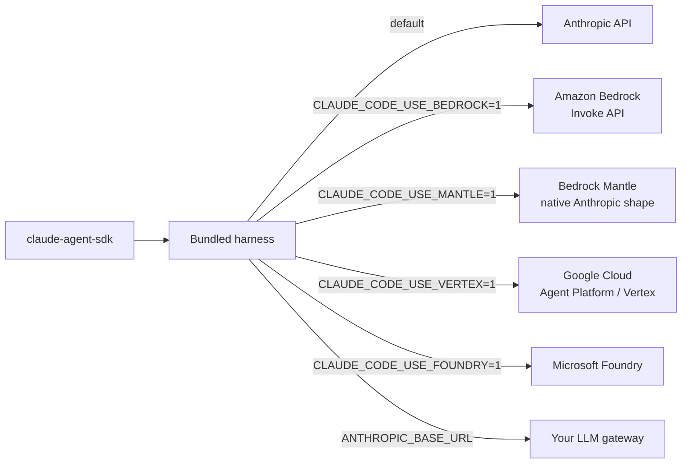

### 22.1 Amazon Bedrock

```bash
export CLAUDE_CODE_USE_BEDROCK=1
export AWS_REGION=us-east-1          # optional if your AWS profile sets one

# PIN MODELS for any multi-user or CI deployment
export ANTHROPIC_DEFAULT_OPUS_MODEL='us.anthropic.claude-opus-4-8'
export ANTHROPIC_DEFAULT_SONNET_MODEL='us.anthropic.claude-sonnet-4-6'
export ANTHROPIC_DEFAULT_HAIKU_MODEL='us.anthropic.claude-haiku-4-5-20251001-v1:0'
```

Credentials: the standard AWS chain — `aws configure`, `AWS_ACCESS_KEY_ID`/`SECRET`/`SESSION_TOKEN`, `AWS_PROFILE` with SSO, instance/task roles, or `AWS_BEARER_TOKEN_BEDROCK` (Bedrock API key).

IAM policy:

```json
{
  "Version": "2012-10-17",
  "Statement": [{
    "Effect": "Allow",
    "Action": [
      "bedrock:InvokeModel",
      "bedrock:InvokeModelWithResponseStream",
      "bedrock:ListInferenceProfiles",
      "bedrock:GetInferenceProfile"
    ],
    "Resource": [
      "arn:aws:bedrock:*:*:inference-profile/*",
      "arn:aws:bedrock:*:*:application-inference-profile/*",
      "arn:aws:bedrock:*:*:foundation-model/*"
    ]
  }]
}
```

Region resolution order: `AWS_REGION` → `AWS_DEFAULT_REGION` → the active profile's region → `us-east-1`.

Cross-region inference profile prefixes by region: `us-gov-*` → `us-gov.`, `us-*` → `us.`, `eu-*` → `eu.`, `ap-*` → `apac.`, everything else → `global.`. Override with `ANTHROPIC_BEDROCK_REGION_PREFIX` (valid: `us`, `eu`, `apac`, `jp`, `au`, `global`).

Other useful variables: `ANTHROPIC_BEDROCK_BASE_URL` (custom endpoint/gateway), `ANTHROPIC_BEDROCK_SERVICE_TIER` (`default`/`flex`/`priority`), `ANTHROPIC_SMALL_FAST_MODEL_AWS_REGION`, `DISABLE_PROMPT_CACHING`, `ENABLE_PROMPT_CACHING_1H`.

Guardrails via headers:

```json
{"env": {"ANTHROPIC_CUSTOM_HEADERS": "X-Amzn-Bedrock-GuardrailIdentifier: your-id\nX-Amzn-Bedrock-GuardrailVersion: 1"}}
```

### 22.2 Google Cloud (Vertex / Agent Platform)

```bash
export CLAUDE_CODE_USE_VERTEX=1
export ANTHROPIC_VERTEX_PROJECT_ID=your-project
export CLOUD_ML_REGION=global        # or us / eu / us-east5
```

Credentials: Application Default Credentials — `gcloud auth application-default login`, or `GOOGLE_APPLICATION_CREDENTIALS` pointing at a service-account key. Role: `roles/aiplatform.user`.

Per-model region overrides exist for models not served on the global endpoint: `VERTEX_REGION_CLAUDE_5_OPUS`, `VERTEX_REGION_CLAUDE_5_SONNET`, `VERTEX_REGION_CLAUDE_HAIKU_4_5`, `VERTEX_REGION_CLAUDE_FABLE_5`, and equivalents for earlier families.

### 22.3 Bedrock Mantle

Mantle is a Bedrock endpoint serving Claude through the **native Anthropic API shape** rather than the Invoke API. Same AWS credentials and IAM.

```bash
export CLAUDE_CODE_USE_MANTLE=1
export AWS_REGION=us-east-1
# Model IDs look like: anthropic.claude-sonnet-5, anthropic.claude-haiku-4-5
```

You can run it alongside the Invoke API — set both `CLAUDE_CODE_USE_BEDROCK=1` and `CLAUDE_CODE_USE_MANTLE=1`, and model IDs matching the Mantle format route to Mantle while everything else goes to Invoke. Worth asking your AWS account team about if you want feature parity closer to the first-party API.

### 22.4 Per-client, not just global

```python
options = ClaudeAgentOptions(
    env={
        "CLAUDE_CODE_USE_BEDROCK": "1",
        "AWS_REGION": "us-east-1",
        "ANTHROPIC_DEFAULT_SONNET_MODEL": "us.anthropic.claude-sonnet-4-6",
        "ANTHROPIC_DEFAULT_HAIKU_MODEL": "us.anthropic.claude-haiku-4-5-20251001-v1:0",
    },
)
```

Useful if one process talks to more than one provider. Remember: Python **merges** `env`; TypeScript **replaces** it.

### 22.5 Five things that will bite your orchestrator

**1. `WebSearch` is not available on Bedrock.** If your `researcher` subagent lists `WebSearch` in `tools`, that tool silently won't exist. Swap for `WebFetch` or an MCP-based search server. On Vertex, MCP tool search is disabled by default, so all MCP tool definitions load upfront — a fixed context cost per agent that matters at fan-out width.

**2. Model aliases in `AgentDefinition` resolve through the pinning variables.** `AgentDefinition(model="haiku")` resolves via `ANTHROPIC_DEFAULT_HAIKU_MODEL`. Unset on Bedrock, the harness falls back to **Sonnet** for the small/fast model, because Haiku isn't enabled in every account. Your cheap tier quietly becomes your mid tier and the cost model you designed is wrong. Pin all three, then verify with `ResultMessage.model_usage`.

**3. Unpinned deployments default to Opus 5 as the primary model** on Bedrock (v2.1.207+) — the Opus rate on every orchestrator turn. Set `ANTHROPIC_MODEL` deliberately.

**4. `max_budget_usd` becomes an estimate.** Billing runs through AWS/GCP, so `total_cost_usd` is the harness's own calculation, not an invoice. Still useful as a circuit breaker; don't reconcile finance against it. Use provider cost tags for the real number.

**5. Prompt caching isn't available in every Bedrock region.** If cache token counts sit at zero, that's why — and it matters a lot for fan-out, where sibling agents are supposed to share a cached prefix.

Also: Bedrock uses the Invoke API only (not Converse), and `/logout` is unavailable on both Bedrock and Vertex since auth is delegated to the cloud provider.

---

## 23. Can it call GPT, Azure OpenAI, DeepSeek? LiteLLM and the honest answer

**Short answer: not natively — the harness only speaks the Anthropic Messages API. But yes via a translating gateway, with real caveats you should read before committing.**

### 23.1 The mechanism

The Agent SDK inherits Claude Code's LLM-gateway support. Point it at anything serving `/v1/messages`:

```python
options = ClaudeAgentOptions(
    env={
        "ANTHROPIC_BASE_URL": "http://litellm:4000",   # no /v1 suffix — it appends
        "ANTHROPIC_AUTH_TOKEN": "sk-...",              # sent as Bearer
        "ANTHROPIC_MODEL": "gpt-5",
        "CLAUDE_CODE_ENABLE_GATEWAY_MODEL_DISCOVERY": "1",
    },
)
```

`ANTHROPIC_AUTH_TOKEN` becomes an `Authorization: Bearer` header; `ANTHROPIC_API_KEY` becomes `x-api-key` when no auth token is set. `CLAUDE_CODE_ENABLE_GATEWAY_MODEL_DISCOVERY=1` (Claude Code v2.1.129+) makes the harness call `GET /v1/models` on your proxy at startup and add those models to the picker.

### 23.2 LiteLLM specifically — two different routes

| Route | What it does | Use for |
|---|---|---|
| `/v1/messages` (unified) | **Translates** Anthropic format ↔ OpenAI/Azure/DeepSeek/Gemini and back | Non-Claude models |
| `/anthropic/*` (passthrough) | Native passthrough, no translation | Real Anthropic models only |

For GPT/Azure/DeepSeek you need the **unified** endpoint. Minimal config:

```yaml
# litellm_config.yaml
model_list:
  - model_name: gpt-4o
    litellm_params:
      model: azure/gpt-4o
      api_base: https://your-resource.openai.azure.com
      api_key: os.environ/AZURE_API_KEY
  - model_name: deepseek-chat
    litellm_params:
      model: deepseek/deepseek-chat
      api_key: os.environ/DEEPSEEK_API_KEY
  # Alias entries so AgentDefinition model aliases resolve
  - model_name: haiku
    litellm_params: {model: anthropic/claude-haiku-4-5-20251001, api_key: os.environ/ANTHROPIC_API_KEY}
  - model_name: sonnet
    litellm_params: {model: anthropic/claude-sonnet-5, api_key: os.environ/ANTHROPIC_API_KEY}
  - model_name: opus
    litellm_params: {model: anthropic/claude-opus-5, api_key: os.environ/ANTHROPIC_API_KEY}
```

Those last three entries are not optional if you use subagents. `AgentDefinition(model="haiku")` sends the literal string `haiku` downstream; without a `model_list` entry the subagent fails to route.

### 23.3 Why I'd push back on doing this for the orchestrator

The transport works. The **harness** is the problem.

**1. Agentic behavior degrades sharply.** Claude Code's system prompt, tool descriptions, and loop are tuned against Claude. Non-Claude models on this harness tend to over-call tools, fail multi-step plans, and ignore instructions like "dispatch all in a single turn" that your fan-out depends on. Translation preserves the schema, not the behavior.

**2. Half your orchestrator config becomes a no-op.** `effort="high"` on an `AgentDefinition`, thinking blocks, `max_thinking_tokens` — no equivalent on GPT or DeepSeek. `WebSearch` is a server tool, so it's gone too. Your carefully tiered subagent definitions silently lose their tiering.

**3. Prompt caching disappears.** This one is quantitative. The workflow runtime deliberately staggers fan-out siblings up to 5s so they read the first agent's cached prefix. Behind a translating gateway there's no `cache_control`, so every one of N parallel workers reprocesses the full system + tools prefix uncached. On a 50-file fan-out that's a large, invisible cost increase.

**4. Your budget circuit breakers break.** `max_budget_usd` and `total_cost_usd` are computed against Anthropic pricing. Point at DeepSeek and the numbers are meaningless — you lose the cap you were relying on in a hierarchical run.

**5. It's an unsupported configuration.** Bugs won't be triaged against it.

### 23.4 What to build instead: LiteLLM as a tool, not as the transport

Keep the harness on Claude. Reach other models through an in-process MCP tool:

```python
# multi_model_tool.py
import litellm
from claude_agent_sdk import tool, create_sdk_mcp_server

@tool("query_model", "Ask a specific non-Claude model a self-contained question",
      {"model": str, "prompt": str})
async def query_model(args):
    resp = await litellm.acompletion(
        model=args["model"],                    # "azure/gpt-4o", "deepseek/deepseek-chat"
        messages=[{"role": "user", "content": args["prompt"]}],
        api_base="http://litellm:4000",
    )
    return {"content": [{"type": "text", "text": resp.choices[0].message.content}]}


models = create_sdk_mcp_server(name="models", version="1.0.0", tools=[query_model])
```

Wire it into a cross-model debate panel:

```python
options = ClaudeAgentOptions(
    model="claude-opus-5",
    mcp_servers={"models": models},
    agents={
        "external-perspective": AgentDefinition(
            description=(
                "Gets an independent answer from a non-Claude model. Use when you "
                "want a genuinely different model's view, not a second Claude pass."
            ),
            prompt=(
                "Use query_model to ask the named model the question verbatim. "
                "Report its answer without editorializing."
            ),
            tools=["mcp__models__query_model"],
            model="haiku",     # the wrapper agent is cheap; the work happens downstream
        ),
    },
    allowed_tools=["Agent", "mcp__models__query_model", "Read", "Grep"],
)
```

Now your Claude orchestrator can delegate a specific subtask to GPT-4o or DeepSeek — cross-model debate, cheap bulk classification, a second opinion in the evaluator-optimizer loop — while the agent loop, subagent runtime, permissions, hooks, and cost accounting all stay on the path they were built for.

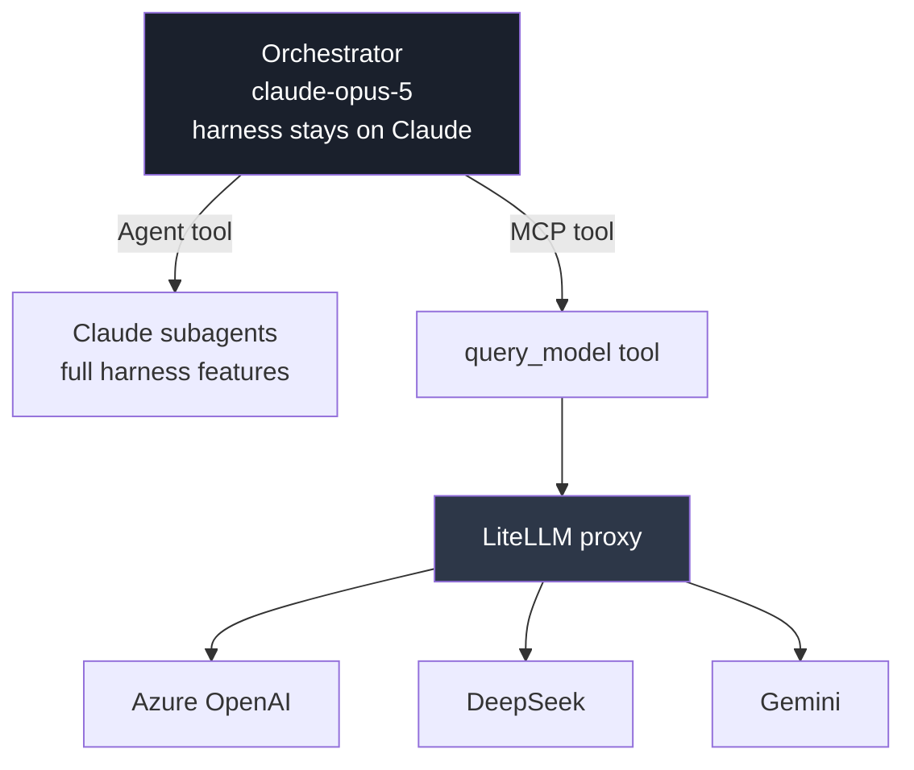

### 23.5 When the gateway route IS right

- **Centralized auth, cost attribution, and audit** for *Claude* traffic — point `ANTHROPIC_BASE_URL` at your gateway and keep Claude models behind it. All the caveats above are about *non-Claude* models; routing Claude through a gateway costs you nothing but a hop.
- **Hard organizational requirement** that no traffic leaves via a vendor SDK.
- **Cost experiments** where degraded agentic behavior is acceptable.

If you genuinely need the *orchestrator itself* to be model-agnostic — a hard requirement, not a nice-to-have — the Agent SDK is the wrong harness and LangGraph or your own loop over LiteLLM is the right one. That's a real architectural fork, not a config flag.

| Requirement | Right tool |
|---|---|
| Best agentic behavior, Claude models | Agent SDK, direct or Bedrock/Vertex |
| Claude models + central gateway governance | Agent SDK + `ANTHROPIC_BASE_URL` |
| Claude orchestrator, occasional other models | Agent SDK + LiteLLM **as an MCP tool** |
| Model-agnostic orchestrator, first-class | LangGraph / custom loop + LiteLLM |
| Non-Claude models on the Claude Code harness | Possible; expect degradation |

### 23.6 Supply-chain note

If LiteLLM will sit in your infrastructure: PyPI versions **1.82.7 and 1.82.8** (March 24, 2026) were published from a hijacked maintainer account and carried a credential stealer in a `.pth` file that executed on every Python interpreter start — no `import litellm` required. It harvested SSH keys, cloud credentials, and Kubernetes configs. Root cause was a second-order compromise via Trivy in LiteLLM's CI/CD. Fixed in **1.83.0** on a rebuilt pipeline; the official Proxy Docker image was never affected because it pins from `requirements.txt`.

For a regulated deployment: use the official Docker image, pin exact versions, verify against GitHub releases, and don't `pip install litellm` unpinned. This is exactly the kind of thing an architecture review will ask about, and having the answer ready is worth the paragraph.

---

## 24. Composing with A2A

The Agent SDK's `SendMessage` and agent teams are **intra-harness** coordination — sessions on the same machine, discovered through files on disk and a local socket. They are not an interop protocol and do not cross organizational boundaries.

The clean composition is layered, not either/or:


- **A2A** = the external contract. Agent discovery, task lifecycle, cross-team interop.
- **Agent SDK subagents** = internal decomposition inside one A2A-addressable agent.
- **MCP** = how any of them reach tools and data.

Mapping the lifecycles:

| A2A concept | Agent SDK equivalent |
|---|---|
| Task ID | `session_id` |
| Task `working` | Streaming `AssistantMessage` / `TaskProgressMessage` |
| Task `input-required` | A `can_use_tool` gate raising back to the caller |
| Task `completed` / `failed` | `ResultMessage.subtype` |
| Task artifacts | `ResultMessage.structured_output` |
| Cancel | `await client.interrupt()` |

Don't try to express A2A semantics with `SendMessage`; they solve different problems at different layers.

---

# Part V — Reference

## 25. Capstone: an end-to-end document orchestrator

Everything above, assembled into one runnable shape: a document-processing orchestrator with parsing tools over MCP, a parallel extraction fan-out, a validation gate, an approval step, structured output, budgets, and tracing.

```python
# capstone_document_orchestrator.py
"""
Flow:
  discover → fan-out extract (haiku) → validate (sonnet) → adjudicate (opus)
  → gated action (parent only, human approval over threshold)
"""
import anyio
from claude_agent_sdk import (
    query, tool, create_sdk_mcp_server,
    ClaudeSDKClient, ClaudeAgentOptions, AgentDefinition, HookMatcher,
    PermissionResultAllow, PermissionResultDeny,
    AssistantMessage, ToolUseBlock, TextBlock, ResultMessage,
)

# ---------------------------------------------------------------- tools

@tool("parse_document", "Parse a document to structured text", {"path": str})
async def parse_document(args):
    text = await run_parser(args["path"])          # your Docling/OCR/etc. call
    return {"content": [{"type": "text", "text": text}]}


@tool("post_to_ledger", "Post an extracted invoice to the ledger",
      {"invoice_id": str, "amount": float, "idem_key": str})
async def post_to_ledger(args):
    if await already_posted(args["idem_key"]):
        return {"content": [{"type": "text", "text": "already posted (no-op)"}]}
    await ledger_post(args["invoice_id"], args["amount"], args["idem_key"])
    return {"content": [{"type": "text", "text": f"posted {args['invoice_id']}"}]}


docs = create_sdk_mcp_server(name="docs", version="1.0.0",
                             tools=[parse_document, post_to_ledger])

# ---------------------------------------------------------------- agents

AGENTS = {
    "extractor": AgentDefinition(
        description=(
            "Extracts structured fields from ONE document. Use once per document "
            "in a parallel fan-out."
        ),
        prompt=(
            "Parse exactly the document named in your prompt using parse_document. "
            "Return ONLY JSON with keys: invoice_id, vendor, amount, currency, "
            "line_items[], confidence (0-1). If a field is unreadable, use null and "
            "lower confidence. Never guess."
        ),
        tools=["mcp__docs__parse_document"],
        model="haiku",
        maxTurns=8,
    ),
    "validator": AgentDefinition(
        description="Validates extracted invoice records against business rules.",
        prompt=(
            "Check each record for: totals matching line items, currency present, "
            "duplicate invoice_id, amount outside historical vendor range. "
            "Output one line per violation as `RULE_ID | invoice_id | detail`, "
            "or exactly CLEAN."
        ),
        tools=["Read"],
        model="sonnet",
    ),
    "adjudicator": AgentDefinition(
        description="Decides post / hold / reject for each validated record.",
        prompt=(
            "You receive extractions and validation findings. For each record "
            "decide POST, HOLD, or REJECT with a one-line reason. Anything with "
            "confidence below 0.85 or any violation is at most HOLD."
        ),
        tools=["Read"],
        model="opus",
        effort="high",
    ),
}

# ---------------------------------------------------------------- control plane

APPROVAL_THRESHOLD = 10_000.0


async def approval_gate(tool_name: str, tool_input: dict, context):
    if tool_name != "mcp__docs__post_to_ledger":
        return PermissionResultAllow()

    amount = float(tool_input.get("amount", 0))
    if amount < APPROVAL_THRESHOLD:
        return PermissionResultAllow(updated_input=tool_input)

    decision = await ask_human(f"Approve posting ${amount:,.2f}?")
    if decision.approved:
        return PermissionResultAllow(
            updated_input={**tool_input, "approved_by": decision.approver_id}
        )
    return PermissionResultDeny(message=f"Denied: {decision.reason}", interrupt=True)


SPANS: dict[str, dict] = {}


async def on_subagent_start(input_data, tool_use_id, context):
    SPANS[input_data.get("agent_id")] = {"type": input_data.get("agent_type")}
    return {}


async def on_subagent_stop(input_data, tool_use_id, context):
    SPANS.get(input_data.get("agent_id"), {})["done"] = True
    return {}


# ---------------------------------------------------------------- run

OPTIONS = ClaudeAgentOptions(
    model="claude-opus-5",
    agents=AGENTS,
    mcp_servers={"docs": docs},
    allowed_tools=["Glob", "Read", "Agent", "mcp__docs__parse_document"],
    # post_to_ledger deliberately NOT allow-listed → routes to approval_gate
    can_use_tool=approval_gate,
    hooks={
        "SubagentStart": [HookMatcher(hooks=[on_subagent_start])],
        "SubagentStop": [HookMatcher(hooks=[on_subagent_stop])],
    },
    system_prompt=(
        "You are a document-processing orchestrator. Steps:\n"
        "1. Glob the target directory to list documents.\n"
        "2. Dispatch ONE extractor per document, ALL IN A SINGLE TURN.\n"
        "3. When all return, dispatch the validator with every extraction.\n"
        "4. Dispatch the adjudicator with extractions plus findings.\n"
        "5. For each POST decision, call post_to_ledger YOURSELF with a stable "
        "   idem_key. Never delegate a ledger write to a subagent.\n"
        "Do not parse documents yourself."
    ),
    output_format={
        "type": "json_schema",
        "schema": {
            "type": "object",
            "required": ["decisions"],
            "properties": {
                "decisions": {
                    "type": "array",
                    "items": {
                        "type": "object",
                        "required": ["invoice_id", "decision", "reason"],
                        "properties": {
                            "invoice_id": {"type": "string"},
                            "decision": {"enum": ["POST", "HOLD", "REJECT"]},
                            "reason": {"type": "string"},
                            "amount": {"type": "number"},
                        },
                    },
                }
            },
        },
    },
    env={
        "CLAUDE_CODE_MAX_SUBAGENT_SPAWN_DEPTH": "1",
        "CLAUDE_CODE_MAX_CONCURRENT_SUBAGENTS": "8",
    },
    max_budget_usd=15.0,
    max_turns=60,
    strict_mcp_config=True,
    permission_mode="default",
)


async def main(inbox: str = "./inbox") -> dict:
    async with ClaudeSDKClient(options=OPTIONS) as client:
        await client.query(f"Process every document in {inbox}.")

        final = None
        async for msg in client.receive_response():
            if isinstance(msg, AssistantMessage):
                scope = "sub" if msg.parent_tool_use_id else "root"
                for block in msg.content:
                    if isinstance(block, ToolUseBlock) and block.name in ("Agent", "Task"):
                        print(f"[{scope}] → {block.input.get('subagent_type')}")
                    elif isinstance(block, TextBlock) and scope == "root":
                        print(block.text, end="", flush=True)
            elif isinstance(msg, ResultMessage):
                final = msg

        if final.subtype != "success":
            raise RuntimeError(f"run ended: {final.subtype} / {final.terminal_reason}")

        print(f"\ncost=${final.total_cost_usd:.4f} turns={final.num_turns} "
              f"agents={len(SPANS)} denials={len(final.permission_denials or [])}")
        return final.structured_output


if __name__ == "__main__":
    print(anyio.run(main))
```

Every design rule in this guide is visible in that file:

| Rule | Where |
|---|---|
| `Agent` in `allowed_tools` | `allowed_tools` list |
| Routing-instruction `description`s | each `AgentDefinition` |
| Model tiering | haiku → sonnet → opus by role |
| "single turn" for real parallelism | system prompt step 2 |
| Structured return contract | extractor prompt: "ONLY JSON with keys…" |
| Side effects in the parent, gated | system prompt step 5 + `can_use_tool` |
| Idempotency | `idem_key` on `post_to_ledger` |
| Depth and concurrency bounds | `env` |
| Budget circuit breakers | `max_budget_usd`, `max_turns` |
| Tracing spans | `SubagentStart`/`SubagentStop` hooks |
| Validated output | `output_format` → `structured_output` |
| Config isolation | `strict_mcp_config=True` |
| Branch on `subtype` | the `RuntimeError` check |

---

## 26. Reference tables

### `ClaudeAgentOptions` — full field list (`0.2.139`)

**Model & reasoning:** `model` · `fallback_model` · `effort` · `thinking` · `max_thinking_tokens` · `betas`

**Tools & MCP:** `tools` · `allowed_tools` · `disallowed_tools` · `mcp_servers` · `strict_mcp_config` · `skills` · `plugins`

**Agents & orchestration:** `agents` · `max_turns` · `task_budget` · `max_budget_usd`

**Permissions & safety:** `permission_mode` · `can_use_tool` · `permission_prompt_tool_name` · `sandbox` · `hooks` · `include_hook_events`

**Session:** `session_id` · `resume` · `resume_session_at` · `resume_drops_turn` · `continue_conversation` · `fork_session` · `session_store` · `session_store_flush` · `enable_file_checkpointing`

**Environment:** `cwd` · `add_dirs` · `env` · `settings` · `setting_sources` · `cli_path` · `extra_args` · `load_timeout_ms`

**I/O & prompt:** `system_prompt` · `output_format` · `include_partial_messages` · `max_buffer_size` · `stderr` · `debug_stderr` · `user`

### `ResultMessage` — full field list

`subtype` · `duration_ms` · `duration_api_ms` · `is_error` · `num_turns` · `session_id` · `stop_reason` · `total_cost_usd` · `usage` · `result` · `structured_output` · `model_usage` · `permission_denials` · `deferred_tool_use` · `errors` · `api_error_status` · `uuid` · `terminal_reason` · `origin`

### `AssistantMessage` — full field list

`content` · `model` · `parent_tool_use_id` · `error` · `usage` · `message_id` · `stop_reason` · `session_id` · `uuid`

### Permission and hook helpers

| Class | Fields |
|---|---|
| `PermissionResultAllow` | `behavior`, `updated_input`, `updated_permissions` |
| `PermissionResultDeny` | `behavior`, `message`, `interrupt` |
| `HookMatcher` | `matcher`, `hooks`, `timeout` |

### Hook events

`PreToolUse` · `PostToolUse` · `PostToolUseFailure` · `UserPromptSubmit` · `Stop` · `SubagentStop` · `SubagentStart` · `PreCompact` · `Notification` · `PermissionRequest`

*(Python SDK does not support `SessionStart`, `SessionEnd`, or `Notification`.)*

### Built-in tools

| Tool | Notes |
|---|---|
| `Read` `Write` `Edit` | Filesystem. `Edit` respects checkpointing |
| `Bash` | Shell. The tool to gate hardest |
| `Glob` `Grep` | Discovery. Cheap, safe, allow-list freely |
| `WebSearch` `WebFetch` | Network. **`WebSearch` unavailable on Bedrock** |
| `Agent` | Subagent invocation (was `Task` pre-v2.1.63) |
| `Workflow` | Dynamic workflow runs (TS SDK v0.3.149+) |
| `Skill` | Invokes skills not preloaded |
| `SendMessage` `ListAgents` | Peer messaging between sessions/teammates |
| `TodoWrite` | The agent's own task list — useful UI progress signal |

### Environment variables referenced in this guide

| Variable | Purpose |
|---|---|
| `ANTHROPIC_API_KEY` / `ANTHROPIC_AUTH_TOKEN` | Auth (`x-api-key` / `Bearer`) |
| `ANTHROPIC_BASE_URL` | Route through an LLM gateway |
| `ANTHROPIC_MODEL` / `ANTHROPIC_DEFAULT_{OPUS,SONNET,HAIKU,FABLE}_MODEL` | Model pinning |
| `CLAUDE_CODE_USE_BEDROCK` / `_VERTEX` / `_FOUNDRY` / `_MANTLE` | Provider selection |
| `AWS_REGION`, `AWS_PROFILE`, `AWS_BEARER_TOKEN_BEDROCK` | Bedrock auth/region |
| `ANTHROPIC_BEDROCK_REGION_PREFIX` / `_BASE_URL` / `_SERVICE_TIER` | Bedrock routing |
| `ANTHROPIC_VERTEX_PROJECT_ID`, `CLOUD_ML_REGION`, `VERTEX_REGION_*` | Vertex |
| `CLAUDE_CODE_MAX_SUBAGENT_SPAWN_DEPTH` | Subagent nesting depth (default 3) |
| `CLAUDE_CODE_MAX_CONCURRENT_SUBAGENTS` | Concurrency (default 20) |
| `CLAUDE_CODE_WORKFLOW_PREFIX_STAGGER_MS` | Fan-out cache stagger (default 5000) |
| `CLAUDE_CODE_ENABLE_GATEWAY_MODEL_DISCOVERY` | Gateway `/v1/models` discovery |
| `CLAUDE_CODE_DISABLE_WORKFLOWS` | Turn workflows off |
| `CLAUDE_CONFIG_DIR` | Where sessions/settings live |
| `DISABLE_PROMPT_CACHING` / `ENABLE_PROMPT_CACHING_1H` | Cache behavior |

---

## 27. Decision matrix and anti-patterns

### Which SDK, by scenario

| Scenario | Use |
|---|---|
| Chat endpoint, streaming a single answer | `anthropic` |
| Classification, extraction, structured output at volume | `anthropic` (+ Batches) |
| RAG answer synthesis over retrieved chunks | `anthropic` |
| Claude with 3–5 of your own functions, no filesystem | `anthropic` + `tool_runner` |
| Non-Python/TS backend | `anthropic`, or the CLI as a subprocess with `-p --output-format json` |
| Agent that reads/edits a repo or filesystem | `claude-agent-sdk` |
| Anything with subagents or delegation | `claude-agent-sdk` |
| Long-running work needing context compaction | `claude-agent-sdk` |
| Approval gates, permission policy, audited tool use | `claude-agent-sdk` |
| Document pipelines with OCR/parse tools over MCP | `claude-agent-sdk` |
| Hundreds of parallel units of work | `claude-agent-sdk` + workflows, or your own fan-out |
| You can't run a Node subprocess | `anthropic`, or Managed Agents |
| Orchestrator must be model-agnostic | Neither — LangGraph/custom loop + LiteLLM |

### Anti-patterns

**Subagent for a single sequential read.** Spawn cost exceeds the work. Just read the file.

**One mega-agent with forty tools.** Tool selection accuracy degrades with tool count. Split by domain and route.

**Orchestrator that also does the work.** Give it `["Agent"]` and little else. Capability removal beats instruction every time.

**Approval gates inside subagents.** A subagent cannot prompt a human. Investigation goes in subagents; approval-gated actions in the parent.

**Model-driven control flow for a fixed sequence.** If you can draw the flowchart in advance, write it in Python. Cheaper, deterministic, unit-testable.

**Unbounded depth.** Default depth is 3 and Opus 5 delegates eagerly. One prompt becomes a tree. Always set `CLAUDE_CODE_MAX_SUBAGENT_SPAWN_DEPTH` and `max_budget_usd`.

**Job-title `description` fields.** "Expert code reviewer" routes badly. "Use for security review of auth code before merge" routes well. The `description` is a routing instruction, not a bio.

**Serial fan-out.** Without "dispatch all in a single turn," Claude often dispatches one at a time. Measure wall clock ÷ sum of subagent durations; near 1.0 means it isn't fanning out.

**Subagents that return raw dumps.** Defeats the entire point of context isolation. Specify the return contract in the subagent's prompt.

**`snake_case` in `AgentDefinition`.** It's `maxTurns`, `disallowedTools`, `mcpServers`, `permissionMode` — camelCase inside `AgentDefinition`, snake_case inside `ClaudeAgentOptions`.

**Matching only `"Agent"` or only `"Task"`.** Match both; the SDKs are inconsistent across surfaces during the rename.

**Treating `result` as success without checking `subtype`.** `error_max_turns` returns partial work that reads like a complete answer.

**Assuming `WebSearch` works everywhere.** It doesn't exist on Bedrock. Your subagent will just quietly lack it.

**Unpinned models on Bedrock/Vertex.** Aliases resolve to harness defaults that change between releases, and your cost tiering silently inverts.

**Pointing `ANTHROPIC_BASE_URL` at a non-Claude model and expecting harness parity.** The transport works; the agentic behavior, caching, thinking config, and cost accounting do not.

**Letting a subagent's raw output drive a tool call.** It's untrusted input. The harness scan is defense in depth, not a guarantee.

---

## 28. Sources

Official documentation — verify against these; the SDK moves quickly:

- Agent SDK overview — https://code.claude.com/docs/en/agent-sdk/overview
- Agent SDK quickstart — https://platform.claude.com/docs/en/agent-sdk/quickstart
- Subagents in the SDK — https://code.claude.com/docs/en/agent-sdk/subagents
- Dynamic workflows — https://code.claude.com/docs/en/workflows
- Agent teams — https://code.claude.com/docs/en/agent-teams
- Python SDK reference — https://code.claude.com/docs/en/agent-sdk/python
- Tool runner (Client SDK) — https://platform.claude.com/docs/en/agents-and-tools/tool-use/tool-runner
- Claude Code on Amazon Bedrock — https://code.claude.com/docs/en/amazon-bedrock
- Claude Code on Google Cloud — https://code.claude.com/docs/en/google-vertex-ai
- LLM gateways — https://code.claude.com/docs/en/llm-gateway
- Python SDK repo — https://github.com/anthropics/claude-agent-sdk-python
- TypeScript SDK repo — https://github.com/anthropics/claude-agent-sdk-typescript
- Example agents — https://github.com/anthropics/claude-agent-sdk-demos
- Agent harness design — https://claude.com/blog/a-harness-for-every-task-dynamic-workflows-in-claude-code
- LiteLLM: Claude Code with non-Anthropic models — https://docs.litellm.ai/docs/tutorials/claude_non_anthropic_models
- LiteLLM `/v1/messages` — https://docs.litellm.ai/docs/anthropic_unified/
- LiteLLM March 2026 security update — https://docs.litellm.ai/blog/security-update-march-2026

Verified against `claude-agent-sdk==0.2.139`, `anthropic==0.122.0`, August 2026.

Anything version-gated — subagent background default, the `Task`→`Agent` rename, workflow availability, depth/concurrency limits, Bedrock default-model changes — should be re-checked against the changelogs before you rely on it. Several of these changed within the last two releases.
