# Claude Agent SDK vs LangChain DeepAgents

**A zero-to-hero deep dive: internals, architecture, flow diagrams, and production patterns.**

Last verified against docs: **August 2026**. Both projects move fast — every version-sensitive claim in here is flagged, and the appendix lists exactly which pages I checked. Treat this as a map, not a spec sheet.

---

## Table of contents

1. [The one-paragraph answer](#1-the-one-paragraph-answer)
2. [Where each one sits in its stack](#2-where-each-one-sits-in-its-stack)
3. [Two mental models: a process vs a graph](#3-two-mental-models-a-process-vs-a-graph)
4. [Claude Agent SDK internals](#4-claude-agent-sdk-internals)
5. [DeepAgents internals](#5-deepagents-internals)
6. [Head-to-head, dimension by dimension](#6-head-to-head-dimension-by-dimension)
7. [Zero to hero: eleven labs](#7-zero-to-hero-eleven-labs)
8. [Two end-to-end reference architectures](#8-two-end-to-end-reference-architectures)
9. [Porting between them](#9-porting-between-them)
10. [Choosing: a decision framework that isn't a feature table](#10-choosing-a-decision-framework-that-isnt-a-feature-table)
11. [Gotchas that will bite you](#11-gotchas-that-will-bite-you)
12. [Appendix: sources, versions, glossary](#12-appendix-sources-versions-glossary)

---

## 1. The one-paragraph answer

Both are **agent harnesses** — opinionated wrappers around the "call model, run tools, feed results back, repeat" loop, with planning, a filesystem, subagents, and context compaction bundled in. They converged on nearly identical *capabilities* because DeepAgents was explicitly built by reverse-engineering what made Claude Code general-purpose. They diverge completely on *substrate*.

The Claude Agent SDK is **Claude Code, packaged as a library**. Your process spawns a `claude` CLI subprocess and talks to it over stdio. The loop runs inside a binary Anthropic ships; you steer it through options, hooks, and permission rules. It is Anthropic-model-only, and it inherits a genuinely battle-tested harness plus a filesystem config convention (`.claude/`, `CLAUDE.md`, skills, plugins) that most teams underrate.

DeepAgents is **a middleware stack compiled into a LangGraph `CompiledStateGraph`**. Everything runs in your Python process, in a graph you can inspect, checkpoint, fork, replay, and rewrite. It's model-agnostic and every behavior — planning, filesystem, delegation, compaction — is a middleware object you can remove, reorder, or replace.

> **The short heuristic:** if the agent loop's behavior is the product, take the SDK. If the agent loop is one node in a larger orchestrated system you own, take DeepAgents. If you're an enterprise team that will be asked "show me exactly what the agent did and why" by a control function, read §6.7 before deciding.

---

## 2. Where each one sits in its stack

Neither is a peer of the other in a clean way, and pretending otherwise is the source of most bad comparisons. Here's the actual layering.

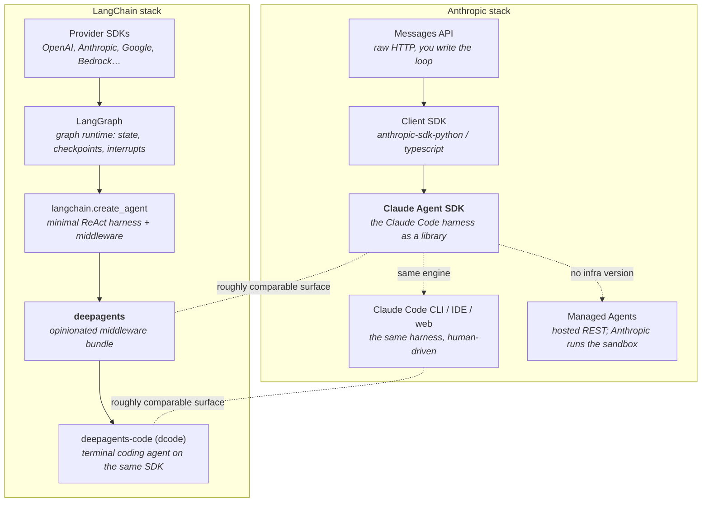

Two things fall out of this picture immediately:

**The Agent SDK has no "drop down a layer" escape hatch inside the same abstraction.** If the loop isn't the shape you want, you don't customize the graph — you leave for the Client SDK and write your own loop. Anthropic is explicit about this in their own comparison table.

**DeepAgents has three escape hatches, all in the same runtime.** Drop from `create_deep_agent` to `create_agent` for a thinner harness. Drop from `create_agent` to raw LangGraph for a custom graph shape. Or keep DeepAgents and pass a hand-built `CompiledStateGraph` in as a subagent, so custom orchestration sits *alongside* the harness defaults. That composability is the real architectural argument for DeepAgents, more than any individual feature.

---

## 3. Two mental models: a process vs a graph

Almost every practical difference — deployment, debugging, HITL, multi-tenancy, cost accounting — is downstream of one fact.

### 3.1 Claude Agent SDK: the harness is a subprocess

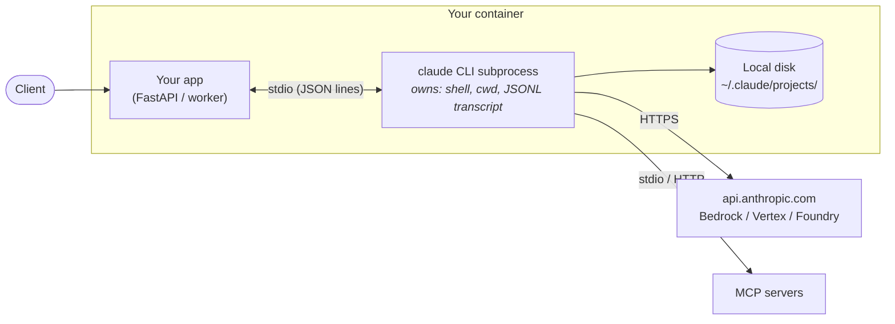

One session = one subprocess. N concurrent sessions = N process trees, N transcript files, N working directories. The loop, the tool executor, the compactor, the permission engine — all of it lives in that binary. Your Python or TypeScript is a **driver and a policy layer**, not the runtime.

This is why the SDK's hosting guide reads like it's describing a stateful service rather than an API wrapper: because it is one.

### 3.2 DeepAgents: the harness is a compiled graph

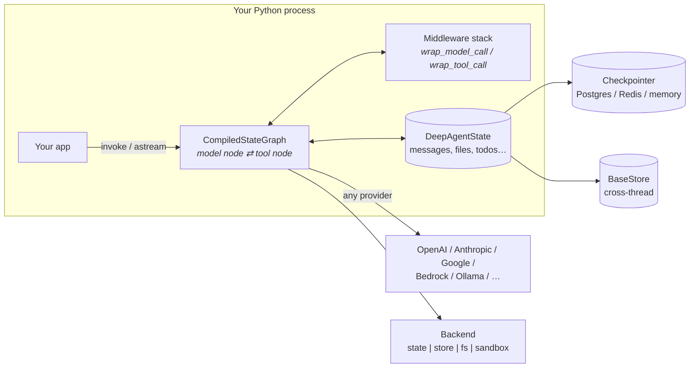

Everything is in-process and in-memory-typed. The conversation is a `messages` key in a TypedDict. Tool results are state updates. Pausing for human approval is a graph interrupt persisted by a checkpointer. There is no second process and no local JSONL you have to babysit.

### 3.3 The consequences table

| Question | Agent SDK | DeepAgents |
|---|---|---|
| Where does agent state live? | JSONL transcripts on the container's disk | A typed state dict in the graph, checkpointed to your DB |
| How do I resume after a pod restart? | Configure a `SessionStore` adapter to mirror transcripts off-box | It already works — the checkpointer is the source of truth |
| How do I pause for a human? | Permission callback / hook returns a decision, in-process, synchronously | Graph `interrupt` → durable pause → resume days later from any host |
| Can I inspect intermediate state? | Via the message stream and hooks | Directly — read the state object, replay a checkpoint, fork a thread |
| Can I run a non-Anthropic model? | No | Yes, anything with tool calling |
| What's my per-session RAM floor? | ~1 GiB (a whole process) | The graph object + message history |
| What breaks under load first? | Subprocess count vs host RAM | Checkpoint write throughput and model rate limits |

That last row matters more than it looks. Concurrency planning for the Agent SDK is literally `agents per host = (host RAM − overhead) / per-session RAM ceiling`. For DeepAgents it's the usual async-Python story.

---

## 4. Claude Agent SDK internals

### 4.1 The loop, precisely

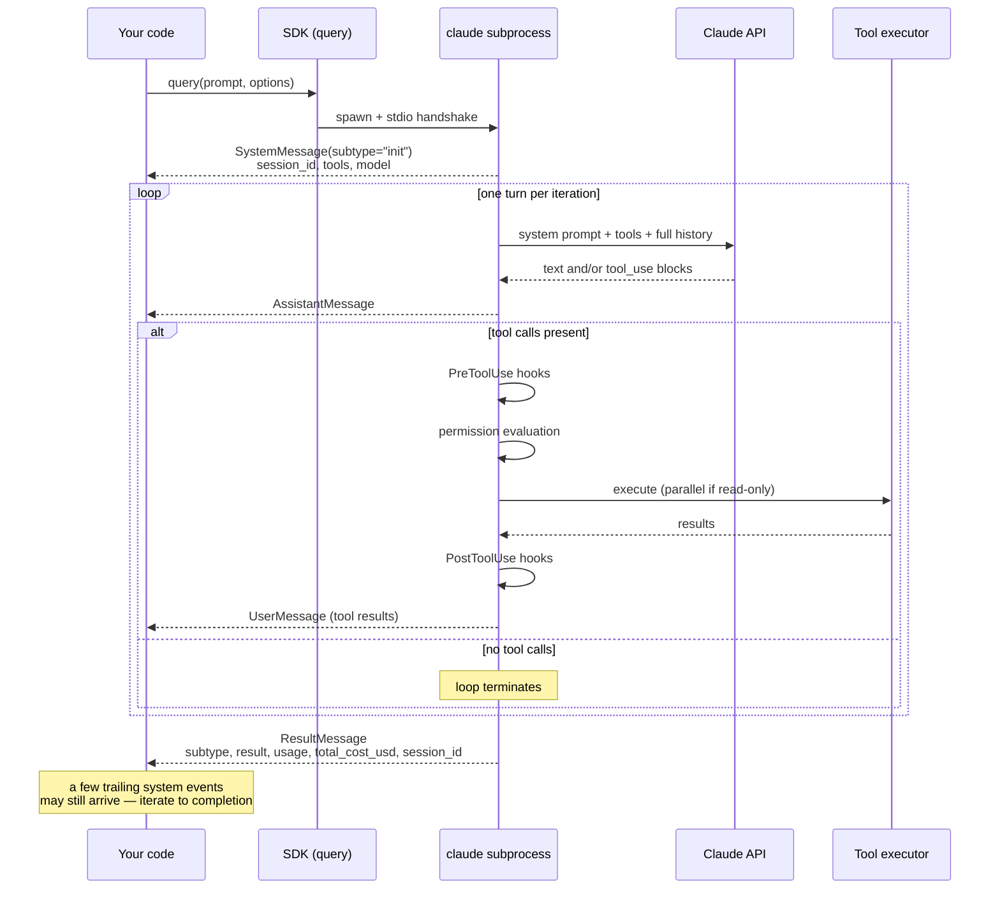

**A "turn" is one round trip that includes tool execution**, not one user message. `max_turns` counts tool-use turns only. The final text-only response isn't one. This trips people up constantly when they set `max_turns=1` and wonder why nothing happened.

### 4.2 The message stream as a state machine

Everything you observe comes through one async iterator. Model your consumer on this:

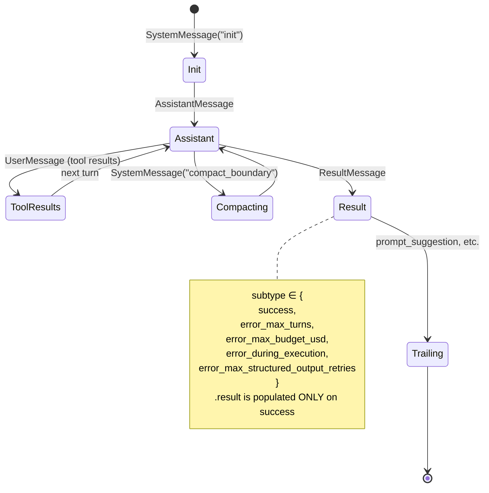

Five core types: `SystemMessage`, `AssistantMessage`, `UserMessage`, `StreamEvent` (only with partial messages enabled), `ResultMessage`.

Two footguns worth internalizing now:

- **Don't `break` on `ResultMessage`.** Trailing system events arrive after it. Iterate to completion.
- **A single-shot `query()` raises after yielding an error result.** The error result comes through the stream *and then* the call throws. Wrap in try/except or your process dies on a `max_turns` hit that you already handled.

```python
# The shape you actually want in production
import asyncio
from claude_agent_sdk import query, ClaudeAgentOptions, ResultMessage, AssistantMessage

async def run(prompt: str) -> dict:
    outcome = {"ok": False, "text": None, "cost": None, "session_id": None}
    try:
        async for msg in query(prompt=prompt, options=ClaudeAgentOptions(
            allowed_tools=["Read", "Grep", "Glob"],
            permission_mode="dontAsk",     # hard deny anything not pre-approved
            setting_sources=[],            # no filesystem config leakage
            max_turns=25,
            max_budget_usd=2.00,
            effort="high",
        )):
            if isinstance(msg, AssistantMessage):
                pass  # emit progress to your UI here
            if isinstance(msg, ResultMessage):
                outcome["session_id"] = msg.session_id
                outcome["cost"] = msg.total_cost_usd     # may be None on some error paths
                outcome["ok"] = msg.subtype == "success"
                outcome["text"] = msg.result if outcome["ok"] else None
                if msg.stop_reason == "refusal":
                    outcome["ok"] = False
    except Exception as e:
        # already-handled error results also land here; connection failures yield no result
        outcome.setdefault("error", str(e))
    return outcome
```

### 4.3 Permission evaluation — the part people skip and then regret

Three knobs interact, and the interaction order is fixed by the SDK:

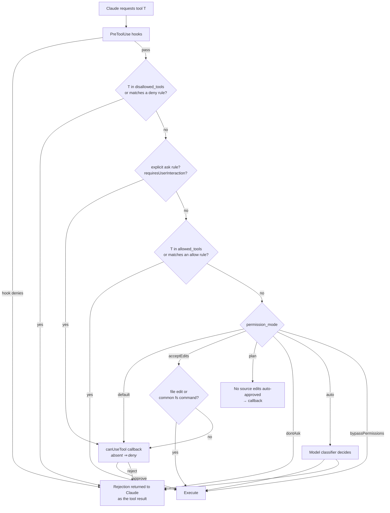

Rules worth pinning to the wall:

- Listing a tool in `allowed_tools` **auto-approves** it. It doesn't merely make it available — everything is available unless denied.
- `"default"` mode with **no** `canUseTool` callback denies. Silent, confusing, and the single most common "why won't my agent do anything" bug.
- `"dontAsk"` is the mode you want for headless enterprise agents: a fixed, explicit tool surface with hard denial as the fallback, instead of relying on the absence of a callback.
- `"bypassPermissions"` needs `allowDangerouslySkipPermissions: true` in TypeScript, won't run as root on Unix, and belongs only in disposable containers.
- Scoped rules work: `"Bash(npm *)"` allows only matching commands.

### 4.4 Context management

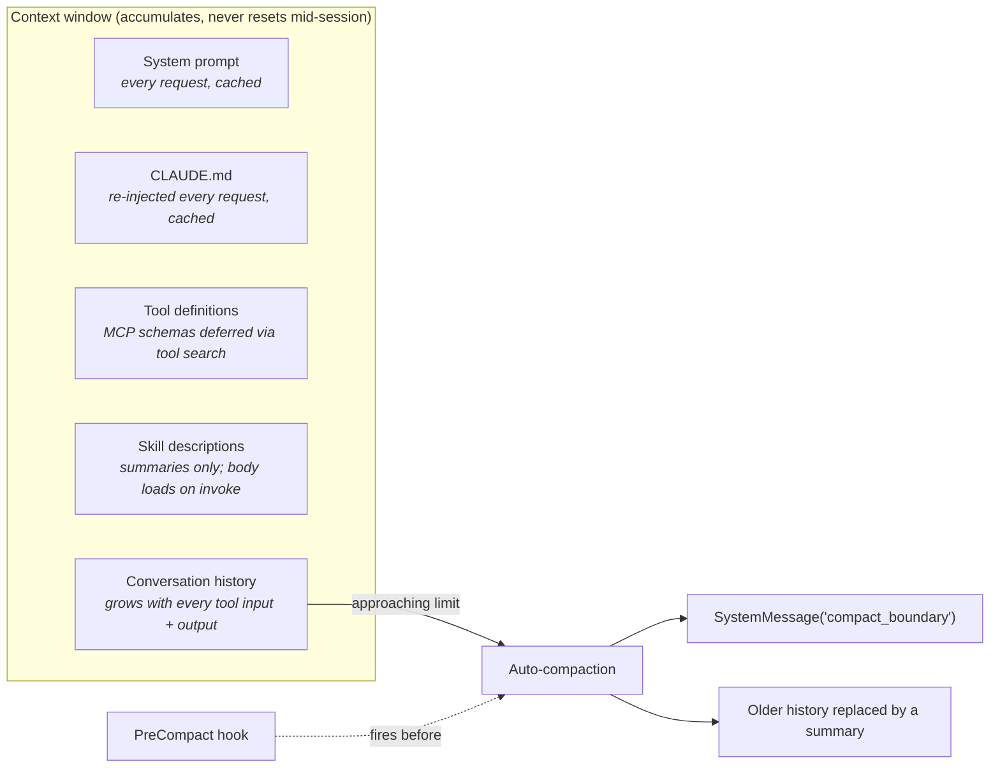

The single most important consequence: **instructions given only in your opening prompt can be summarized away.** Persistent rules belong in `CLAUDE.md`, which is re-injected on every request. This is not a style preference — it's a correctness property of long sessions.

You can steer the compactor by putting a "what to preserve when summarizing" section in `CLAUDE.md`. The header text isn't a magic string; it matches on intent.

Three levers for keeping context lean, in order of impact:

1. **Delegate to subagents.** Only the subagent's final message returns to the parent. A subagent that reads forty files costs the parent one summary.
2. **Scope tools per agent.** Every tool definition is context. Use `AgentDefinition.tools`.
3. **Drop effort for routine work.** `effort="low"` for "list the files" agents.

### 4.5 Subagents: what actually crosses the boundary

This diagram is the one to memorize, because getting it wrong produces agents that mysteriously "forget" things.

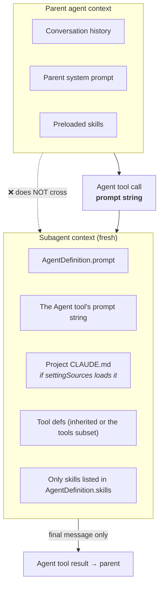

**The prompt string is the only channel from parent to child.** File paths, error text, prior decisions — if the subagent needs it, put it in that prompt explicitly.

Behavior that changed recently and will silently alter your architecture if you upgrade blind:

| Change | Version | Impact |
|---|---|---|
| Subagents run in the **background by default** | Claude Code v2.1.198 | An `Agent` call without `run_in_background` no longer blocks. Set `background: false`/rely on Claude setting it when it needs the result. |
| Subagents can spawn subagents | current | One prompt can become a tree. Cap it. |
| `Task` tool renamed to `Agent` | v2.1.63 | `tool_use` blocks say `Agent`; the `system:init` tool list and `permission_denials[].tool_name` still say `Task`. **Match both.** |
| Subagent output is scanned for instruction-shaped patterns | v2.1.210 | Control-tag imitation and `Human:`/`Assistant:` turn markers get escaped, with a `[harness: ...]` marker line prepended. Nothing is deleted. |

Bounding the tree — do this before you ship anything with `Agent` in `allowed_tools`:

```python
options = ClaudeAgentOptions(
    allowed_tools=["Read", "Grep", "Glob", "Agent"],
    env={                                        # Python merges; TypeScript REPLACES the env
        "CLAUDE_CODE_MAX_SUBAGENT_SPAWN_DEPTH": "1",   # default 3
        "CLAUDE_CODE_MAX_CONCURRENT_SUBAGENTS": "5",   # default 20
    },
    max_budget_usd=5.0,   # subagent spend counts toward this
)
```

At the concurrency limit you'll see a `tool_result` carrying `Concurrent subagent limit reached`. At the budget cap, spawning fails with `Budget limit reached`, running background subagents are stopped, and the query ends with `error_max_budget_usd`.

> Opus 5 delegates to subagents noticeably more eagerly than earlier models. With the `claude_code` system prompt preset the harness adds a restraining line automatically; with a **custom** system prompt it does not, and you have to add it yourself. Either way, set the numeric limits — instructions steer, limits enforce.

### 4.6 Hooks: your policy plane

Hooks run **in your application process**, not in the model's context. They cost zero tokens and can short-circuit the loop.

| Hook | Fires | Enterprise use I'd actually build |
|---|---|---|
| `PreToolUse` | before a tool executes | Block `Bash` matching a denylist regex; redact PII from tool inputs; emit an audit event with the full tool input |
| `PostToolUse` | after a tool returns | Hash and log the output; scan for secrets before it reaches the model |
| `UserPromptSubmit` | on prompt send | Inject tenant context, entitlements, retrieval results |
| `Stop` | agent finished | Validate against a schema; persist final state; fire a downstream webhook |
| `SubagentStart` / `SubagentStop` | delegation boundaries | Per-subagent cost attribution and span creation |
| `PreCompact` | before compaction | **Archive the full transcript before it's summarized away** — this is your audit trail |
| `SessionStart` / `Setup` | session startup | Warm caches, mount tenant volumes |

`PreCompact` deserves emphasis. Compaction destroys detail. If a regulator or an incident review will ever ask "what did the agent see at step 40?", the pre-compact archive is the only place that answer survives.

The TypeScript SDK exposes additional hook events that Python doesn't yet.

### 4.7 Sessions and durability

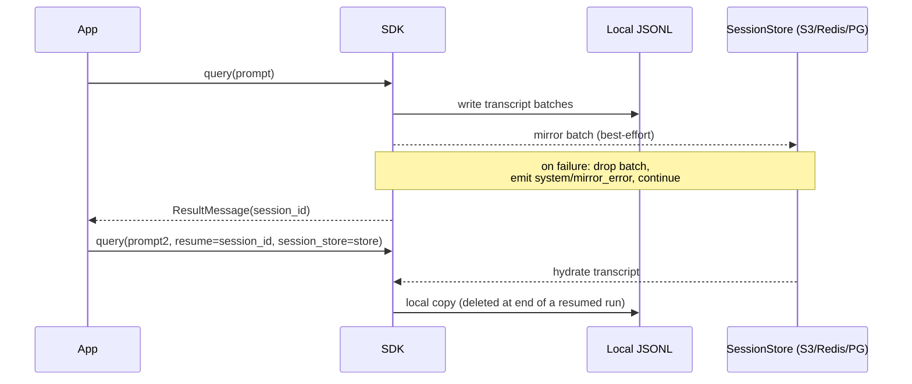

Three facts that determine whether your resume story actually works:

1. **`SessionStore` mirrors transcripts only.** Not `CLAUDE.md`, not working-directory artifacts. Those need a volume or an object-store sync of their own.
2. **Mirror writes are best-effort.** A failed batch is *dropped*, a `{type:"system", subtype:"mirror_error"}` message is emitted, and the query continues. **Alert on `mirror_error`** if durability matters — nothing else will tell you your audit trail has holes.
3. **A resumed run deletes its local copy at the end**, so the store becomes the only durable copy. Get the store right before you rely on resume.

### 4.8 Multi-tenant isolation

Default behavior reads settings and memory from the filesystem, which in a shared container means tenant A's context can reach tenant B's session. Four options, applied together:

```python
async for msg in query(prompt=prompt, options=ClaudeAgentOptions(
    cwd=tenant_dir,                 # per-tenant working directory, on EVERY call
    setting_sources=[],             # no filesystem settings load
    env={
        "CLAUDE_CONFIG_DIR": config_dir,          # per-tenant ~/.claude.json
        "CLAUDE_CODE_DISABLE_AUTO_MEMORY": "1",   # auto memory loads regardless of setting_sources
    },
)):
    ...
```

`CLAUDE_CODE_DISABLE_AUTO_MEMORY` is the non-obvious one: auto memory at `~/.claude/projects/<project>/memory/` loads into the system prompt **even with `setting_sources=[]`**. Add per-tenant egress rules at your proxy and you've covered the four SDK-level vectors plus the network one.

### 4.9 Observability

The SDK inherits OTel config from the environment, so set it at the container level and every `query()` exports:

```bash
CLAUDE_CODE_ENABLE_TELEMETRY=1
CLAUDE_CODE_ENHANCED_TELEMETRY_BETA=1     # traces only; omit for metrics+logs
OTEL_TRACES_EXPORTER=otlp
OTEL_METRICS_EXPORTER=otlp
OTEL_LOGS_EXPORTER=otlp
OTEL_EXPORTER_OTLP_PROTOCOL=http/protobuf
OTEL_EXPORTER_OTLP_ENDPOINT=http://collector.internal:4318
```

Prompt text and tool inputs are **excluded by default** — opt in explicitly if you need them, and think hard about where those spans land.

### 4.10 Scale limits you have to design around

| Limitation | Design response |
|---|---|
| No top-level session timeout — sessions don't self-terminate | Always set `max_turns`; add `max_budget_usd` as a second fence |
| Memory grows over long sessions | Cap session length or recycle subprocesses on a schedule |
| Wide parallel subagent fanouts hit rate limits | Batch the dispatch instead of one wide fan-out |
| No per-subagent wall-clock deadline | `maxTurns` per `AgentDefinition`; `CLAUDE_ASYNC_AGENT_STALL_TIMEOUT_MS` is a *stall* watchdog for background subagents, not a runtime cap |

For long-running sessions behind a load balancer, pin each session to a container with consistent hashing on `session_id` — the subprocess only exists on one box.

---

## 5. DeepAgents internals

### 5.1 What `create_deep_agent` actually returns

A `CompiledStateGraph`. That's the whole trick. Every DeepAgents feature is a middleware object that contributes tools, state keys, and lifecycle hooks; `create_deep_agent` assembles them in a fixed order and compiles.

```python
from deepagents import create_deep_agent

agent = create_deep_agent(
    model="openai:gpt-5.5",            # or a BaseChatModel instance
    tools=[my_custom_tool],
    system_prompt="You are a research assistant.",
)
result = agent.invoke({"messages": "Research LangGraph and write a summary"})
```

The full parameter surface, which is also a decent map of the feature set:

| Parameter | Type | What it controls |
|---|---|---|
| `model` | `str \| BaseChatModel` | `provider:model` string or an initialized chat model. **Relying on the default is deprecated since 0.5.3** and the parameter loses `None` in 1.0.0 — pass it explicitly. |
| `tools` | `Sequence[BaseTool \| Callable \| dict]` | Your tools; plain dicts pass provider-native tools straight through |
| `system_prompt` | `str \| SystemMessage` | Replaces/augments the Claude-Code-inspired default prompt |
| `middleware` | `Sequence[AgentMiddleware]` | Your own layers, composed with the built-ins |
| `subagents` | `SubAgent \| CompiledSubAgent \| AsyncSubAgent` | Declarative specs, pre-compiled graphs, or remote background agents |
| `skills` | `list[str]` | Source paths for `SKILL.md` discovery |
| `memory` | `list[str]` | Source paths for `AGENTS.md` loading |
| `permissions` | `list[FilesystemPermission]` | Path/operation allow-deny rules enforced in `wrap_tool_call` |
| `backend` | `BackendProtocol` | Where files live and whether `execute` exists |
| `interrupt_on` | `dict[str, bool \| InterruptOnConfig]` | Which tools pause for human approval |
| `response_format` | schema | Structured final output |
| `state_schema` | `type[DeepAgentState]` | Custom state keys (prefer middleware-scoped state) |
| `context_schema` | `type[ContextT]` | Runtime context typing |
| `checkpointer` | `Checkpointer` | Durable state across turns — **required for HITL** |
| `store` | `BaseStore` | Cross-thread long-term storage |
| `cache`, `name`, `debug` | | Standard LangGraph plumbing |

Two runtime defaults are worth knowing because they're deliberately unusual:

- **`recursion_limit` defaults to 1000**, so deep tool-call chains don't die on LangGraph's normal ceiling.
- **`DeepAgentState` puts a `DeltaChannel` on `messages`**, which drops checkpoint growth from O(N²) to O(N). If you subclass the state schema, you must subclass `DeepAgentState` specifically to keep that reducer — this is the single most expensive mistake you can make on long-running threads.

### 5.2 The middleware onion

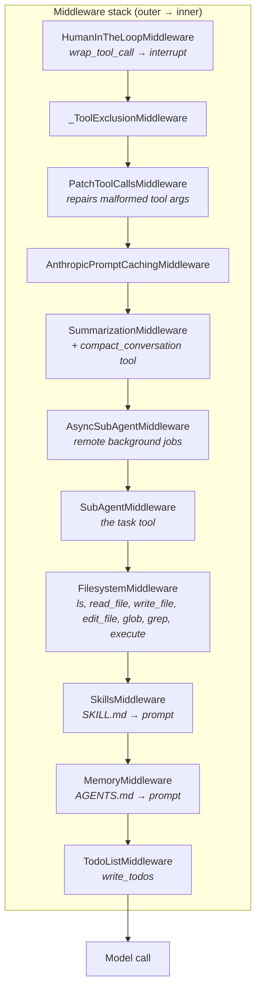

Recent builds also ship `GoalToolsMiddleware` (goal lifecycle: active/blocked/complete) and `RubricMiddleware` (self-evaluation against acceptance criteria) near the top of the stack.

> **Version caution.** The exact ordering has changed more than once between releases, and different documentation snapshots list it differently. Don't hardcode assumptions about position — if ordering matters to your middleware, assert on it in a test rather than trusting a diagram (including this one).

The ordering is not cosmetic. Inner middleware modifies the state and prompt that outer layers see. `MemoryMiddleware` and `SkillsMiddleware` sit inside so their prompt injection lands before `FilesystemMiddleware` decides which tools to expose. `HumanInTheLoopMiddleware` is outermost so it can intercept *any* tool call including ones contributed by other middleware.

### 5.3 The `AgentMiddleware` protocol

Five extension points. This is the whole API you need to build anything custom.

| Member | Purpose |
|---|---|
| `state_schema` | A `TypedDict` merged into agent state (e.g. `FilesystemState` adds `files`) |
| `tools` | Tools this middleware contributes to the agent |
| `before_agent` / `abefore_agent` | Runs at session init — load `AGENTS.md`, hydrate caches |
| `wrap_model_call` / `awrap_model_call` | Intercept the model request: rewrite the prompt, filter tools, inspect the response |
| `wrap_tool_call` / `awrap_tool_call` | Intercept tool execution: validate args, enforce permissions, transform or evict results |

Both wrap hooks are **handler-chain** style — you receive `(request, handler)` and decide whether, when, and with what to call `handler`. That's what makes retries, caching, approval gates, and result rewriting all expressible in the same shape.

```python
from langchain.agents.middleware import AgentMiddleware

class AuditMiddleware(AgentMiddleware):
    """Emit an immutable audit record around every tool call, and hard-block egress tools."""

    BLOCKED = {"execute"}

    def wrap_tool_call(self, request, handler):
        if request.tool_call["name"] in self.BLOCKED and not self._is_approved(request):
            return {
                "role": "tool",
                "content": "Denied by policy: tool requires an approved change record.",
                "tool_call_id": request.tool_call["id"],
            }
        audit_id = self._emit_start(request)
        try:
            result = handler(request)          # <- run the actual tool
            self._emit_success(audit_id, result)
            return result
        except Exception as exc:
            self._emit_failure(audit_id, exc)
            raise

    def wrap_model_call(self, request, handler):
        request = self._append_tenant_context(request)   # inject entitlements
        return handler(request)
```

Compare that with the SDK's hooks: same intent, different physics. Here you're a function in the call stack holding the continuation. There you're a callback the subprocess consults.

### 5.4 Execution flow with middleware in place

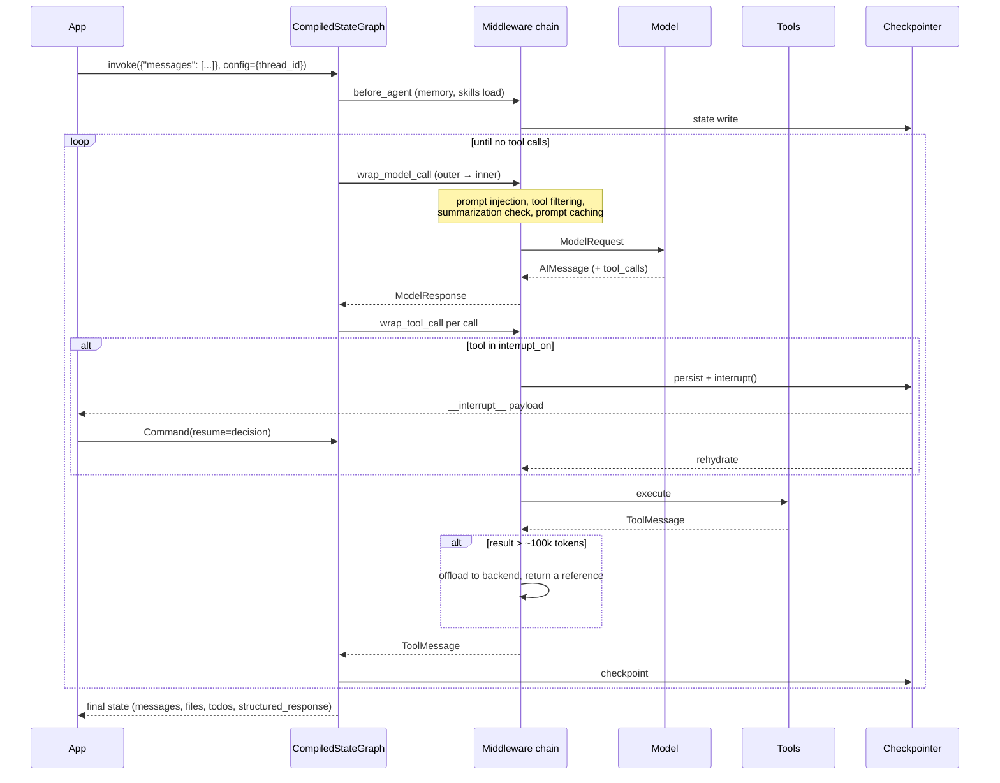

### 5.5 The backend abstraction

The bit with no equivalent on the Anthropic side. "Filesystem" is a protocol, and the choice changes the agent's tool surface at runtime.

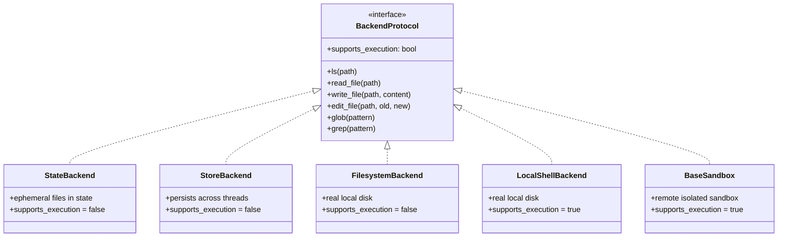

| Backend | Storage | `execute` | Where I'd use it |
|---|---|---|---|
| `StateBackend` | `state["files"]` | no | Default. Research agents, doc pipelines — the "filesystem" is scratch memory that dies with the run and lands in your checkpoint |
| `StoreBackend` | `runtime.store` | no | Agent memory that must survive across threads and users |
| `FilesystemBackend` | real disk | no | Agent reads a mounted corpus but must never shell out |
| `LocalShellBackend` | real disk | **yes** | Local coding agent. Treat as a trust boundary |
| `BaseSandbox` | remote sandbox | **yes** | Untrusted code execution with isolation you actually control |

`FilesystemMiddleware` checks `supports_execution` and **removes the `execute` tool at call time** if the backend can't run code. That's dynamic tool filtering as a first-class pattern, and it's the cleanest security story either framework offers: capability is a property of the environment, not a prompt instruction.

The `_file_data_reducer` treats a `None` value in a state update as a deletion marker, which is how file deletes work through a merge-only state channel.

### 5.6 Context management: summarize, offload, evict

Two mechanisms, both worth knowing separately.

**Summarization.** When token usage crosses a threshold, `SummarizationMiddleware` truncates old tool arguments, summarizes older messages via an internal LLM call, and offloads the summarized history to the backend at `/conversation_history/{thread_id}.md`. The agent can also trigger it deliberately through the `compact_conversation` tool.

**Tool result eviction.** `FilesystemMiddleware` intercepts oversized tool results in `wrap_tool_call`. Past roughly a 100k-token limit, the result is written to the backend and the model receives a **reference** instead of the payload.

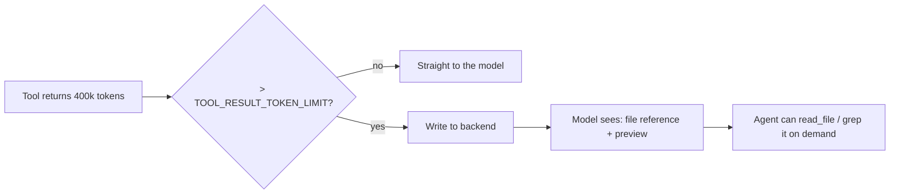

That second mechanism is genuinely elegant: an oversized result becomes a *file the agent can search*, rather than a context bomb or a truncation. The Agent SDK's equivalent instinct is "delegate the reading to a subagent" — same goal, different lever.

### 5.7 Subagents in DeepAgents

Exposed to the model as the `task` tool. Three flavors:

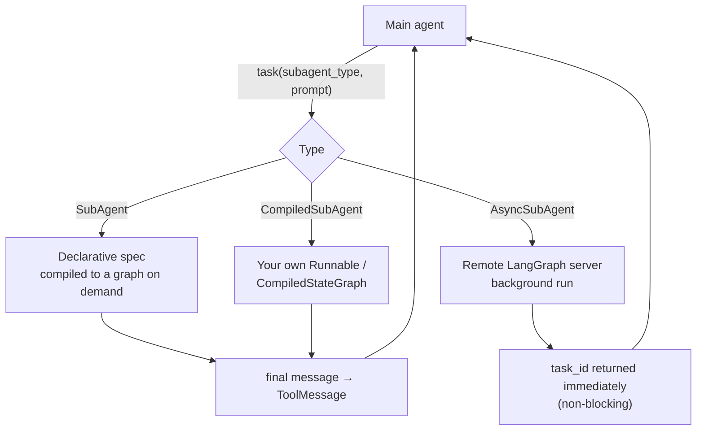

**`SubAgent`** (a TypedDict): `name`, `description`, `system_prompt` required; `model`, `tools`, `middleware`, `skills`, `permissions`, `response_format` optional. Note `permissions` **replaces** the parent's rules rather than intersecting them — read that twice before you use it to tighten a child.

**`CompiledSubAgent`**: `name`, `description`, `runnable`. This is the composability escape hatch — hand it any LangChain/LangGraph runnable. Caveat from the docs: a `CompiledSubAgent` does **not** inherit a custom `state_schema`, because it's already compiled. Compile it with a compatible schema yourself.

**`AsyncSubAgent`**: `name`, `description`, `graph_id`, optional `url`. Runs as a background job on a remote LangGraph deployment via five tools — `start_async_task`, `check_async_task`, `update_async_task`, `cancel_async_task`, `list_async_tasks` — with task state tracked in `async_tasks` under a dedicated reducer.

**Context isolation** is enforced by explicitly filtering state keys before handing state to the child: `messages` (handled specially so only the final message returns), `todos` and `structured_response` (no merge reducers), and `skills_metadata` / `memory_contents` (to stop parent context leaking). Everything else in your custom state *does* flow down to declarative subagents — which is a real capability the Agent SDK doesn't have, and also a real leak risk you should audit.

That's the sharpest architectural difference in delegation:

| | Agent SDK | DeepAgents |
|---|---|---|
| Parent → child channel | The Agent tool's prompt string, and nothing else | The prompt **plus** unfiltered custom state keys |
| Child → parent | Final message only (scanned for instruction-shaped patterns) | Final message only, as a `ToolMessage` |
| Custom implementations | Not as a subagent — subagents are `AgentDefinition`s | Any `Runnable` via `CompiledSubAgent` |
| Remote/background | Background subagents in the same session | `AsyncSubAgent` on a remote server, fully out-of-process |

### 5.8 Human-in-the-loop

This is where the graph substrate pays for itself. `interrupt_on` marks tools as requiring approval; `HumanInTheLoopMiddleware` intercepts them in `wrap_tool_call`; LangGraph's `interrupt` durably pauses the run and the checkpointer holds it.

```python
from deepagents import create_deep_agent
from langgraph.checkpoint.postgres import PostgresSaver
from langgraph.types import Command

agent = create_deep_agent(
    model="anthropic:claude-sonnet-5",
    tools=[issue_refund, send_email, lookup_account],
    interrupt_on={
        "issue_refund": True,        # always ask
        "send_email": True,
        "lookup_account": False,     # read-only, auto-run
    },
    checkpointer=PostgresSaver(...),   # REQUIRED — no checkpointer, no durable interrupt
)

config = {"configurable": {"thread_id": "case-8842"}}
state = agent.invoke({"messages": "Refund order 5512"}, config=config)

if "__interrupt__" in state:
    # The process can now exit. A different pod, hours later, can resume.
    decision = await get_human_decision(state["__interrupt__"])
    state = agent.invoke(Command(resume=decision), config=config)
```

> Check the current `InterruptOnConfig` shape against the docs before you build on it — it accepts more than a bool (per-tool approve/edit/reject affordances) and that surface has been evolving.

The Agent SDK's `canUseTool` callback and `AskUserQuestion` tool solve the same *user need*, but they're **in-process and synchronous**: something has to stay alive holding the subprocess while the human thinks. For a five-second UI confirmation, fine. For a four-hour approval that routes through a queue and a different service, DeepAgents' durable interrupt is a structurally better fit and you'll write far less glue.

### 5.9 Memory and skills

- **`AGENTS.md`** — loaded by `MemoryMiddleware` from configured sources (e.g. `~/.deepagents/AGENTS.md`) and injected into the system message wrapped in `<agent_memory>` tags. The default prompt encourages the agent to update these files itself via `edit_file`, which is a self-improving-memory loop you should decide about deliberately rather than inherit by accident.
- **`SKILL.md`** — loaded by `SkillsMiddleware` from backend sources, YAML frontmatter parsed for metadata, descriptions injected into the prompt with bodies loaded on demand.

If those conventions sound familiar, they should: they're the same shape as `CLAUDE.md` and Agent Skills. Both ecosystems landed on "markdown files on a path are the config format," and that convergence is good news for portability — see §9.

---

## 6. Head-to-head, dimension by dimension

### 6.1 Concept mapping

Almost everything has a counterpart. Print this table.

| Concept | Claude Agent SDK | DeepAgents |
|---|---|---|
| Entry point | `query()` / `ClaudeSDKClient` (Py) / `streamInput()` (TS) | `create_deep_agent()` → `.invoke()` / `.astream()` |
| Runtime | `claude` CLI subprocess over stdio | LangGraph `CompiledStateGraph` in-process |
| Planning tool | `TaskCreate` / `TaskUpdate` (todo tracking) | `write_todos` (`TodoListMiddleware`) |
| File tools | `Read`, `Write`, `Edit`, `Glob`, `Grep` | `read_file`, `write_file`, `edit_file`, `glob`, `grep`, `ls` |
| Shell | `Bash` (sandboxable) | `execute` (only if backend `supports_execution`) |
| Delegation tool | `Agent` (formerly `Task`) | `task` |
| Subagent definition | `AgentDefinition` | `SubAgent` / `CompiledSubAgent` / `AsyncSubAgent` |
| Project instructions | `CLAUDE.md` | `AGENTS.md` |
| Reusable capability | Agent Skills (`SKILL.md`) | Skills (`SKILL.md`) |
| Packaging | Plugins (`.claude-plugin/plugin.json`) | Python packages / custom middleware |
| Context compaction | Automatic + `/compact` + `PreCompact` hook | `SummarizationMiddleware` + `compact_conversation` tool |
| Oversized tool results | Delegate the reading to a subagent | Automatic eviction to backend + reference |
| Interception | Hooks (`PreToolUse`, `PostToolUse`, …) | Middleware (`wrap_model_call`, `wrap_tool_call`, …) |
| Permissions | Modes + allow/deny rules + `canUseTool` | `interrupt_on` + `FilesystemPermission` + custom middleware |
| Durable state | JSONL transcripts + `SessionStore` mirror | Checkpointer (Postgres/Redis) + `BaseStore` |
| Resume / fork | `resume` / fork a session | `thread_id` + checkpoint replay / fork |
| Structured output | JSON Schema / Zod / Pydantic | `response_format` |
| External tools | MCP (first-class, with tool search) | MCP via `langchain-mcp-adapters`; native in `deepagents-code` |
| Cost accounting | `total_cost_usd` on `ResultMessage`, subagents included | Provider callbacks / LangSmith |
| Terminal app on same core | Claude Code | `deepagents-code` (`dcode`) |

### 6.2 Model support

| | Agent SDK | DeepAgents |
|---|---|---|
| Providers | Anthropic API, Amazon Bedrock, Google Cloud's Agent Platform (formerly Vertex), Microsoft Foundry | Any LangChain chat model with tool calling |
| Models | Claude only | Claude, GPT, Gemini, Llama, Qwen, local Ollama, … |
| Per-subagent override | Yes (`model` on `AgentDefinition`, incl. `'inherit'`) | Yes (`model` on `SubAgent`) |
| Reasoning depth control | `effort`: low / medium / high / xhigh / max | Whatever the provider exposes |
| Prompt caching | Automatic for the stable prefix | `AnthropicPromptCachingMiddleware` (Anthropic-specific) |

If "we must not be single-vendor on models" is a hard constraint from your architecture review board — and at a lot of large institutions it is — this row ends the discussion. It's not a quality judgment; it's a procurement one.

Do note the flip side. `effort` levels, prompt-cache handling for the stable prefix, and the compaction quality are all tuned for Claude by people who see the failure data. Model-agnostic harnesses buy optionality with a real tuning discount.

### 6.3 Extensibility: hooks vs middleware

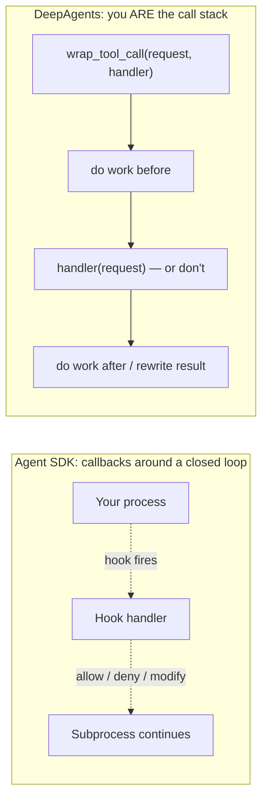

| Capability | Agent SDK hooks | DeepAgents middleware |
|---|---|---|
| Block a tool call | ✅ `PreToolUse` returns rejection | ✅ return a `ToolMessage` without calling `handler` |
| Modify tool **input** | ✅ | ✅ |
| Modify tool **output** | ✅ `PostToolUse` | ✅ |
| Inject prompt context | ✅ `UserPromptSubmit` | ✅ `wrap_model_call` |
| Filter the tool list per call | ⚠️ via permission rules | ✅ directly, dynamically |
| Retry / fallback around the model call | ❌ | ✅ (you hold the continuation) |
| Add typed state | ❌ | ✅ `state_schema` |
| Reorder or delete built-in behavior | ❌ | ✅ build your own stack |
| Zero token cost | ✅ (runs outside context) | ✅ |
| Works when you don't own the loop | ✅ (that's the point) | n/a |

Middleware is strictly more powerful. Hooks are strictly simpler, and they come attached to a harness someone else is tuning for you. Which trade you want depends on whether "the loop's behavior improves without me doing anything" is worth more than "I can change anything."

### 6.4 Context engineering compared

| Technique | Agent SDK | DeepAgents |
|---|---|---|
| Auto-compaction | Yes, with `compact_boundary` signal + `PreCompact` hook | Yes, `SummarizationMiddleware`, threshold-configurable |
| Manual compaction | `/compact` as a prompt | `compact_conversation` tool |
| Persistent instructions survive compaction | `CLAUDE.md` re-injected every request | `AGENTS.md` re-injected via `wrap_model_call` |
| Big tool results | Manual: delegate to a subagent | Automatic eviction to backend + reference |
| Deferred tool schemas | `ToolSearch` defers MCP schemas by default | Manual tool filtering in middleware |
| Offloaded history location | `PreCompact` hook, you choose | `/conversation_history/{thread_id}.md` in the backend |
| Checkpoint growth | n/a (transcript is append-only JSONL) | `DeltaChannel` on `messages` → O(N) |

`ToolSearch` is underrated. Deferring MCP tool schemas until needed is the difference between an agent that can reach a thousand tools and one that burns its context window before the first turn. If you're wiring an enterprise MCP fleet — and if you've built FastMCP servers you know how fast that surface grows — this is the feature that makes it tractable.

### 6.5 Human-in-the-loop compared

| Property | Agent SDK | DeepAgents |
|---|---|---|
| Mechanism | `canUseTool` callback, `AskUserQuestion` tool, permission modes | `interrupt_on` → LangGraph `interrupt` |
| Durability across process restart | ❌ in-process; use session resume as a workaround | ✅ checkpointer holds the pause |
| Approval latency tolerated | Seconds to minutes (something must stay alive) | Unbounded — resume from any host, any time |
| Approval granularity | Per tool, per rule pattern (`Bash(npm *)`), classifier in `auto` mode | Per tool, with per-tool config |
| Edit-then-approve | Via callback logic you write | Supported in `InterruptOnConfig` |
| Audit surface | Hooks | Middleware + checkpoint history |

For a maker-checker workflow where a human approves a financially consequential action, DeepAgents' model is the one that maps onto the org chart without a bespoke state machine.

### 6.6 Deployment and operations

| | Agent SDK | DeepAgents |
|---|---|---|
| Unit of concurrency | One subprocess per session | One async task per run |
| Per-session resource floor | ~1 GiB RAM, 5 GiB disk, 1 CPU (starting point) | The graph object + history |
| Horizontal scaling | Pool of containers; **pin sessions** via consistent hashing on `session_id` | Stateless workers; state lives in the checkpointer |
| Cold start | Container + subprocess spawn (`startup()` pre-warms in TS) | Process warm; graph compile is cheap |
| Durable sessions | `SessionStore` adapter (S3/Redis/Postgres), best-effort mirror | Checkpointer, transactional |
| Sandboxing | Sandboxed `Bash`, containers, Modal/E2B/Daytona/Fly/Vercel/Cloudflare | Sandbox backends (Daytona, Modal), `LocalShellBackend` for local |
| Managed option | Managed Agents (Anthropic hosts agent + sandbox) | LangSmith Deployment / `deepagents deploy` |
| Telemetry | OTel via env vars, native | LangSmith native; OTel via LangChain's exporters |
| Update mechanism | Bundled CLI binary is pinned to the SDK version — update the package | Normal Python dependency management |

The Agent SDK's operational profile is closer to running a fleet of stateful sidecars. DeepAgents' is closer to running a normal Python service with a database. Neither is harder in absolute terms, but they consume different kinds of platform expertise, and you should pick the one your platform team already has.

### 6.7 Governance, audit, and the control-function conversation

If you work somewhere with model risk management, this section is the one that decides the outcome.

| Requirement | Agent SDK | DeepAgents |
|---|---|---|
| "Show me every action the agent took" | OTel spans + hooks + JSONL transcripts; **archive at `PreCompact`** or lose detail | Checkpoint history is a replayable record of every state transition |
| "Reproduce the run" | Resume/fork a session; model non-determinism still applies | Replay from a checkpoint; fork to test counterfactuals |
| "Prove the agent couldn't do X" | Deny rules + `dontAsk` mode + egress policy; enforcement is inside the vendor binary | Backend without `execute` + middleware you wrote + tool list you control |
| "Explain the decision" | Model reasoning + tool trace | Same, plus inspectable intermediate state |
| "Where does data go?" | Subprocess → api.anthropic.com / Bedrock / Vertex / Foundry; route via egress proxy; ZDR available on qualifying Enterprise accounts | Whatever providers you configure; self-host the whole path if you want |
| Vendor concentration | High by design | Low by design |
| Independent verification of the loop | Limited — the harness is a shipped binary | Full — it's Python you can read, patch, and unit-test |

That last row is the honest crux. The Agent SDK's harness quality is a genuine asset **and** an auditability constraint, because you're trusting behavior you can't read line by line. DeepAgents gives you a loop you can inspect and a harness you're now responsible for keeping good. Pick which risk you'd rather own — and be clear-eyed that "we can read the code" only helps if someone on your team actually will.

### 6.8 Where each one is simply better

**Reach for the Claude Agent SDK when:**

- The work is software engineering — reading repos, editing code, running tests. The harness has more real-world tuning on this task than anything else available.
- You want Claude Code's filesystem conventions (`.claude/`, skills, slash commands, plugins) to carry from developer laptops into production with the same config.
- MCP is central and your tool count is large — `ToolSearch` is the best answer either side has.
- You want a hosted option: Managed Agents removes the sandbox problem entirely.
- Your team's leverage is in *prompts, skills, and policy*, not in orchestration code.

**Reach for DeepAgents when:**

- Model portability is a requirement, not a preference.
- The agent is one component in a larger LangGraph system, or must interoperate with graphs you already run.
- Durable human-in-the-loop across long time horizons is core to the workflow.
- You need to inspect, replay, fork, or unit-test the loop itself.
- You want to swap the "filesystem" for a store, a sandbox, or something you wrote.
- You're already invested in LangGraph/LangSmith and the marginal cost of adoption is near zero.

**They're roughly a tie for:** research and report-writing agents, document processing pipelines, customer-support agents with tool access, and general "long task, many steps, needs a scratchpad" work. At that point choose on the operational and governance rows, not the feature rows — because the features have converged and the operations have not.

---

## 7. Zero to hero: eleven labs

Each lab does the same thing in both frameworks so you can feel the difference rather than read about it. Run them in order; they build.

### Lab 0 — Install and verify

```bash
# --- Claude Agent SDK ---
pip install claude-agent-sdk            # Python 3.10+
# or: npm install @anthropic-ai/claude-agent-sdk   # Node 18+
export ANTHROPIC_API_KEY=sk-ant-...
# Bedrock:  export CLAUDE_CODE_USE_BEDROCK=1  (+ AWS creds)
# Vertex:   export CLAUDE_CODE_USE_VERTEX=1   (+ GCP creds)

# --- DeepAgents ---
pip install deepagents
export ANTHROPIC_API_KEY=...      # or OPENAI_API_KEY / GOOGLE_API_KEY / ...
```

The SDK packages bundle a native `claude` binary, so there's usually no separate Claude Code install. If you need a specific version, install it separately and point at it with `cli_path`.

Smoke test both:

```python
# sdk_smoke.py
import asyncio
from claude_agent_sdk import query

async def main():
    async for m in query(prompt="Reply with exactly: ok"):
        print(type(m).__name__, m)

asyncio.run(main())
```

```python
# da_smoke.py
from deepagents import create_deep_agent

agent = create_deep_agent(model="anthropic:claude-sonnet-5")
print(agent.invoke({"messages": "Reply with exactly: ok"})["messages"][-1].content)
```

If the first one hangs, you have a subprocess or PATH problem. If the second one hangs, you have a network or API-key problem. That diagnostic difference is the whole architectural comparison in miniature.

---

### Lab 1 — Hello agent, with the guardrails you'd actually ship

**Agent SDK**

```python
import asyncio
from claude_agent_sdk import query, ClaudeAgentOptions, ResultMessage

async def main():
    try:
        async for msg in query(
            prompt="Summarize what this repository does. Do not modify anything.",
            options=ClaudeAgentOptions(
                allowed_tools=["Read", "Glob", "Grep"],   # listing = auto-approve
                disallowed_tools=["Bash", "Write", "Edit"],
                permission_mode="dontAsk",                # anything else: hard deny
                setting_sources=["project"],              # load CLAUDE.md + project skills
                max_turns=20,
                max_budget_usd=1.00,
                effort="medium",
                model="claude-sonnet-5",
            ),
        ):
            if isinstance(msg, ResultMessage):
                print(msg.subtype, msg.total_cost_usd, msg.num_turns)
                if msg.subtype == "success":
                    print(msg.result)
    except Exception as e:
        print("ended with error:", e)

asyncio.run(main())
```

**DeepAgents**

```python
from deepagents import create_deep_agent
from deepagents.backends import FilesystemBackend    # read-only: no execute tool

agent = create_deep_agent(
    model="anthropic:claude-sonnet-5",
    system_prompt="Summarize what this repository does. Never modify files.",
    backend=FilesystemBackend(root_dir="."),
    memory=["./AGENTS.md"],
)

state = agent.invoke(
    {"messages": "Summarize what this repository does."},
    config={"recursion_limit": 100},
)
print(state["messages"][-1].content)
```

Note what's already different. The SDK enforces read-only through *permission rules*. DeepAgents enforces it through *the backend not having the capability*. The second is harder to talk your way past, because there's no tool to call.

---

### Lab 2 — Custom tools

**Agent SDK** — custom tools run through an in-process MCP server:

```python
from claude_agent_sdk import query, ClaudeAgentOptions, tool, create_sdk_mcp_server

@tool("lookup_account", "Look up an account by ID", {"account_id": str})
async def lookup_account(args):
    row = await db.fetch_account(args["account_id"])
    return {"content": [{"type": "text", "text": row.to_json()}]}

server = create_sdk_mcp_server(name="core-banking", version="1.0.0",
                              tools=[lookup_account])

options = ClaudeAgentOptions(
    mcp_servers={"core": server},
    allowed_tools=["mcp__core__lookup_account", "Read"],
)
```

Custom tools default to **sequential** execution. Set `readOnlyHint` in the tool annotations to let Claude run them in parallel — free latency on read-heavy agents.

**DeepAgents** — any LangChain tool or plain callable:

```python
from langchain_core.tools import tool
from deepagents import create_deep_agent

@tool
def lookup_account(account_id: str) -> str:
    """Look up an account by ID."""
    return db.fetch_account(account_id).to_json()

agent = create_deep_agent(model="anthropic:claude-sonnet-5", tools=[lookup_account])
```

For MCP servers in DeepAgents, use `langchain-mcp-adapters` to load remote tools and pass them in `tools=[...]`. It works, but MCP is a first-class citizen on the Anthropic side and an adapter on this one — if you have a large MCP estate, weigh that.

---

### Lab 3 — Subagents and delegation

**Agent SDK**

```python
from claude_agent_sdk import ClaudeAgentOptions, AgentDefinition

options = ClaudeAgentOptions(
    allowed_tools=["Read", "Grep", "Glob", "Agent"],   # Agent must be allowed
    agents={
        "policy-checker": AgentDefinition(
            description="Checks a document against internal policy. Read-only.",
            prompt="You verify documents against policy. Cite the exact clause you relied on.",
            tools=["Read", "Grep", "Glob"],
            model="sonnet",
            maxTurns=15,
            effort="high",
        ),
        "risk-scorer": AgentDefinition(
            description="Scores residual risk 1-5 with justification.",
            prompt="You are a risk analyst. Output a score and two sentences of rationale.",
            tools=["Read"],
            model="haiku",           # cheap model for a narrow job
        ),
    },
    env={"CLAUDE_CODE_MAX_SUBAGENT_SPAWN_DEPTH": "1",
         "CLAUDE_CODE_MAX_CONCURRENT_SUBAGENTS": "5"},
    max_budget_usd=5.0,
)
```

Remember: the parent passes **only the prompt string**. Write the delegation prompt as if the child knows nothing, because it doesn't.

**DeepAgents**

```python
from deepagents import create_deep_agent

policy_checker = {
    "name": "policy-checker",
    "description": "Checks a document against internal policy. Read-only.",
    "system_prompt": "You verify documents against policy. Cite the exact clause you relied on.",
    "model": "anthropic:claude-sonnet-5",
    "tools": [read_policy, search_policy],
}

risk_scorer = {
    "name": "risk-scorer",
    "description": "Scores residual risk 1-5 with justification.",
    "system_prompt": "You are a risk analyst. Output a score and two sentences of rationale.",
    "model": "openai:gpt-5.5-mini",        # different vendor, same run
    "response_format": RiskScore,           # Pydantic → structured output
}

# An existing graph you already own, dropped in as a subagent
legacy = {"name": "legacy-classifier",
          "description": "Classifies document type using our existing pipeline.",
          "runnable": my_existing_compiled_graph}

agent = create_deep_agent(
    model="anthropic:claude-sonnet-5",
    subagents=[policy_checker, risk_scorer, legacy],
)
```

Two things the SDK can't do appear here: mixed vendors inside one run, and an arbitrary compiled graph as a delegate.

---

### Lab 4 — Human-in-the-loop approval

**Agent SDK** — synchronous callback:

```python
async def can_use_tool(tool_name: str, input_data: dict, context) -> dict:
    if tool_name == "issue_refund" and input_data.get("amount", 0) > 500:
        decision = await approval_service.request(tool_name, input_data)  # blocks
        if not decision.approved:
            return {"behavior": "deny", "message": f"Denied: {decision.reason}"}
    return {"behavior": "allow", "updatedInput": input_data}

options = ClaudeAgentOptions(permission_mode="default", can_use_tool=can_use_tool)
```

Something must stay alive holding the subprocess for the duration. For long approvals, the workaround is to deny with an explanatory message, capture `session_id`, and **resume the session** once the human decides.

**DeepAgents** — durable interrupt:

```python
from langgraph.types import Command

agent = create_deep_agent(
    model="anthropic:claude-sonnet-5",
    tools=[issue_refund, lookup_account],
    interrupt_on={"issue_refund": True, "lookup_account": False},
    checkpointer=PostgresSaver.from_conn_string(DSN),
)

cfg = {"configurable": {"thread_id": case_id}}
state = agent.invoke({"messages": user_msg}, config=cfg)

if "__interrupt__" in state:
    queue.publish(case_id, state["__interrupt__"])   # hand off; this pod can now die
    return

# ...later, in a completely different process:
state = agent.invoke(Command(resume={"decision": "approve"}), config=cfg)
```

If your approval SLA is measured in hours, the second pattern is the one that survives contact with reality.

---

### Lab 5 — Context pressure

Run a task that reads twenty large files and watch what each does.

**Agent SDK** — watch for the compaction signal and archive before it:

```python
from claude_agent_sdk import SystemMessage

async for msg in query(prompt=big_task, options=options):
    if isinstance(msg, SystemMessage) and msg.subtype == "compact_boundary":
        metrics.increment("agent.compaction")
```

Then put your durable rules in `CLAUDE.md`, not the prompt:

```markdown
# CLAUDE.md

## Non-negotiable rules
- Never write outside ./output
- Always cite the source file path for any claim

## Summary instructions
When summarizing this conversation, always preserve:
- The current task objective and acceptance criteria
- File paths read or modified
- Decisions made and the reasoning behind them
```

And register a `PreCompact` hook that archives the full transcript. Do this on day one, not after your first incident review.

**DeepAgents** — the same job is configuration plus automatic eviction:

```python
from deepagents.middleware import SummarizationMiddleware

agent = create_deep_agent(
    model="anthropic:claude-sonnet-5",
    memory=["./AGENTS.md"],                 # re-injected every model call
    middleware=[SummarizationMiddleware(...)],   # threshold-tuned
)
```

Oversized tool results are offloaded to the backend and replaced with a reference automatically — the agent can `grep` the offloaded file later. No configuration needed for that part.

---

### Lab 6 — MCP

**Agent SDK** (first-class, with schema deferral):

```python
options = ClaudeAgentOptions(
    mcp_servers={
        "internal-api": {"type": "http", "url": "https://mcp.internal/api"},
        "database":     {"type": "stdio", "command": "uvx", "args": ["mcp-server-postgres"]},
    },
    allowed_tools=["mcp__internal-api__*", "mcp__database__query"],
)
```

MCP tool schemas are deferred by default via `ToolSearch` and loaded on demand — with a fallback to upfront loading on unsupported models and certain platforms. Verify which regime you're in before assuming your 300-tool estate is free.

**DeepAgents**:

```python
from langchain_mcp_adapters.client import MultiServerMCPClient

client = MultiServerMCPClient({
    "internal-api": {"url": "https://mcp.internal/api", "transport": "streamable_http"},
})
tools = await client.get_tools()
agent = create_deep_agent(model="anthropic:claude-sonnet-5", tools=tools)
```

All schemas load upfront unless you filter them yourself in `wrap_model_call`. With a large estate, write that filter — a middleware that exposes only tools matching the current task is ~30 lines and pays for itself immediately.

---

### Lab 7 — Structured output

**Agent SDK** — validated JSON after multi-turn tool use, via JSON Schema, Zod, or Pydantic. Watch for the `error_max_structured_output_retries` result subtype: it means every attempt failed validation, or a model fallback retracted a completed output with no successful retry. Treat it as a distinct failure class in your metrics, not a generic error.

**DeepAgents** — `response_format=MyPydanticModel` on the agent or on any individual `SubAgent`. Per-subagent structured output is genuinely useful: your `risk-scorer` returns a typed object into the parent's tool result rather than prose the parent has to re-parse.

---

### Lab 8 — Evaluation

The frameworks differ less here than you'd expect, because good agent eval is mostly about what you instrument, not what you use.

Instrument these in both, at minimum:

| Signal | Why it's the one that matters |
|---|---|
| Turns to completion | The clearest early-warning of prompt or tool-description rot |
| Tool call sequence | Compare against a reference trajectory; catches silent strategy drift |
| Tool error rate by tool | One bad tool description poisons an entire run |
| Delegation depth and fan-out | Where cost blowups actually originate |
| Compaction count | A run that compacted three times probably needed a subagent |
| Cost per successful task | The only cost number that means anything |
| Refusal / stop reason distribution | `stop_reason == "refusal"` is a product signal, not an error |

**Agent SDK:** derive all of these from the message stream plus OTel spans. `ResultMessage` gives `num_turns`, `usage`, `total_cost_usd`, `stop_reason`, `session_id` for free — including subagent spend rolled into the total.

**DeepAgents:** LangSmith traces give you the trajectory natively; checkpoint history gives you replay. For offline eval, the fact that you can fork a thread from checkpoint N and run a counterfactual is a capability the SDK doesn't match.

A pattern worth stealing regardless of framework: assert on **trajectories**, not just final answers. "Did it call `lookup_account` before `issue_refund`" catches regressions that output-similarity scoring sails straight past.

---

### Lab 9 — Deployment

**Agent SDK — pick a session pattern first, a platform second.**

| Pattern | Shape | Fits |
|---|---|---|
| Ephemeral | Container per task, one-shot entrypoint, destroyed on completion | Document extraction, translation, one-off bug fixes |
| Long-running | Persistent containers, many sessions each, HTTP/WS endpoint | Slack bots, email triage, high-volume streams |
| Hybrid | Ephemeral containers that hydrate from a `SessionStore` and persist back | Deep research that pauses for hours; support agents across interactions |
| Multi-agent | Several SDK subprocesses in one container | Simulations, tightly collaborating agents |

For hybrid, `SessionStore` is **required, not optional** — shutting down without one loses the transcript. For multi-agent, give each agent its own `cwd` and isolate settings loading so per-agent `CLAUDE.md` files don't leak.

```dockerfile
FROM python:3.12-slim
RUN pip install --no-cache-dir claude-agent-sdk fastapi uvicorn
WORKDIR /app
COPY app.py .
ENV CLAUDE_CODE_ENABLE_TELEMETRY=1 \
    OTEL_EXPORTER_OTLP_ENDPOINT=http://collector:4318 \
    CLAUDE_CODE_DISABLE_AUTO_MEMORY=1
# Size for concurrency: (host RAM - overhead) / per-session RAM ceiling
CMD ["uvicorn", "app:api", "--host", "0.0.0.0", "--port", "8080"]
```

**DeepAgents** — a normal Python service plus a state store:

```python
# langgraph.json → deploy to LangSmith, or serve it yourself
agent = create_deep_agent(
    model="anthropic:claude-sonnet-5",
    checkpointer=PostgresSaver.from_conn_string(os.environ["PG_DSN"]),
    store=PostgresStore.from_conn_string(os.environ["PG_DSN"]),
)
```

Workers are stateless; scale them like any other service. The database becomes the thing you have to run well.

---

### Lab 10 — Hardening (do this before production, both)

**Agent SDK checklist**

- [ ] `max_turns` **and** `max_budget_usd` on every query — there is no session timeout
- [ ] Subagent depth and concurrency capped via env vars
- [ ] `permission_mode="dontAsk"` for headless agents, with an explicit allow list
- [ ] `setting_sources=[]` + `CLAUDE_CODE_DISABLE_AUTO_MEMORY=1` + per-tenant `CLAUDE_CONFIG_DIR` + per-call `cwd` in shared containers
- [ ] Egress proxy with a domain allowlist; tool credentials injected **outside** the container
- [ ] Inbound auth at a gateway — the agent should never validate user tokens
- [ ] `PreCompact` hook archiving full transcripts
- [ ] Alerting on `mirror_error` system messages
- [ ] `bypassPermissions` used only in disposable containers, never as root
- [ ] Subprocess recycling policy for long-lived containers

**DeepAgents checklist**

- [ ] Explicit `model=` — the default is deprecated and disappears in 1.0.0
- [ ] Custom state schemas subclass `DeepAgentState` so `DeltaChannel` survives
- [ ] Backend chosen for capability, not convenience — no `execute` unless you meant it
- [ ] `FilesystemPermission` rules on any real-disk backend; remember subagent `permissions` **replace** the parent's
- [ ] Checkpointer is durable (Postgres/Redis), not in-memory
- [ ] `recursion_limit` tuned deliberately — the default 1000 is generous
- [ ] Tool filtering middleware if you load a large MCP estate
- [ ] Audit middleware wrapping `wrap_tool_call` with immutable records
- [ ] Sandbox backend for any untrusted code execution
- [ ] Checkpoint retention policy — these grow, and they contain everything

---

## 8. Two end-to-end reference architectures

Same business problem both times: **a document-driven case agent with a human approval gate**. Ingest a document, extract and validate, check policy, propose an action, get a human decision, execute, and leave an audit trail. It's the shape behind refund handling, claims processing, KYC review, and contract intake.

### 8.1 On the Claude Agent SDK

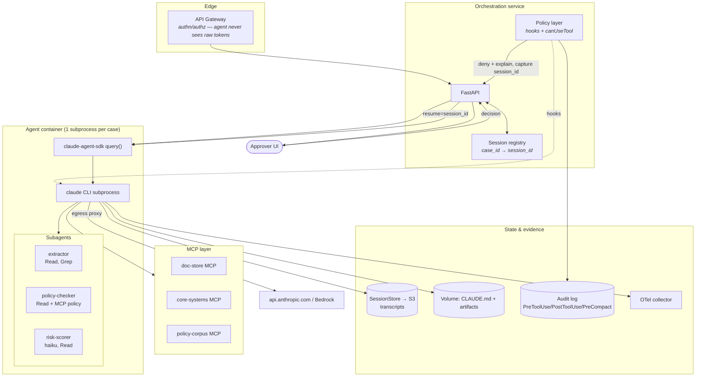

**How the approval works.** `canUseTool` fires on `execute_action`. If the amount exceeds a threshold, the callback denies with a message explaining that approval is pending, and the loop ends cleanly. Your service stores `session_id` against the case, notifies the approver, and later **resumes the session** with the decision as a new prompt. Not a durable interrupt — an intentional stop-and-resume you implement.

**Where the audit trail lives.** Hooks emit records before and after every tool call. `PreCompact` archives full transcripts to WORM storage before summarization destroys detail. `SessionStore` mirrors transcripts to S3, with alerting on `mirror_error`.

**Cost control.** `max_budget_usd` per case, subagent depth capped at 1, `haiku` for the risk-scorer, `effort="low"` for extraction, `effort="high"` only for policy reasoning.

### 8.2 On DeepAgents

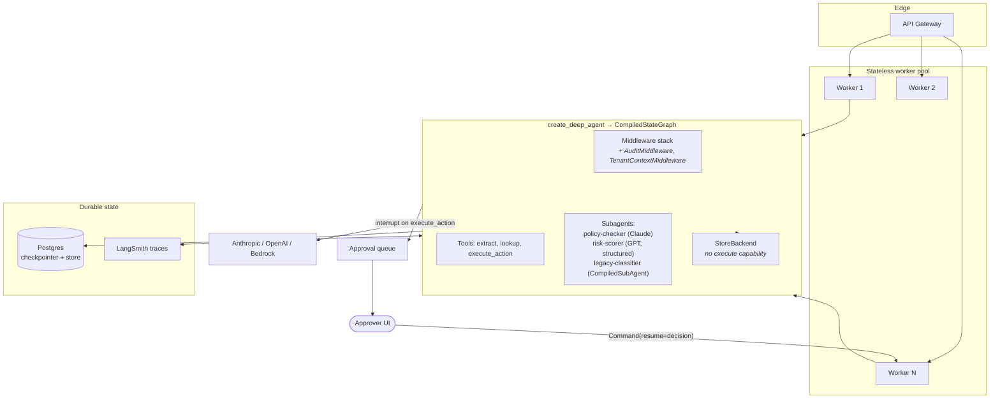

**How the approval works.** `interrupt_on={"execute_action": True}`. The graph pauses, the checkpointer persists everything, the worker publishes to the queue and **exits**. Hours later, any worker resumes with `Command(resume=decision)` on the same `thread_id`. No session registry, no resume-prompt engineering, no process held open.

**Where the audit trail lives.** Checkpoint history is inherently a replayable record of every state transition. `AuditMiddleware` adds immutable business-level records around each tool call. LangSmith holds the traces.

**Why it's not `execute`-capable.** `StoreBackend` doesn't support execution, so `FilesystemMiddleware` never exposes the `execute` tool. The agent cannot shell out because there is no tool to call — enforced by architecture, not instruction.

### 8.3 The comparison in one paragraph

The SDK version has fewer moving parts you had to build and more moving parts you have to *operate*: subprocess lifecycle, session pinning, transcript mirroring, per-tenant filesystem hygiene. The DeepAgents version has more code you own and a simpler operational picture: stateless workers plus a Postgres you already know how to run. Both are defensible. The SDK version will produce better results on unstructured document reasoning with less prompt work; the DeepAgents version will survive a four-hour approval SLA without you inventing anything.

---

## 9. Porting between them

Because the concepts map so cleanly, porting is mostly mechanical. Here's the translation table, followed by the parts that aren't mechanical.

| From Agent SDK | To DeepAgents |
|---|---|
| `ClaudeAgentOptions(system_prompt=...)` | `create_deep_agent(system_prompt=...)` |
| `allowed_tools=[...]` | `tools=[...]` — presence *is* permission |
| `disallowed_tools` / deny rules | Omit the tool, or block it in `wrap_tool_call` |
| `permission_mode="default"` + `canUseTool` | `interrupt_on={...}` + checkpointer |
| `agents={"x": AgentDefinition(...)}` | `subagents=[{"name": "x", ...}]` |
| `PreToolUse` / `PostToolUse` hooks | One `wrap_tool_call` middleware |
| `UserPromptSubmit` hook | `wrap_model_call` middleware |
| `PreCompact` hook | Custom middleware around summarization |
| `CLAUDE.md` | `AGENTS.md` (`memory=[...]`) |
| Agent Skills | Skills (`skills=[...]`) — same `SKILL.md` shape |
| `resume=session_id` | `config={"configurable": {"thread_id": ...}}` |
| `SessionStore` | Checkpointer |
| `max_turns` | `recursion_limit` (different unit — a graph step, not a turn) |
| `max_budget_usd` | No direct equivalent; enforce in middleware |
| MCP `mcp_servers` | `langchain-mcp-adapters` → `tools=[...]` |

Reverse direction is the same table read right-to-left, with these losses:

- Model heterogeneity within a run has to collapse to Claude.
- `CompiledSubAgent` (arbitrary graphs as delegates) has no equivalent — reimplement as an `AgentDefinition` or expose it as an MCP tool.
- Durable interrupts become stop-and-resume that you implement.
- The backend abstraction disappears; capability control moves to permission rules and sandboxing.

**What doesn't port mechanically:** the prompts. Both harnesses ship detailed default system prompts and the models behave differently against them. Budget real time for re-tuning prompts and subagent descriptions after a port, and re-run your trajectory evals rather than assuming behavioral parity. This is the step teams skip and then blame the framework for.

**The hybrid nobody talks about.** These aren't exclusive. Wrap a Claude Agent SDK agent as an MCP server or a plain async function, and call it as a tool — or a `CompiledSubAgent` — from a DeepAgents orchestrator. You get LangGraph's durable orchestration and multi-model routing on the outside, and Claude Code's harness on the inside for the tasks where it's strongest (anything code-shaped). If you're already running an A2A-style platform where agents are addressable services, this is barely any extra work and it sidesteps the whole either/or framing.

---

## 10. Choosing: a decision framework that isn't a feature table

Work down this list and stop at the first hard constraint. Feature comparisons rarely decide anything; constraints always do.

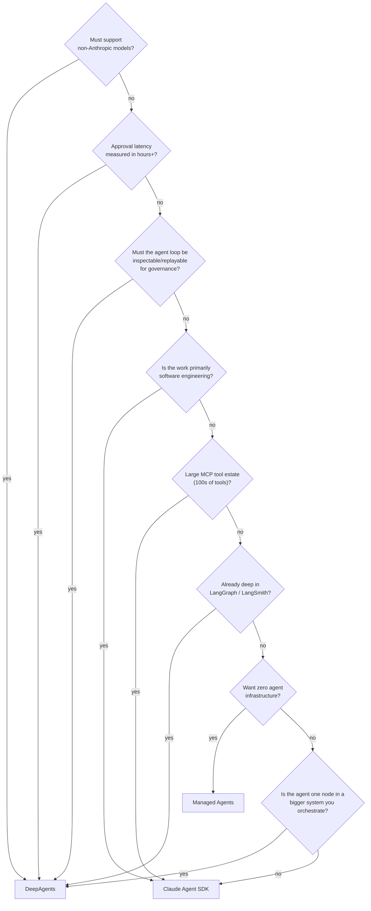

Two failure modes I'd flag from watching teams make this call:

**Over-indexing on the feature table.** They've converged. Both plan, both have a filesystem, both delegate, both compact, both do skills and markdown memory. Choosing on "does it have X" in 2026 mostly means choosing on which docs page you read most recently.

**Under-indexing on the operating model.** Subprocess-per-session versus stateless-workers-plus-database is a permanent property of your system. It determines your on-call runbook, your scaling story, your incident surface, and how your platform team feels about you. That's the choice you're actually making.

And a third, quieter one: **treating this as a permanent decision.** Both are young. The porting table above is short precisely because the concepts converged — which means the cost of being wrong is lower than the cost of stalling. If it's genuinely close for your use case, build the thing with whichever your team already knows, keep tool definitions and prompts in framework-neutral modules, and revisit in two quarters.

---

## 11. Gotchas that will bite you

### Claude Agent SDK

| Symptom | Cause | Fix |
|---|---|---|
| Agent does nothing, no error | `permission_mode="default"` with no `canUseTool` callback → silent deny | Add the callback, or use `dontAsk` with an explicit allow list |
| `max_turns=1` produces no work | Turns count **tool-use** round trips only | Raise the limit; the final text turn isn't counted |
| Process exits after a handled error | `query()` raises after yielding an error result | Wrap the loop in try/except |
| Missed trailing messages | Code `break`s on `ResultMessage` | Iterate the stream to completion |
| Subagent detection fails | Tool renamed `Task` → `Agent`, but `system:init` and `permission_denials` still say `Task` | Match both names |
| Subagent "forgets" everything | Only the Agent tool's prompt string crosses the boundary | Put file paths, errors, decisions in that prompt |
| Delegation calls don't block anymore | Subagents run in the background by default since v2.1.198 | Rely on Claude setting `run_in_background: false`, or force via `background` |
| Instructions ignored late in a session | Compaction summarized them away | Move persistent rules to `CLAUDE.md` |
| Tenant context bleeding | Auto memory loads even with `setting_sources=[]` | `CLAUDE_CODE_DISABLE_AUTO_MEMORY=1` + per-tenant `CLAUDE_CONFIG_DIR` |
| Sessions vanish on deploy | Transcripts are local disk | `SessionStore` adapter; alert on `mirror_error` |
| Runaway cost | No session timeout; Opus 5 delegates eagerly | `max_turns` + `max_budget_usd` + depth/concurrency caps |
| Env vars disappear (TypeScript) | TS `env` **replaces** the subprocess env; Python merges | Spread `...process.env` |
| Custom tools run slowly | Custom tools default to sequential | Set `readOnlyHint` on read-only tools |
| `bypassPermissions` refuses to run | Not allowed as root on Unix; TS needs `allowDangerouslySkipPermissions` | Run as non-root in a disposable container |

### DeepAgents

| Symptom | Cause | Fix |
|---|---|---|
| Checkpoints balloon on long threads | Custom `state_schema` dropped `DeltaChannel` on `messages` | Subclass `DeepAgentState`, or scope state via middleware instead |
| Deprecation warnings on model | Relying on the default model is deprecated since 0.5.3, removed in 1.0.0 | Pass `model=` explicitly |
| Interrupt doesn't survive restart | No durable checkpointer | Postgres/Redis checkpointer, not in-memory |
| `execute` tool missing | Backend doesn't support execution | That's the design — switch backend deliberately, don't work around it |
| Subagent has *more* access than the parent | Subagent `permissions` **replace** the parent's rules | Restate the full rule set on the child |
| Custom state missing in a subagent | `CompiledSubAgent` doesn't inherit `state_schema` (already compiled) | Compile it with a compatible schema |
| Parent data leaking into subagents | Only specific keys are filtered; your custom keys flow through | Audit what's in state; filter in middleware |
| Runs terminate unexpectedly deep in a chain | `recursion_limit` (default 1000) reached | Raise it, or restructure into subagents |
| Middleware doesn't fire where expected | Stack ordering has changed between releases | Assert ordering in a test; don't trust a diagram |
| Context blows up with MCP tools | All schemas load upfront | Write a tool-filtering `wrap_model_call` middleware |
| Deleted files reappear | File deletion is a `None` marker through the reducer | Use the provided tools rather than mutating state directly |

### Both

- **Prompts don't transfer between models.** Re-tune and re-evaluate after any model swap. Every time.
- **Subagent output is untrusted input to the parent.** The SDK now scans for instruction-shaped patterns; DeepAgents does not. If a subagent reads attacker-controlled documents, treat its output as hostile and validate it.
- **Delegation is where cost goes exponential.** One prompt becomes a tree. Cap depth, concurrency, and spend before your first production run, not after your first invoice.
- **"Trust the LLM" is the stated model for both.** DeepAgents says so outright: enforce boundaries at the tool and sandbox level, not by expecting the model to self-police. Same is true of the SDK's permission system. Every real boundary must be structural.

---

## 12. Appendix: sources, versions, glossary

### Verified against (August 2026)

**Claude Agent SDK**
- Agent SDK overview — https://code.claude.com/docs/en/agent-sdk/overview
- How the agent loop works — https://code.claude.com/docs/en/agent-sdk/agent-loop
- Subagents in the SDK — https://code.claude.com/docs/en/agent-sdk/subagents
- Hosting the Agent SDK — https://code.claude.com/docs/en/agent-sdk/hosting
- Full docs index — https://code.claude.com/docs/llms.txt
- Python SDK — https://github.com/anthropics/claude-agent-sdk-python
- TypeScript SDK — https://github.com/anthropics/claude-agent-sdk-typescript
- Hosting cookbook — https://github.com/anthropics/claude-cookbooks/tree/main/claude_agent_sdk/hosting

Pages worth reading next that I referenced but didn't fully unpack here: `permissions`, `hooks`, `session-storage`, `secure-deployment`, `observability`, `tool-search`, `structured-outputs`, `workflows`, `cost-tracking`.

**DeepAgents**
- Repository — https://github.com/langchain-ai/deepagents
- Docs — https://docs.langchain.com/oss/python/deepagents/quickstart
- API reference — https://reference.langchain.com/python/deepagents
- `create_deep_agent` reference — https://reference.langchain.com/python/deepagents/graph/create_deep_agent
- Architecture (code-linked) — https://deepwiki.com/langchain-ai/deepagents/1.3-architecture-overview
- Middleware system — https://deepwiki.com/langchain-ai/deepagents/2.2-middleware-system
- Sub-agent delegation — https://deepwiki.com/langchain-ai/deepagents/2.3-sub-agent-delegation
- Quickstart examples — https://github.com/langchain-ai/deepagents-quickstarts
- PyPI — https://pypi.org/project/deepagents/

### Version notes

| Item | Status as verified |
|---|---|
| Claude Code SDK → Claude Agent SDK | Renamed; migration guide in the docs |
| `Task` tool → `Agent` tool | Renamed in Claude Code v2.1.63; both names still appear in different fields |
| Subagents background-by-default | Claude Code v2.1.198 |
| Subagent output scanning | Claude Code v2.1.210 |
| Subagent depth/concurrency/spend caps | TS SDK v0.3.219 / Python SDK v0.2.127+ (bundling Claude Code v2.1.219+) |
| `Workflow` tool | TypeScript Agent SDK v0.3.149+ |
| deepagents package | 0.6.x line observed |
| deepagents default model | Deprecated since 0.5.3; parameter loses `None` in 1.0.0 |
| deepagents CLI | `deepagents-cli` → `deepagents-code` (`dcode`) |

Anything version-tagged above is the fastest-decaying content in this document. Re-verify before you build on it.

### Glossary

**Agent harness** — the machinery around the model call: loop control, tool execution, context management, delegation. Both projects are harnesses.

**Agent loop** — call model → execute tools → feed results back → repeat until no tool calls.

**Turn** — one round trip *including* tool execution. Not one user message.

**Compaction / summarization** — replacing older conversation history with a summary to free context.

**Context isolation** — a subagent starting from a fresh context so its intermediate work never enters the parent's window.

**Checkpointer** (LangGraph) — durable persistence of graph state, enabling resume, replay, fork, and durable interrupts.

**`DeltaChannel`** — the reducer on DeepAgents' `messages` key that makes checkpoint growth linear instead of quadratic.

**Backend** (DeepAgents) — the `BackendProtocol` implementation that determines where "files" live and whether code execution exists.

**`SessionStore`** (Agent SDK) — an adapter that mirrors JSONL transcripts to durable storage so other hosts can resume.

**MCP** — Model Context Protocol; the tool/data-source interface both ecosystems speak.

**Skill** — a `SKILL.md` file whose description loads into the prompt and whose body loads on demand. Same idea, same filename, both frameworks.

---
Absolutely. If your goal is **Senior/Staff AI Engineer-level understanding**, don't learn Claude Agent SDK vs Deep Agents as two APIs. Learn them as **two different agent runtimes/harness philosophies**, and understand what happens underneath the LLM call, tool loop, context, filesystem, subagents, memory, persistence, security, and deployment.

I’ll structure this as a **Zero → Hero → Production Architect** path.

---

# 1. First: the mental model

The most important distinction:

> **Claude Agent SDK = Anthropic/Claude-centered agent harness.**
> **LangChain Deep Agents = provider-agnostic agent harness built on LangChain + LangGraph.**

Deep Agents is specifically designed around planning, filesystem/context management, subagents, memory, and long-running execution. Underneath, it uses LangGraph for durable execution, streaming, persistence, and human-in-the-loop. ([Docs by LangChain][1])

Claude's current ecosystem has several layers: direct Messages API, SDK-based agents, and Managed Agents. The Managed Agents product is different from the locally/self-hosted Claude Agent SDK. ([Claude Platform][2])

---

# 2. The architecture you should memorize

Think about an agent as:

```text
                    ┌───────────────────────┐
                    │       USER            │
                    │ "Investigate fraud"   │
                    └───────────┬───────────┘
                                │
                                ▼
                    ┌───────────────────────┐
                    │       AGENT            │
                    │                       │
                    │  Reason / Plan        │
                    │  Decide next action   │
                    └───────────┬───────────┘
                                │
                    ┌───────────┴───────────┐
                    │                       │
                    ▼                       ▼
               ┌─────────┐             ┌──────────┐
               │  Tools  │             │ Memory   │
               └────┬────┘             └────┬─────┘
                    │                       │
          ┌─────────┼─────────┐             │
          ▼         ▼         ▼             ▼
       Search       SQL       API       State/Files
          │         │         │             │
          └─────────┴─────────┴─────────────┘
                                │
                                ▼
                         ┌────────────┐
                         │   Result   │
                         └────────────┘
```

But internally, the real loop is:

```text
USER
 │
 ▼
┌─────────────┐
│   MODEL     │
│ Claude/GPT  │
└──────┬──────┘
       │
       │ tool_call?
       ▼
┌─────────────┐
│ TOOL ROUTER │
└──────┬──────┘
       │
       ▼
┌────────────────────┐
│ Execute tool       │
│                    │
│ SQL/API/Search/etc │
└─────────┬──────────┘
          │
          │ tool_result
          ▼
┌─────────────┐
│    MODEL    │
└──────┬──────┘
       │
       ├──── another tool?
       │          │
       │          └───────────────┐
       │                          │
       ▼                          │
    FINAL                         │
       │                          │
       └──────────────────────────┘
```

This is the **fundamental agent loop**.

Claude's documentation explicitly describes tool use as a contract: Claude emits structured tool requests; your application or Anthropic's infrastructure executes them; results go back to Claude. ([Claude Platform][3])

---

# 3. Zero level: LLM ≠ Agent

This distinction is critical in interviews.

## LLM

```text
User
 │
 ▼
LLM
 │
 ▼
Answer
```

Example:

```python
response = llm.invoke(
    "What is RAG?"
)
```

The model isn't actually doing anything externally.

---

# 4. Tool-using LLM

Now:

```text
                ┌──────────────┐
                │     LLM      │
                └──────┬───────┘
                       │
                "I need SQL"
                       │
                       ▼
                ┌──────────────┐
                │  SQL Tool    │
                └──────┬───────┘
                       │
                       ▼
                    Database
```

Now the model can interact with the world.

---

# 5. Agent

An agent adds **iteration + decision-making**.

```text
              ┌─────────────┐
              │     USER    │
              └──────┬──────┘
                     ▼
              ┌─────────────┐
              │    MODEL    │
              └──────┬──────┘
                     │
                Decide action
                     │
                     ▼
              ┌─────────────┐
              │    TOOL     │
              └──────┬──────┘
                     │
                     ▼
                  RESULT
                     │
                     ▼
              ┌─────────────┐
              │    MODEL    │
              └──────┬──────┘
                     │
             Need another action?
                 /         \
               YES          NO
                │            │
                └──────┐     ▼
                       │   FINAL
                       │
                       └──► TOOL
```

That is the foundation of both Claude Agent SDK and Deep Agents.

---

# 6. Where Claude Agent SDK fits

Conceptually:

```text
Your Application
       │
       ▼
Claude Agent SDK
       │
       ├───────────────┐
       │               │
       ▼               ▼
 Agent Loop          Tools
       │               │
       ▼               ▼
    Claude          Filesystem
       │             Bash
       │             MCP
       │             Custom tools
       │
       ▼
   Final answer
```

The SDK manages much of the repetitive agent-loop machinery.

Anthropic's SDK tool runner, for example, automatically handles tool execution, request/response cycling, conversation state, type validation, and iteration limits. ([Claude Platform][4])

---

# 7. Claude Agent SDK — internal architecture

A useful mental architecture is:

```text
                    APPLICATION
                         │
                         ▼
               ┌────────────────────┐
               │ Claude Agent SDK   │
               └─────────┬──────────┘
                         │
             ┌───────────┼───────────┐
             │           │           │
             ▼           ▼           ▼
          Model        Tools       Context
             │           │           │
             │           │           ├── conversation
             │           │           ├── files
             │           │           └── instructions
             │
             ▼
          Claude
             │
             │ tool_use
             ▼
       ┌──────────────┐
       │ Tool Router  │
       └──────┬───────┘
              │
      ┌───────┼──────────┐
      ▼       ▼          ▼
    Bash     MCP      Custom
                      Tool
      │       │          │
      └───────┴──────────┘
              │
              ▼
         Tool Result
              │
              ▼
           Claude
```

The important point:

**Claude remains the primary reasoning engine.**

---

# 8. Claude Agent SDK strengths

Claude Agent SDK is particularly attractive when you want:

### 1. Claude-native reasoning

```text
Claude
  │
  ├── tool use
  ├── files
  ├── bash
  ├── MCP
  └── agent delegation
```

### 2. Coding agents

For example:

```text
User:
"Fix this repository's failing tests."

        ↓

Claude Agent
        │
        ├── ls
        ├── read files
        ├── inspect git
        ├── run tests
        ├── edit code
        ├── run tests again
        ├── inspect failures
        └── repeat
```

This is one of the places where Claude's agent architecture is extremely natural.

---

# 9. Subagents in Claude

Claude's agent ecosystem can delegate specialized tasks to subagents.

Think:

```text
                 MAIN AGENT
                     │
          ┌──────────┼───────────┐
          ▼          ▼           ▼
      Research     Coding      Security
       Agent       Agent        Agent
          │          │           │
          ▼          ▼           ▼
       Results     Results      Results
          │          │           │
          └──────────┼───────────┘
                     ▼
                 MAIN AGENT
```

Anthropic's own agent examples describe Task-based delegation where subagents have their own instructions, tools and expertise, with separate context and potential parallelization. ([Claude Platform][5])

---

# 10. Now Deep Agents

Deep Agents has a very different philosophy.

It's essentially:

> "Give me a batteries-included agent harness."

The official architecture includes:

* planning
* filesystem
* context management
* subagents
* long-term memory
* human-in-the-loop
* permissions
* sandbox execution

and uses LangGraph underneath. ([Docs by LangChain][1])

---

# 11. Deep Agents architecture

Memorize this:

```text
                 USER
                   │
                   ▼
          ┌─────────────────┐
          │  DEEP AGENT     │
          └────────┬────────┘
                   │
       ┌───────────┼─────────────┐
       │           │             │
       ▼           ▼             ▼
   Planning     Model         Context
   /TODOs                       Mgmt
       │           │             │
       │           │        ┌────┴─────┐
       │           │        │ Filesystem│
       │           │        │ Summaries │
       │           │        │ Memory    │
       │           │        └───────────┘
       │
       ▼
   Subagents
       │
 ┌─────┼──────┐
 ▼     ▼      ▼
RAG   SQL   Research
Agent Agent  Agent
       │
       ▼
   Tool execution
       │
       ▼
   LangGraph Runtime
       │
 ┌─────┼───────────┐
 ▼     ▼           ▼
State Persistence  HITL
                  │
                  ▼
                Human
```

---

# 12. Why LangGraph is underneath

This is a major interview point.

Deep Agents:

```text
Deep Agents
     │
     ▼
LangChain
     │
     ▼
LangGraph
     │
     ├── persistence
     ├── checkpointing
     ├── interrupts
     ├── durable execution
     ├── streaming
     └── orchestration
```

The LangChain documentation explicitly says:

> Deep Agents = agent harness
> LangChain = agent framework
> LangGraph = orchestration runtime
> LangSmith = tracing/evaluation/deployment platform. ([Docs by LangChain][6])

And `create_agent` itself runs on the LangGraph runtime. ([Docs by LangChain][7])

---

# 13. The biggest architectural difference

This is the comparison I want you to remember:

| Layer                  | Claude Agent SDK                  | Deep Agents                             |
| ---------------------- | --------------------------------- | --------------------------------------- |
| Model                  | Claude                            | Any provider                            |
| Agent loop             | Claude-oriented                   | LangChain/LangGraph                     |
| Planning               | Agent/model-driven                | Built-in planning tools                 |
| Filesystem             | Strong                            | Virtual/pluggable filesystem            |
| Subagents              | Yes                               | Yes                                     |
| Memory                 | Available through ecosystem/tools | First-class filesystem/LangGraph memory |
| Persistence            | Depends on implementation/runtime | LangGraph checkpointing                 |
| HITL                   | Implement/SDK mechanisms          | LangGraph interrupts                    |
| Model portability      | Low                               | High                                    |
| LangChain ecosystem    | No                                | Yes                                     |
| LangSmith              | Not native                        | Native ecosystem                        |
| Sandbox                | Strong                            | Pluggable                               |
| Deployment flexibility | More DIY in SDK                   | Strong                                  |
| Vendor lock-in         | Higher                            | Lower                                   |

LangChain's current comparison explicitly highlights that Deep Agents supports any model provider, pluggable execution backends and managed/self-hosted deployment, while Claude Agent SDK is Claude-centered and self-hosting requires you to build more of the server/multi-tenant infrastructure yourself. ([Docs by LangChain][8])

---

# 14. Deep Agents' most important feature: planning

Suppose the user says:

> "Analyze 5 million transactions, identify suspicious behavior, investigate top cases, and produce a report."

A basic agent may do:

```text
User
 ↓
LLM
 ↓
SQL
 ↓
LLM
 ↓
Python
 ↓
LLM
 ↓
Report
```

Deep Agent thinks more like:

```text
                 USER
                  │
                  ▼
             DEEP AGENT
                  │
                  ▼
            CREATE PLAN
                  │
        ┌─────────┼──────────┐
        ▼         ▼          ▼
      Task 1    Task 2     Task 3
      Extract   Detect     Analyze
      data      fraud      customers
        │         │          │
        ▼         ▼          ▼
      result    result     result
        │         │          │
        └─────────┼──────────┘
                  ▼
              Synthesize
                  │
                  ▼
                Verify
                  │
                  ▼
                Report
```

Deep Agents provides a built-in `write_todos` capability specifically for breaking complex tasks into steps and adapting the plan. ([Docs by LangChain][1])

---

# 15. Context engineering

This is where things get **really important**.

Suppose:

```text
10,000 documents
+
SQL output
+
web searches
+
logs
+
tool responses
```

If you dump everything into:

```text
messages[]
```

you eventually get:

```text
Context Window
████████████████████████████████
████████████████████████████████
████████████████████████████████
████████████████████████████████
                 ↑
             overflow
```

Deep Agents uses filesystem/context-management mechanisms to move large intermediate information outside the active conversation context. It can summarize older messages and use files for large data. ([Docs by LangChain][9])

---

# 16. The filesystem is not just "storage"

This is a subtle but very important concept.

Think:

```text
LLM Context
     │
     │ small important information
     ▼
┌───────────────┐
│ Active Context│
└───────┬───────┘
        │
        │ offload
        ▼
┌─────────────────────┐
│ Virtual Filesystem  │
│                     │
│ /research/          │
│   findings.md       │
│   raw_results.json  │
│                     │
│ /analysis/          │
│   fraud_cases.json  │
│                     │
│ /reports/           │
│   final.md          │
└─────────────────────┘
```

The model doesn't need every intermediate token in its context.

It can retrieve what it needs.

That's **context engineering**, not traditional application storage.

---

# 17. Subagent context isolation

This is another major Deep Agents concept.

Without subagents:

```text
Main Agent Context

User
 ↓
Search
 ↓
100 pages
 ↓
SQL
 ↓
50k rows
 ↓
Python
 ↓
logs
 ↓
more searches
 ↓
...
```

Context becomes enormous.

With subagents:

```text
                 MAIN AGENT
                     │
       ┌─────────────┼─────────────┐
       ▼             ▼             ▼
  Research Agent  SQL Agent    Fraud Agent
       │             │             │
  huge context   huge context   huge context
       │             │             │
       ▼             ▼             ▼
    SUMMARY       SUMMARY        SUMMARY
       │             │             │
       └─────────────┼─────────────┘
                     ▼
                 MAIN AGENT
```

This is **context quarantine**.

LangChain specifically describes subagents as a way to solve context bloat and keep specialized state isolated from the parent. ([Docs by LangChain][10])

---

# 18. Memory vs Context

Do not confuse these during interviews.

### Context

```text
Current task
Current conversation
Current tool results
Current working files
```

### Memory

```text
Information that survives the current task/thread
```

Deep Agents supports long-term memory through persistent storage/backends, including LangGraph Store. ([Docs by LangChain][11])

Conceptually:

```text
             Agent
               │
      ┌────────┴────────┐
      │                 │
      ▼                 ▼
 Current Context    Long-term Memory
      │                 │
      ▼                 ▼
  Thread state      Persistent Store
```

---

# 19. LangGraph persistence

Now we reach the runtime layer.

LangGraph can checkpoint state:

```text
                 GRAPH
                   │
                   ▼
                Node A
                   │
              CHECKPOINT
                   │
                   ▼
                Node B
                   │
              CHECKPOINT
                   │
                   ▼
                Node C
```

If Node C crashes:

```text
Node A ✓
Node B ✓
Node C ✗
```

You can resume from persisted state rather than rebuilding everything.

LangGraph's persistence layer stores checkpoints organized by threads and supports memory, HITL, time travel and fault-tolerant execution. ([Docs by LangChain][12])

---

# 20. Human-in-the-loop

Suppose the agent wants:

```sql
DELETE FROM transactions
WHERE ...
```

You don't want:

```text
LLM → DELETE
```

You want:

```text
LLM
 │
 ▼
Tool Call
 │
 ▼
┌────────────────────┐
│ HITL POLICY        │
│                    │
│ DELETE = approval  │
└─────────┬──────────┘
          │
          ▼
       HUMAN
       /   \
 APPROVE   REJECT
    │         │
    ▼         ▼
 EXECUTE     STOP
```

LangGraph interrupts persist state while waiting for human input and resume from that state later. ([Docs by LangChain][13])

Deep Agents exposes this through its HITL capabilities. ([Docs by LangChain][14])

---

# 21. Production architecture

Now let's move from toy agents to something you'd actually build.

Imagine your enterprise agent:

```text
                         USER
                           │
                           ▼
                    ┌─────────────┐
                    │ API Gateway │
                    └──────┬──────┘
                           │
                           ▼
                  ┌──────────────────┐
                  │ Agent Orchestrator│
                  └────────┬─────────┘
                           │
          ┌────────────────┼────────────────┐
          │                │                │
          ▼                ▼                ▼
       Planner         Researcher       Executor
          │                │                │
          │                │                │
          ▼                ▼                ▼
       Subagent         Subagent         Tools
          │                │                │
          └────────────────┼────────────────┘
                           │
                           ▼
                    ┌──────────────┐
                    │ State Store  │
                    └──────────────┘
                           │
             ┌─────────────┼────────────┐
             ▼             ▼            ▼
          Postgres       Redis       Object Store
             │
             ▼
          Vector DB
```

---

# 22. Where RAG fits

RAG should **not automatically be the agent**.

Instead:

```text
                 AGENT
                   │
          "I need policy information"
                   │
                   ▼
              RAG TOOL
                   │
       ┌───────────┴───────────┐
       ▼                       ▼
   Retriever               Reranker
       │                       │
       ▼                       ▼
   OpenSearch              Top-K
       │                       │
       └───────────┬───────────┘
                   ▼
               Documents
                   │
                   ▼
                 Agent
```

Your agent decides **when RAG is needed**.

---

# 23. Your likely enterprise architecture

Given your AI/RAG/agent background, I'd architect it like this:

```text
                         ┌───────────────┐
                         │     User      │
                         └───────┬───────┘
                                 │
                                 ▼
                         ┌───────────────┐
                         │    FastAPI    │
                         └───────┬───────┘
                                 │
                                 ▼
                    ┌────────────────────────┐
                    │    Agent Gateway       │
                    │                        │
                    │ Auth / RBAC / Routing  │
                    └────────────┬───────────┘
                                 │
                                 ▼
                    ┌────────────────────────┐
                    │     Supervisor Agent   │
                    └────────────┬───────────┘
                                 │
               ┌─────────────────┼─────────────────┐
               │                 │                 │
               ▼                 ▼                 ▼
        ┌─────────────┐   ┌─────────────┐   ┌─────────────┐
        │ RAG Agent   │   │ SQL Agent   │   │ Research    │
        │             │   │             │   │ Agent       │
        └──────┬──────┘   └──────┬──────┘   └──────┬──────┘
               │                 │                 │
               ▼                 ▼                 ▼
          OpenSearch         PostgreSQL          Web/MCP
          pgvector           Databricks          APIs
               │                 │                 │
               └─────────────────┼─────────────────┘
                                 ▼
                        ┌─────────────────┐
                        │ Context Manager │
                        └────────┬────────┘
                                 │
                ┌────────────────┼────────────────┐
                ▼                ▼                ▼
             Short-term      Filesystem       Long-term
               State            State            Memory
                │                │                │
                └────────────────┼────────────────┘
                                 ▼
                           LangGraph/
                          Agent Runtime
```

---

# 24. Claude vs Deep Agents: same problem

Let's take:

> "Investigate suspicious transaction ID 12345."

### Claude Agent SDK

```text
User
 │
 ▼
Claude Agent
 │
 ├── get_transaction()
 │
 ├── get_customer()
 │
 ├── search_policy()
 │
 ├── analyze_transactions()
 │
 ├── investigate_related_accounts()
 │
 └── produce_report()
```

Claude decides the sequence.

---

### Deep Agent

```text
User
 │
 ▼
Deep Agent
 │
 ▼
write_todos
 │
 ├── Retrieve transaction
 ├── Retrieve customer
 ├── Find related transactions
 ├── Analyze suspicious patterns
 ├── Check policy
 └── Generate report
 │
 ▼
Subagents
 │
 ├── Transaction Agent
 ├── Fraud Agent
 └── Policy Agent
 │
 ▼
Synthesize
 │
 ▼
Verify
 │
 ▼
Final report
```

Deep Agents gives you more **harness-level primitives** out of the box.

---

# 25. Model portability is a huge difference

Claude:

```text
Claude Agent SDK
       │
       ▼
    Claude
```

Deep Agents:

```text
              Deep Agent
                  │
       ┌──────────┼──────────┐
       ▼          ▼          ▼
    Claude      GPT       Gemini
       │          │          │
       └──────────┼──────────┘
                  ▼
              Same Agent
```

The current Deep Agents comparison explicitly lists support for Anthropic, OpenAI, Google and many other providers, while Claude Agent SDK is centered on Claude. ([Docs by LangChain][8])

---

# 26. But don't misunderstand "provider agnostic"

This doesn't mean:

> "Claude and GPT behave exactly the same."

They don't.

Your harness may be provider-independent, but:

```text
Agent
 │
 ├── system prompt
 ├── tool definitions
 ├── middleware
 ├── planning
 └── subagents
          │
          ▼
       MODEL
```

Different models have different:

* tool-calling behavior
* reasoning behavior
* context windows
* latency
* cost
* structured-output reliability
* instruction following

That's why production systems often have **model-specific profiles**.

---

# 27. Middleware

This is another area you should master.

LangChain middleware can intercept the agent lifecycle.

Think:

```text
                MODEL
                  │
           ┌──────┴──────┐
           │ Middleware  │
           └──────┬──────┘
                  │
                  ▼
                TOOL
                  │
           ┌──────┴──────┐
           │ Middleware  │
           └─────────────┘
```

Middleware can implement:

```text
Authentication
Authorization
Logging
Guardrails
Retries
Token management
Summarization
Human approval
Model routing
Tool filtering
```

LangChain's middleware executes inside the compiled LangGraph agent rather than being a separate runtime. ([Docs by LangChain][15])

---

# 28. Model routing

Imagine:

```text
                 USER
                   │
                   ▼
               CLASSIFIER
                   │
       ┌───────────┼────────────┐
       │           │            │
       ▼           ▼            ▼
    Simple       Complex      Coding
       │           │            │
       ▼           ▼            ▼
    cheap LLM   Claude/GPT    coding model
```

This is easier to express in a provider-neutral Deep Agents/LangGraph architecture.

---

# 29. Claude's big advantage

If you're building a **Claude-first coding/research agent**, Claude Agent SDK is extremely compelling.

Example:

```text
                 Coding Agent
                     │
       ┌─────────────┼──────────────┐
       ▼             ▼              ▼
      Bash          Files          MCP
       │             │              │
       ▼             ▼              ▼
      Tests         Code         GitHub
       │             │              │
       └─────────────┼──────────────┘
                     ▼
                   Claude
```

The agent can operate naturally around a working directory and development tools.

---

# 30. Deep Agents' big advantage

If you're building an **enterprise agent platform**, Deep Agents becomes very attractive:

```text
                  Agent Platform
                       │
        ┌──────────────┼───────────────┐
        ▼              ▼               ▼
     Agent A         Agent B          Agent C
        │              │               │
     Claude           GPT            Gemini
        │              │               │
        └──────────────┼───────────────┘
                       ▼
                   LangGraph
                       │
        ┌──────────────┼───────────────┐
        ▼              ▼               ▼
   Persistence       HITL          Streaming
        │
        ▼
    Postgres
```

---

# 31. Production decision tree

Use this:

```text
                    Need an agent?
                         │
                         ▼
                 Is it simple?
                   /          \
                 YES           NO
                  │             │
                  ▼             ▼
             LangChain      Deep Agent
             create_agent       │
                                │
                         Complex planning?
                                │
                          ┌─────┴─────┐
                          ▼           ▼
                         NO          YES
                          │           │
                          ▼           ▼
                    LangChain     Deep Agents
                                    │
                             Complex workflows?
                                    │
                             ┌──────┴──────┐
                             ▼             ▼
                            NO            YES
                             │             │
                             ▼             ▼
                       Deep Agents     LangGraph
```

This aligns with LangChain's own positioning: use `create_agent` for simpler agents, Deep Agents for batteries-included complex agents, and LangGraph when you need lower-level orchestration of deterministic and agentic workflows. ([Docs by LangChain][1])

---

# 32. When I'd choose Claude Agent SDK

Choose it when:

```text
Claude is your model
       +
Coding/research agent
       +
Filesystem/Bash/MCP
       +
You want Anthropic-native behavior
       +
You're comfortable owning infrastructure
```

---

# 33. When I'd choose Deep Agents

Choose it when:

```text
Multiple model providers
       +
Complex planning
       +
Subagents
       +
Long-running execution
       +
Persistent state
       +
Human approval
       +
Enterprise deployment
       +
LangSmith observability
```

---

# 34. The really important architectural distinction

Don't say in an interview:

> "Deep Agents is basically another agent framework."

That's too shallow.

Say:

> **"Claude Agent SDK and Deep Agents are both agent harnesses, but Deep Agents separates the model, execution backend, and deployment concerns more explicitly, while Claude Agent SDK is optimized around the Claude ecosystem. Deep Agents builds on LangChain primitives and the LangGraph runtime to provide planning, context management, subagents, persistence and HITL capabilities."**

That's a **senior-level answer**.

LangChain's own comparison makes essentially this distinction around model/provider flexibility, execution backends, deployment and ecosystem integration. ([Docs by LangChain][8])

---

# 35. The complete stack you should learn

For your goal, I would learn this hierarchy:

```text
                     AI APPLICATION
                           │
                           ▼
                    ┌─────────────┐
                    │  Agent UI   │
                    └──────┬──────┘
                           │
                           ▼
                    ┌─────────────┐
                    │   FastAPI   │
                    └──────┬──────┘
                           │
                           ▼
                 ┌───────────────────┐
                 │  Agent Harness    │
                 │                   │
                 │ Deep Agents       │
                 │ Claude Agent SDK  │
                 └─────────┬─────────┘
                           │
             ┌─────────────┼─────────────┐
             ▼             ▼             ▼
          Planning      Subagents      Tools
             │             │             │
             └─────────────┼─────────────┘
                           ▼
                  ┌─────────────────┐
                  │ Agent Runtime   │
                  │                 │
                  │ LangGraph       │
                  │ / SDK Runtime   │
                  └────────┬────────┘
                           │
          ┌────────────────┼────────────────┐
          ▼                ▼                ▼
       Memory          Persistence         HITL
          │                │                │
          ▼                ▼                ▼
      Vector DB        PostgreSQL         Human
                           │
                           ▼
                    ┌───────────────┐
                    │ Observability │
                    │ LangSmith     │
                    └───────────────┘
```

---

# 36. Your Zero → Hero learning sequence

I recommend **not** jumping directly into Deep Agents.

Learn in this exact order:

### Level 1 — LLM fundamentals

```text
Prompt
 ↓
Messages
 ↓
Tool calling
 ↓
Structured output
```

### Level 2 — Agent fundamentals

```text
LLM
 ↓
Tool
 ↓
Result
 ↓
LLM
 ↓
Tool
 ↓
Final
```

### Level 3 — LangChain

Learn:

```text
ChatModel
Tools
create_agent
Middleware
Structured output
Runtime
```

### Level 4 — LangGraph

Learn:

```text
State
Node
Edge
Conditional edge
Checkpoint
Thread
Interrupt
Command
Persistence
Subgraph
```

### Level 5 — Deep Agents

Then:

```text
Planning
Filesystem
Context engineering
Subagents
Memory
Skills
Permissions
Sandbox
HITL
```

### Level 6 — Claude Agent SDK

Then:

```text
Claude
 ↓
Tools
 ↓
Agent loop
 ↓
MCP
 ↓
Filesystem
 ↓
Bash
 ↓
Subagents
 ↓
Sessions
 ↓
Deployment
```

### Level 7 — Production

Finally:

```text
Authentication
Authorization
Multi-tenancy
Rate limiting
Cost control
Retries
Idempotency
Observability
Tracing
Evaluation
Security
Sandboxing
Human approval
Failure recovery
```

---

# 37. The one architecture diagram I'd memorize for interviews

```text
                         USER
                           │
                           ▼
                     API / UI Layer
                           │
                           ▼
                  ┌──────────────────┐
                  │   Agent Gateway  │
                  │ Auth / RBAC      │
                  │ Routing          │
                  └────────┬─────────┘
                           │
                           ▼
                   ┌───────────────┐
                   │ Agent Harness │
                   │               │
                   │ Claude SDK    │
                   │ OR            │
                   │ Deep Agents   │
                   └───────┬───────┘
                           │
              ┌────────────┼─────────────┐
              │            │             │
              ▼            ▼             ▼
          Planning      Model         Context
              │            │             │
              │       ┌────┴────┐     ┌──┴────┐
              │       │ Claude  │     │ Files │
              │       │ GPT     │     │ Memory│
              │       │ Gemini  │     │ State │
              │       └─────────┘     └───────┘
              │
              ▼
           Subagents
              │
      ┌───────┼────────┐
      ▼       ▼        ▼
     RAG     SQL      API
    Agent   Agent    Agent
      │       │        │
      ▼       ▼        ▼
 OpenSearch DB      MCP/API
      │       │        │
      └───────┼────────┘
              ▼
         Tool Results
              │
              ▼
          Verification
              │
              ▼
          Human Approval
              │
              ▼
          Final Answer
              │
              ▼
       ┌──────────────┐
       │ Observability│
       │ Tracing      │
       │ Evaluation   │
       └──────────────┘
```

---

## 38. The deepest takeaway

Think of the ecosystem as **four layers**, not two frameworks:

```text
┌────────────────────────────────────────────┐
│              APPLICATION                   │
│       FastAPI / UI / Business Logic        │
├────────────────────────────────────────────┤
│              AGENT HARNESS                 │
│                                            │
│ Claude Agent SDK     Deep Agents           │
├────────────────────────────────────────────┤
│              ORCHESTRATION                │
│                                            │
│ SDK runtime          LangGraph             │
├────────────────────────────────────────────┤
│              MODEL                         │
│                                            │
│ Claude        GPT        Gemini             │
└────────────────────────────────────────────┘
```

**Claude Agent SDK** is strongest when you want a Claude-native agent experience.

**Deep Agents** is strongest when you want a batteries-included, model/provider-flexible agent harness.

**LangGraph** is what you learn when you need to understand what is actually happening underneath Deep Agents—state, checkpoints, interrupts, durable execution, graph topology, and recovery.

And **LangChain** sits above/around that as the broader agent/tool/model integration framework. ([Docs by LangChain][6])

### If you're preparing for a Senior/Staff AI Engineer interview, I would go even deeper next into these 10 practical builds:

1. **Build a raw Claude tool-calling agent from scratch**
2. **Build the same agent using Claude Agent SDK**
3. **Build the same agent using LangChain `create_agent`**
4. **Build it using Deep Agents**
5. **Inspect the LangGraph execution underneath**
6. **Add planner + TODO state**
7. **Add RAG + SQL + API tools**
8. **Add parallel subagents + context isolation**
9. **Add PostgreSQL persistence + HITL + failure recovery**
10. **Deploy the entire thing behind FastAPI and compare Claude SDK vs Deep Agents at production scale**

That sequence will take you from **"I know agent frameworks" → "I understand the internals and can architect an enterprise agent platform."**

[1]: https://docs.langchain.com/oss/python/deepagents/overview?utm_source=chatgpt.com "Deep Agents overview - Docs by LangChain"
[2]: https://platform.claude.com/docs/en/home?via=xoor&utm_source=chatgpt.com "Documentation - Claude Platform Docs"
[3]: https://platform.claude.com/docs/en/agents-and-tools/tool-use/how-tool-use-works?utm_source=chatgpt.com "How tool use works - Claude Platform Docs"
[4]: https://platform.claude.com/docs/en/agents-and-tools/tool-use/tool-runner?utm_source=chatgpt.com "Tool runner (SDK) - Claude Platform Docs"
[5]: https://platform.claude.com/cookbook/claude-agent-sdk-01-the-chief-of-staff-agent?utm_source=chatgpt.com "The chief of staff agent | Claude Cookbook"
[6]: https://docs.langchain.com/oss/python/langgraph/overview?utm_source=chatgpt.com "LangGraph overview - Docs by LangChain"
[7]: https://docs.langchain.com/oss/python/langchain/runtime?utm_source=chatgpt.com "Runtime - Docs by LangChain"
[8]: https://docs.langchain.com/oss/python/deepagents/comparison "Comparison with Claude Agent SDK - Docs by LangChain"
[9]: https://docs.langchain.com/oss/python/deepagents/context-engineering?utm_source=chatgpt.com "Context engineering in Deep Agents - Docs by LangChain"
[10]: https://docs.langchain.com/oss/python/deepagents/subagents?utm_source=chatgpt.com "Subagents - Docs by LangChain"
[11]: https://docs.langchain.com/oss/python/deepagents/memory?utm_source=chatgpt.com "Memory - Docs by LangChain"
[12]: https://docs.langchain.com/oss/python/langgraph/persistence?utm_source=chatgpt.com "Persistence - Docs by LangChain"
[13]: https://docs.langchain.com/oss/python/langgraph/interrupts?utm_source=chatgpt.com "Interrupts - Docs by LangChain"
[14]: https://docs.langchain.com/oss/python/deepagents/human-in-the-loop?utm_source=chatgpt.com "Human-in-the-loop - Docs by LangChain"
[15]: https://docs.langchain.com/oss/python/langchain/middleware/overview?utm_source=chatgpt.com "Overview - Docs by LangChain"
